# TSST 2

## Wstemp

Tu są takie początkowe idee tego wszystkiego. Wysyłam, żeby od razu skrytykować te pomysły zanim zaczniemy w to brnąć. Ogólnie strasznie pogmatwane to jest, ten projekt2, duża dowolność, czasem ASON się kłóci z tymi sieciami telefonicznymi, co AT pokazuje. Też zrobiłem tak sieć, żeby były w niej wszystkie bajery, jak poziomy hierarchii, partitioning (to jest na 100% wymagane), role węzłów i nie wiem czy one wszystkie są wymagane, oraz czy niektóre w połączeniu z pomysłami telekomunistów z lat 80 się nieco wykluczają, dlatego nie ma tu żadnego systemu podanego na wykładzie, a jedynie inspirację. To co tu jest łupane, wydaje mi się na ten moment, że jest do zrobienia, mniej więcej jakoś tam każdy problem mam przemyślany jak to może wyglądać, ale bez konkretów.

Wiedza którą tutaj szastam to są wykłady 7_201120, 8_201204, 9_201211. Ale cała teoria jaką z nich używam jest opisana. Dalsze wykłady, wydaje mi się nie są must-have do projektu, a czas nagli, dlatego zacząłem już coś rzeźbić.

Wysyłam taką małą jak na razie porcję, ~~bo więcej nie mam~~ bo:

- Większa szansa na znalezienie jakiś błędów w tym wszystkich, co trzy głowy to nie jedna
- Żebyście się mogli zapoznać z ogólną ideą. Dużo lepiej niż dostać na ryj 15 stron tekstu.
- Nie ma tu opisanych dokładnych zasad sterowania, temat jest do dyskusji i znowu co trzy głowy to nie jedna.

## No to jazda

Opisując taki scenariusz jaki będzie prezentowany na obronie projektu to...

Najpierw klient wybiera ile slotów chce zająć na swoje połączenie oraz adres docelowy.

> W świecie to ma odzwierciedlenie takie, że klient żąda połączenia o przepustowości 100Gb/s.  Czyli widmo musie mieć szerokość 200GHz.
>
> Teraz należy wybrać modulację w zależności od odległości:
>
> - 0-100 km -> 64QAM
> - 101-200 km -> 32QAM
> - 201-300 km -> 16QAM
> - 301-400 km -> 8QAM
> - 401-500 km -> 4QAM
> - 501-600 km -> BPKS
>
> Załóżmy  że adres docelowy jest 217km od klienta, no to wybieramy 16QAM. (!Ale skąd CC/RC wie, ma tablice odległości dla każdej pary klientów?)
>
> Czyli każdy baud/impuls może zakodować naraz 4 bity. Więc potrzebujemy już tak naprawdę pasma o szerokości 50GHz.
>
> Z racji, że szczelina/slot ma 12.5 GHz oraz potrzebujemy jakiś odstęp między innymi połączeniami (W tym przykładzie wszystko na jednej podnośnej!), to połączenie żądane przez klienta zajmie 5 szczelin/slotów, które muszą być obok siebie, na całej długości.
>
> 
>
> Ale myślę, że my sobie pominiemy tą szampańską zabawę i klient będzie wpisywał ile szczelin potrzebuje.

## RSA - Routing and Spectrum Allocation

Zakres długości fal jaki zajmuje jedno połączenie, nie zmienia się na całej drodze danego połączenia.

Czyli tak: III oknie mamy zakres fal 1480-1660nm. 

Załóżmy, że jakieś połączenie ze swojego rutera brzegowego zajęło pasmo (w przeliczeniu na zakres długości fali) 1500-1520nm. To jak po drodze przejdzie ono przez łącze, gdzie już jest połączenie, którego zakres długość fal się pokrywa to jest lipa.

My sobie załóżmy, że na łączu jest dostępnych 100 szczelin. Które sobie ponumerujemy od 0 do 99.

I trzeba będzie robić drogę tak, żeby dwa zakresy (np. 7-12) nie najechały na siebie.

///TODO Trzeba wymyślić na to sposób.

Np. że RC będą wiedziały przecież od LRM jakie są szczeliny zajęte, i tym info można się jakoś powymieniać z sąsiednimi RC.

## Struktura sieci

### Czysta struktura sieci

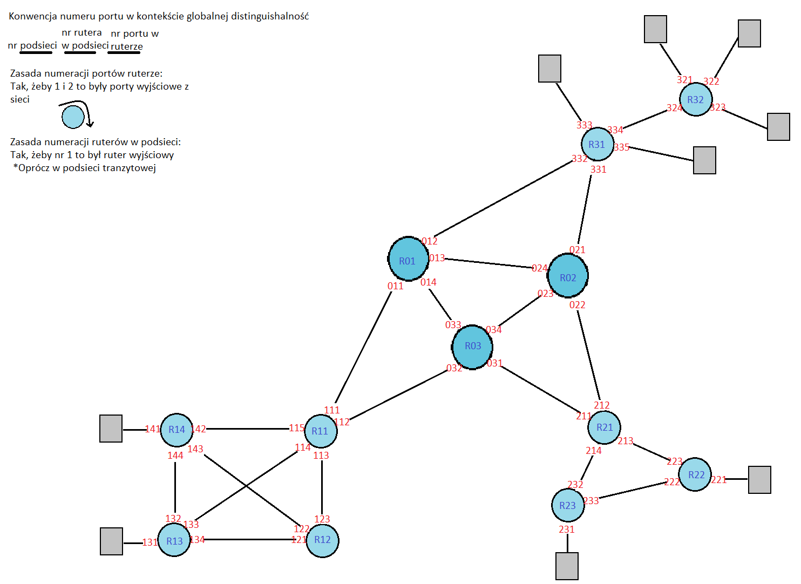

Szare to hosty, niebieskie to routery. Niektóre routery są ciemniejsze i nieco większe. W ten sposób zaznaczone są routery tranzytowe.

Co nam wprowadza pierwszy podział węzłów, czyli podział na **płaszczyzny hierarchii**.

> **Płaszczyzny/poziomy hierarchii** opisują kategorie węzłów. Im węzeł jest niżej w hierarchii tym bliżej jest end-usera, im wyżej tym bardziej tranzytuje ruch na coraz większe odległości.
>
> Zasada jest taka, że jeżeli mamy dwa węzły na tym samym poziomie hierarchii, to one z punktu widzenia kierowania ruchu zachowują się bardzo podobnie.
>
> - Jeżeli znajdują się one w tej samej strefie/podsieci, to ruch między nimi jest kierowany bezpośrednio ewentualnie przez jakiś węzeł z tej samej strefy/podsieci z tej samej płaszczyzny hierarchii.
> - Jeżeli są od siebie odległe (inne strefy/podsieci) to korzystam z węzłów hierarchicznie poziomu wyższego.

My zainspirowani sieciami telefonii stacjonarnej z lat 80/90 ustalamy dwa poziomy hierarchii.

### Podsieci i strefy(domeny)

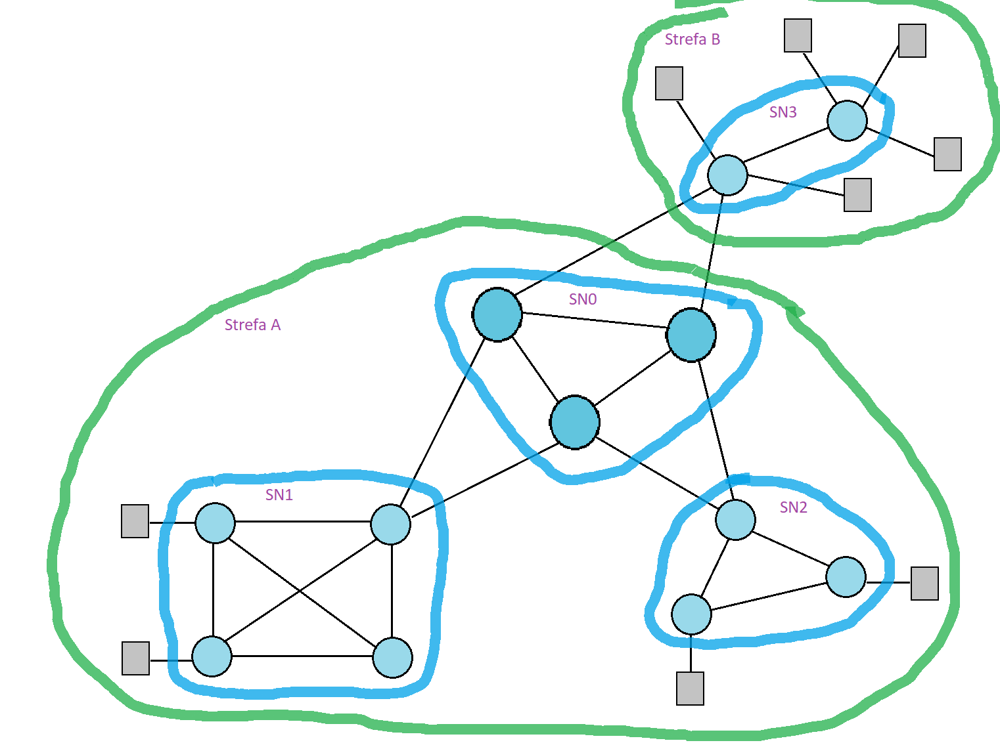

>**Strefa/domena*** - służą one po to, by rozdzielić fragmenty sieci. Ponieważ np: należą one do różnych operatorów, są zarządzane przez inny dział danego operatora, pełnią w sieci różne funkcję. W strefę mogą wchodzić węzły różnych poziomów hierarchii.
>
>*(raczej strefa, bo słowo "domena" jest bardzo dobrze umiejscowione w Internecie, ma tam nadane wyraźnie znaczenie, strefa jest bardziej ogólne).

My zakładamy, że strefy należą do różnych operatorów, stąd każda strefa ma swoje NCC i globalne CC.

> **Podsieć** - zbiór węzłów w obrębie jednej strefy o jednakowym poziomie w hierarchii, które są z jakiegoś powodu wyróżnione, czy to szczególna struktura, czy funkcja w sieci.

U nas podsieci są wyróżnione:

- ze względu na strukturę
  - SN1 - wielobok zupełny
  - SN2 - pierścień
- ze względu na funkcję
  - SN0 - obsługuje ruch tranzytowy (między SN1 i SN2 oraz między strefami A i B)
  - SN3 - obsługuje węzły klienckie operatora strefy B

### Role węzłów

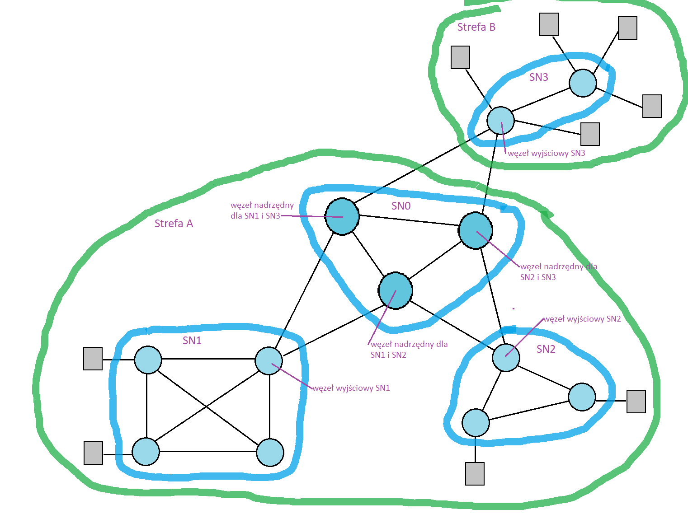

> **Role węzłów** - zdefiniowane są, ażeby łatwiej organizować ruch.
>
> **Węzeł wyjściowy** - zdefiniowany dla podsieci oznacza, że wszystkie połączenia poza tą podsieć muszą prowadzić przez ten węzeł. Pojęcie gateway w Internecie. Oczywiście podsieć może mieć dwa węzły wyjściowe, wtedy połączenia poza podsieć, muszą iść przez jeden lub przez drugi. Można też zdefiniować węzeł wyjściowy dla całej strefy.
>
> **Węzeł nadrzędny** - obsługuje zbiór węzłów, które pod niego podlegają w sensie poziomu hierarchii. Można być węzłem nadrzędnym dla jednego węzła lub dla całej podsieci. Może być tak, że podsieć ma dwa węzły nadrzędne (posiadanie tylko jednego <=> single point of failure).

### Partitioning

> **Partitioning** - hierarchiczny podział sieci na podsieci. Wykorzystywany tam, gdzie nie chcemy lub nie możemy widzieć całej podsieci. Korzystam tylko z wiedzy na temat jej portów.

Potraktujemy naszą sieć globalną jako podsieć, jedną z SNx. Bo globalnie oraz w podsieciach będą obowiązywać te same zasady routingu.

SNy w partitionigu inaczej się przedstawia, ale z uwagi na zdanie wyżej narysuje rutery.

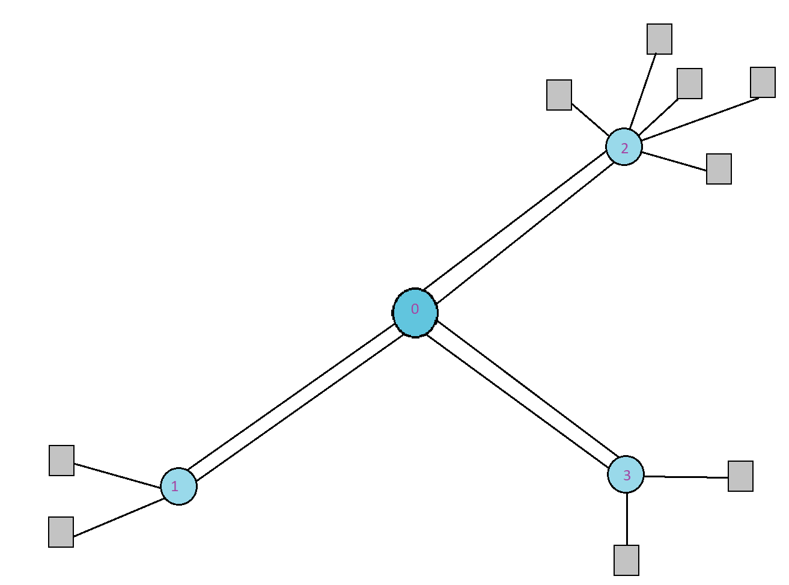

## ASON

Na najbardziej globalnej strukturze sieci pokażmy elementy ASON.

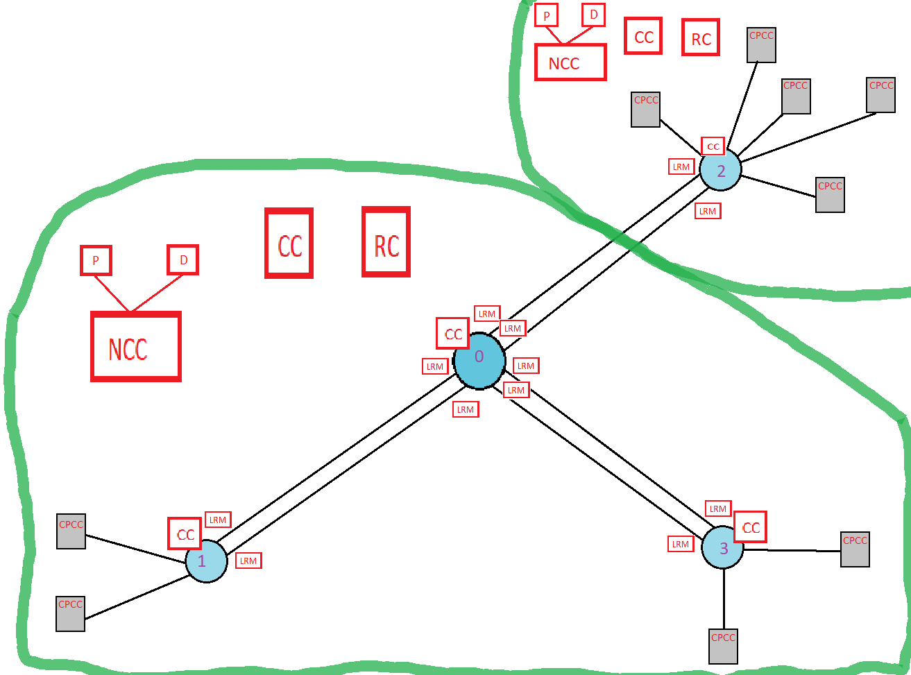

A teraz jak to wygląda w podsieci.

W tym przypadku SN1

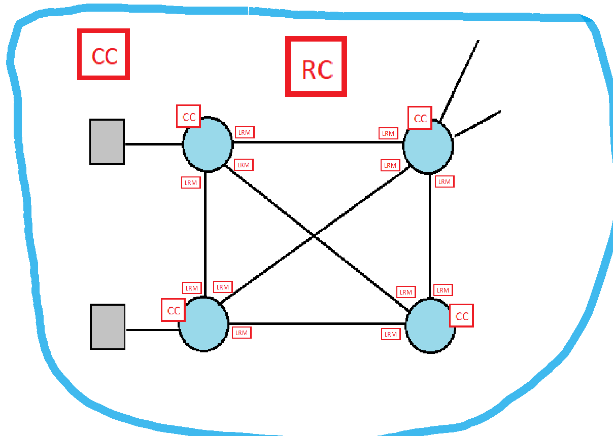

## Zasady sterowania

### Inspiracja nr 1

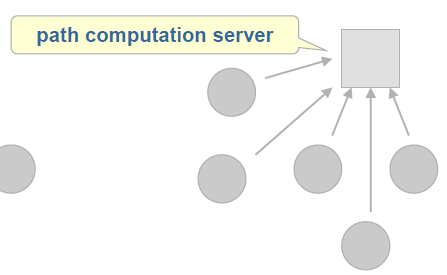*Szablon prezentacji* slajd 67/91 - Cele, kryteria i rozwiązania.

Omawiane na wykładzie 8_201204.

> Rysunek odpowiada sieci optycznej, gdzie nie tylko trzeba znaleźć trasę prowadzącą do adresu docelowego, ale również bezkonfliktowy zakres długości fal, dobrać modulację. 
>
> Zasada (przekładając na terminy z ASON) jest taka:
>
> - W węzłach są tylko CC, funkcja RC jest wyniesiona do pojedynczego komponentu, wspólnego dla całej sieci.
>
> - RC jest to po prostu jakiś serwer, który ma bazę danych, różne algorytmy i interfejsy, na których każdy z CC może zapytać o trasę do określonego adresu.
>
> - Scentralizowane RC często jest nazywane Path Computation Server, żeby podkreślić, że w tej sieci jest oddzielny komponent do wyliczania ścieżek.
>
> - Więc po prostu to jest tak, że CC węzła dostaje przedłużenie ConnectionRequest do jakiegoś adresu, zwraca się więc z prośbą do RC, wysyłając mu adres docelowy. To co może otrzymać to:
>
>   - Cała ścieżka tzw. Explicit Path. Wtedy węzły po drodze nie będą musiały pytać RC drugi raz.
>   - Pierwsze łącze ze ścieżki.
>
>   I to jest chyba, tak że pierwsza opcja to wynik jakiegoś algorytmu, a druga to prosta tablica kierowania połączeń w RC. Ma ona następujące kolumny:
>
>   `który_węzeł_pyta` | `o_jaki_adres_docelowy`  | `które_łącze_mu_odesłać`
>
>   Przykład
>
>   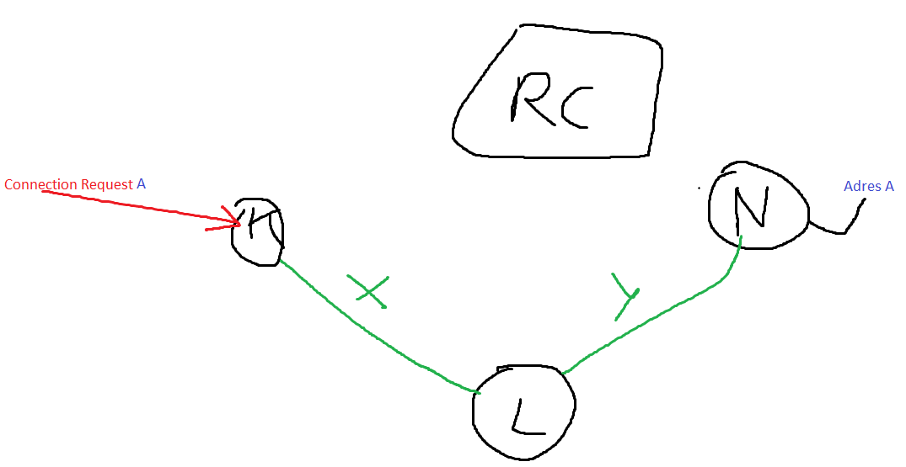
>
>   CC węzła K dostaje ConnectionRequest do adresu docelowego A. Pyta on więc o drogę RC, które odsyła mu łącze X.
>
>   Na tej podstawie węzeł K zaktualizuję swoją tablice połączeń. Czyli, że ustawi, że teraz sygnał o tym zakresie długości fali (taki jaki było w ConnectionRequest wymagany), który przyszedł na ten port (ten, na który ConnectionRequest przyszło), ma być kierowany na ten port (ten, z którego wychodzi łącze jakie dostaliśmy od RC jako odpowiedź).
>
>   Tablica kierowania połączeń w RC może być wzbogacona czy łącze jest sprawne i wtedy może być kilka opcji dla danej pary węzeł_pytający-adres_docelowy. Mogą one być uporządkowane (wg. info jakie RC dostaje od LRM) lub losowo przydzielane.
>
> Proszę tylko nie mylić tablicy kierowania połączeń z tablicą połączeń. Tą pierwszą ma RC i na jej podstawie wypełnia tablice połączeń w węzłach, czyli ona jest w Control Plane. Ta druga jest w węźle i mówi, o tym jakie połączenia przechodzą przez dany węzeł i jak jest komutować, czyli ona jest w Data Plane, ma wpływ na to co jest ustawione w polu komutacyjnym.
>
>
> Skąd się bierze tablica kierowania połączeń w PCS? 
>
> - Jest MS i ludzie z niego wpisują taką tablicę i wsadzają do RC
> - RC informacjami od LRM, wyobraża sobie topologię i robi sobie tablicę sam
> - Nie ma żadnej tablicy, a odpowiedź to wynik jakiegoś algorytmu.

### Inspiracja nr 2

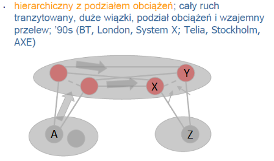

> Wyróżniamy 2 płaszczyzny hierarchii. Każda podsieć ma 2 lub 3 węzły nadrzędne, tranzytowe. Każdy węzeł podsieci jest podłączany do węzłów tranzytowych.
>
>
> Zasada:
>
> Jeśli mamy pokierować połączenie z węzła A do Z to losujemy jeden węzeł tranzytowy przez który to zrobimy. Np. A ma do wyboru dwa łącza.
>
> To jest tzw. **Mechanizm podziału obciążeń**.
>
> Widać, że w płaszczyźnie tranzytowej węzły nadrzędne podsieci lewej mają po 2 łączą do węzłów nadrzędnych sieci prawej, wobec tego tu znowu można zastosować mechanizm podziału obciążeń.
> **Wzajemny przelew**
>
> W węźle X, gdzie jest już tylko jeden wybór, może się okazać, że łącze XZ jest niedostępne (czy to awaria czy przeciążęnie) i wtedy można zrobić tzw. wzajemny przelew, który w tym przypadku skieruje połączenie do węzła Y (do drugiego węzła nadrzędnego) i on zrealzuje połączenie do węzła docelowego.

### Nasze zasady

Z inspiracji 1 bierzemy kierowanie ruchu w podsieci (gdzie sieć globalną też traktujemy jako podsieć).

Z inspiracji 2 bierzemy 2 płaszczyzny hierarchii oraz mechanizm podziału obciążeń (wzajemny przelew sam się zaimplementuje, bo w podsieci tranzytowej robimy inspirację 1). Zmieniamy tą rzecz, że nie wszystkie węzły podsieci są połączone z nadrzędnymi, a jedynie węzeł pełniący rolę węzła wyjściowego.

## Scemariusze

Polecam je tak czytać, że najpierw jeden monitor rysunek, drugi monitor opis krokowy, w głowie nieco wiedzy ASON'a i pod każdym krokiem, to co napisałem "quot'em", to takie pierwsze przybliżenie.

### 1 - Połączenie pomyślnie między-podsieciowe, wewnątrz-strefowe.

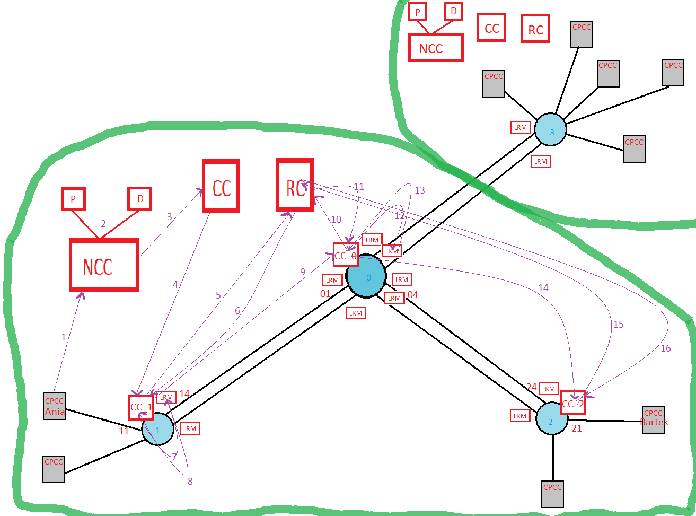

​	*Od 16 przestałem rysować, te strzałki, bo mało ważne, a bałagan*

#### 1.  CPCC_Ania do NCC - ConnectionRequestPYT(Ania, Bartek, 5 slotów)

Opcjonalnie: NCC do CPCC_Bartek - CallAcceptPYT(Ania) i jak Bartek odeśle CallAcceptODP(200 OK) to gituwa lecimy dalej.

> Ania żąda od sieci połączenia z Bartkiem.

#### 2.  NCC do P i D - Policy i Directory

Tu się nie bawimy w wysyłanie, Mycko lub AT gdzieś mówili, że to może być w NCC zasymulowane tylko logiem.

No ale ogólnie NCC ma jakąś tablicę i zamienia Ania i Bartek na porty brzegowe, którymi są oni dołączeni do sieci.

Ania - 11, Bartek - 21

Na tej podstawie NCC ma **adresy** dla połączenia. Teraz NCC wymyśla jakieś **id** dla połączenia, które jest globalne na całą sieć. **Liczba slotów** została określona w ConnectionRequest.

> NCC zamienia imię Bartek na adres docelowy, czyli nr portu brzegowego, którym jest on do sieci podłączony.

#### 3.  NCC do CC - ConnectionRequestPYT(id=1, src=11, dst=21, sl=5)

NCC zleca podsieć (tu akurat całej sieci) zestawienie połączenia.

W tym momencie CC zaczyna czekać na ConnectionRequestODP.

> NCC zleca CC globalnemu zestawienie połączenia, w jego podsieci (czyli całej sieci), między Anią i Bartkiem.

#### 4. CC do CC_1 - ConnectionRequestPYT(id=1, src=11, dst=21, sl=5)

CC zna porty węzłów w swojej podsieci, więc wie, że jak src=11, to musi zażądać zestawienie połączenia przez CC_1, który zajmuje się podsiecią SN1.

W tym momencie CC zaczyna czekać na ConnectionRequestODP.

> CC po porcie Ani, wie, że trzeba zacząć od SN1, czyli zwraca się do CC tej podsieci (ale w jego podsieci jest to węzeł), żeby zestawił on połączenie między portami u siebie.
>
> Mówi mu tak, masz zacząć stąd 11, a dojść do 21. Zrób połączenie między swoim portami, i przekaż następnemu po drodze do 21 węzłowi, gdzie ma się do Ciebie dołączyć.

#### 5. CC_1 do RC -  RouteTableQueryPYT(id=1, src=11, dst=21, sl=5)

CC_1 jest Connection Controllerem węzłowym, więc wysyła zapytanie do RC o drogę. A dokładniej, przez który węzeł ma przedłużyć połączenie, a dokładniej, którym łączem (a dokładniej będzie to łącze, które wychodzi z danego portu, który CC_1 dostanie w odpowiedzi od RC).

> CC_1 jak dostał misję to musi spytać o drogę, o następne łącze na drodze do 21.

#### 6. RC do CC_1 - RouteTableQueryODP(res=14, slots={5,10})

RC ma w tabeli wpis

| src  | dst  | res  |
| :--: | :--: | :--: |
|  11  |  21  |  14  |

Dodatkowo RC dostało w RouteTableQueryPYT jako parametr liczbę wymaganych slotów. Musi więc on poszukać 5 wolnych slotów (obok siebie) na wszystkich łączach, aż do adresu docelowego. 

Stąd parametry jakie RC zwraca w RouteTableQueryODP.

W tej chwili wszystkie od 0 do 99 sloty są wolne. Ale potem na podstawie wiedzy zebranej od LRM, RC będzie musiał decydować jak to mądrze zrobić. Dodatkowo, RC widzi, że to nowe połączenie (bo w swoim spisie nie ma jeszcze połączenia o id=1), więc może sobie już coś pokombinować, pozmieniać coś w tej swojej tablicy, żeby jak go zaraz znowu będą pytać optymalnie odpowiadać (bez pętli, omijając zepsute łącza).

Jeśli chodzi o mechanizm podziału obciążeń z inspiracji 2, to to losowanie dla węzła robi RC za niego.

Teraz CC_1 jak dostało odpowiedź ma 3 następujące misje:

- zarezerwować zasoby na łączu między jego podsiecią(węzłem), a podsiecią(węzłem) przez, które będzie przechodziło połączenie (czyli CC_0)
- przedłużyć połączenie, które dostał od CC do CC_0
- zlecić zestawienie połączenie w swojej podsieci(węźle), co generuje nowy wątek i się będzie działo współbieżnie (lub CC_1 dopiero przedłuży do CC_0 jak dostanie odpowiedź, że w podsieci(węźle) się udało zestawić połączenie)

> CC_1 wie, którym portem ze swojej podsieci wyjść, musi teraz tylko zestawić wewnętrzne połączenie, i rozkazać CC_0 dołączyć się do tego połączenie, oraz powiedzieć gdzie ma ono końcowo i się dostać. CC_0 zrobi tą samą akcję.

#### 7. CC_1 do LRM_14 - LinkConnectionRequestPYT(slots={5-10})

CC_1 zleca LRM_14 rezerwację zasobów na łączu. W odpowiedzi CC_1 dostanie port, który jest na drugim końcu łącza.

LRM_14 tutaj współbieżnie informuje o rezerwacji zasobu RC na styku LocalTopologyPYT(type=ADD, link={14,01}, slots={5-10}).

> CC_1 zestawia połączenie między sobą a następnym węzłem na drodze do 21.

#### 8. LRM_14 do CC_1 -  LinkConnectionRequestODP(res=01)

LRM_14 wie do jakiego portu jest podłączone jego łącze, więc odsyła ten port do CC_1, że ten wiedział, co dać jako parametr "src" w PeerCoordinationPYT do CC_0.

>CC_1 wie, z jakiego portu połączenie ma zacząć następny węzeł.

#### 9. CC_1 do CC_0 - PeerCoordinationPYT(id=1, src=01, dst=21, sl=5)

CC_1 przedłuża połączenie do CC_0.

CC_1 zaczyna czekać na PeerCoordinationODP.

> CC_1 rozkazuje CC_0 zrobić te same sztuczki co sam dostał od CC

#### 10. CC_0 do RC -  RouteTableQueryPYT(id=1, src=01, dst=21, sl=5)

> CC_0 pyta RC, które łącze jest następne na drodze do 21

#### 11. RC do CC_0 - RouteTableQueryODP(res=04, slots={5,10})

RC ma w tabeli wpis:

| src  | dst  | res  |
| :--: | :--: | :--: |
|  11  |  21  |  14  |

RC dzięki, temu, że dostało id połączenia, które jest globalne, wie, że musi przypisać mu te same sloty co wcześniej.

Teraz CC_0 jak dostało odpowiedź ma 3 następujące misje:

- zarezerwować zasoby na łączu między jego podsiecią(węzłem), a podsiecią(węzłem) przez, które będzie przechodziło połączenie (czyli CC_2)
- przedłużyć połączenie, które dostał od CC_1 do CC_2
- zlecić zestawienie połączenie w swojej podsieci(węźle), co generuje nowy wątek i się będzie działo współbieżnie (lub CC_0 dopiero przedłuży do CC_2 jak dostanie odpowiedź, że w podsieci(węźle) się udało zestawić połączenie)

> RC zwraca do CC_0 że łączem {04,24}, czyli następny węzeł to SN2.

#### 12. CC_0 do LRM_04 - LinkConnectionRequestPYT(slots={5-10})

CC_0 zleca LRM_04 rezerwację zasobów na łączu. W odpowiedzi CC_0 dostanie port, który jest na drugim końcu łącza.

LRM_04 tutaj współbieżnie informuje o rezerwacji zasobu RC na styku LocalTopologyPYT(type=ADD, link={04,24}, slots={5-10}).

> CC_0 rezerwuje zasoby na łączu wskazanym przez RC

#### 13. LRM_04 do CC_0 -  LinkConnectionRequestODP(res=24)

LRM_14 wie do jakiego portu jest podłączone jego łącze, więc odsyła ten port do CC_1, że ten wiedział, co dać jako parametr "src" w PeerCoordinationPYT do CC_0.

#### 14. CC_0 do CC_2 - PeerCoordinationPYT(id=1, src=24, dst=21, sl=5)

CC_0 przedłuża połączenie do CC_2.

CC_0 zaczyna czekać na PeerCoordinationODP.

> CC_0 przedłuża połączenie do CC_2 (tak mu RC kazało)

#### 15. CC_2 do RC -  RouteTableQueryPYT(id=1, src=24, dst=21, sl=5)

> CC_2 pyta o drogę

#### 16. RC do CC_2 - RouteTableQueryODP(res=21, slots={5,10})

RC ma w tabeli wpis:

| src  | dst  | res  |
| :--: | :--: | :--: |
|  11  |  21  |  14  |

CC_2 dostało w odpowiedź port, który był dst całego połączenia, co oznacza, że to koniec przygody.

CC_2 ma misję zestawić połączenie w swojej podsieci.

CC_2 nie rezerwuje żadnych zasobów na łączach.

Po prostu po udanej próbie zestawienia u siebie połączenie wyślę do CC_0 PeerCoordinationODP(res=OK).

> RC zwraca CC_2, port którym CC_2 ma wyjść ze swojej podsieci, okazuje się, że to cel podróży, czyli połączenie w sieci zestawione!

#### 17. CC_2 do CC_0 - PeerCoordinationODP(res=OK)

#### 18. CC_0 do CC_1 - PeerCoordinationODP(res=OK)

#### 29. CC_1 do CC - ConnectionRequestODP(res=OK)

#### 20. CC zleca zestawienie połączeń między Anią a portem 11 oraz, między Bartkiem a portem 21

Nie jednak nie zleca, światłowody to są tylko w sieci operatora, w węzłach brzegowych są transpondery, które zamieniają sygnały optyczne na coś tam innego. To już nie jest nasza sprawa.

#### 21. CC do NCC - ConnectionRequestODP(res=OK)

Ania dostaje info, że jest połączona.

**Przejdźmy teraz do tego, co się dzieje w podsieciach Tutaj SN1.**

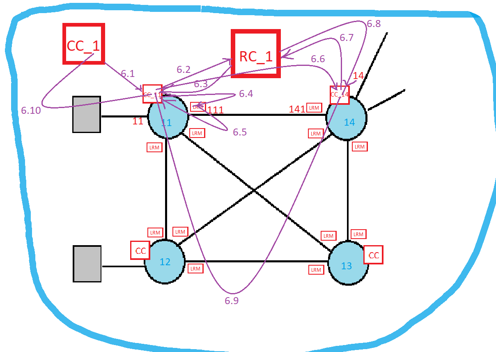

W kroku 6 w sieci domenowej, napisałem, iż CC_1 zleca zestawienie połączenia w swojej podsieci. Tutaj wracamy do tego wątku. Konwencja nazywania kroków jest taka, że jeśli od wydarzenia 6, zaczyna się nowy wątek to dodaje się kropkę, i zaczyna numeracje. Taki fork.

> Dobra nieważne, porzucam idee współbieżnego że najpierw sieć zestawia połączenie pomiędzy swoimi podsieciami, a potem podsieci i tak w kółko, bo, to skomplikuje proces wycofania się z przechodzenia przez pewne węzły, gdy zabraknie tam zasobów podczas zestawiania połączenia.

#### 6.1. C_1 do C_11 - ConnectionRequestPYT(id=1, src=11, dst=14, sl=5)

#### 6.2. C_11 do RC_1 RouteTableQueryPYT(id=1, src=11, dst=14, sl=5)

#### 6.3. RC_1 do CC_11 - RouteTableQueryODP(res=111, slots={5,10})

RC_1 ma w tabeli wpis:

| src  | dst  | res  |
| :--: | :--: | :--: |
|  11  |  14  | 111  |

Oraz jak dostał, że połączenie o id=1, to spytał na NetworkTopology RC wyżej, o to jakie sloty przypisał temu połączeniu poza SN1.

Teraz CC_11 jak dostało odpowiedź ma 3 następujące misje:

- zarezerwować zasoby na łączu między jego podsiecią(węzłem), a podsiecią(węzłem) przez, które będzie przechodziło połączenie (czyli CC_2)

- przedłużyć połączenie, które dostał od CC_1 do CC_2

- zlecić zestawienie połączenie w swojej podsieci(węźle). Ale tu podsiecią jest ruter, do którego przylega CC_11, więc CC_11 zleci ruterowi dodanie wpisu do FIB, a jakiego wpisu?
  O takiego:

  | in_port | slots  | out_port |
  | :-----: | :----: | :------: |
  |   11    | {5-10} |   111    |

  

#### 6.4. CC_11 do LRM_111 - LinkConnectionRequestPYT(slots={5-10})

#### 6.5. LRM_11 do CC_11 -  LinkConnectionRequestODP(res=141)

#### 6.6. CC_11 do CC_14 - PeerCoordinationPYT(id=1, src=141, dst=14, sl=5)

#### 6.7 C_14 do RC_1 RouteTableQueryPYT(id=1, src=141, dst=14, sl=5)

#### 6.8 RC_1 do CC_14 - RouteTableQueryODP(res=14, slots={5,10})

RC_1 ma w tabeli wpis:

| src  | dst  | res  |
| :--: | :--: | :--: |
| 141  |  14  |  14  |

CC_14 dostało jako odpowiedź port, który był, dst całego połączenia (w sensie podsieci), czyli że to koniec przygody.

CC_14 ma misję zestawić połączenie w swojej podsieci, czyli wypełnić FIB routera czymś takim.

| in_port | slots  | out_port |
| :-----: | :----: | :------: |
|   141   | {5-10} |    14    |

CC_14 nie rezerwuje żadnych zasobów na łączach.

Po prostu po udanej próbie zestawienia u siebie połączenie wyślę do CC_11 PeerCoordinationODP(res=OK).

#### 6.9 CC_14 do CC_11 - PeerCoordinationODP(res=OK)

#### 6.10 CC_11 do CC_1 - ConnectionRequestODP(res=OK)

### 2 Połączenie pomyślnie, wewnątrz-podsieciowe.

Tu trzeba zadbać, żeby RC globalne sprytnie wykorzystywało wiedze o użytym w tej podsieci slotach na łączach.

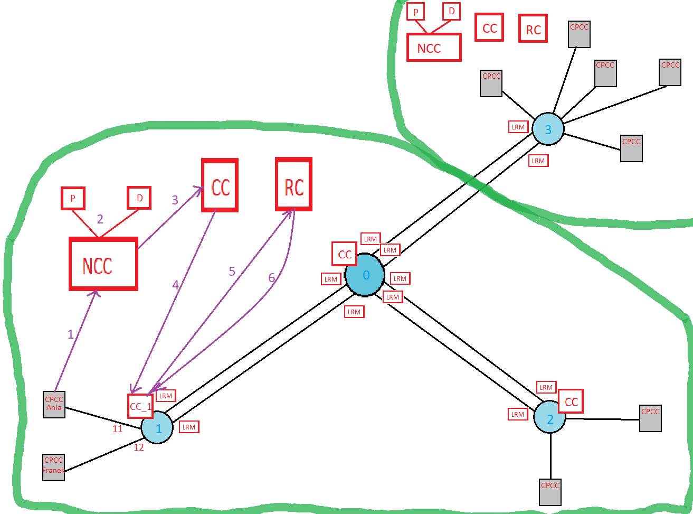

#### 1. CPCC do NCC - ConnectionRequestPYT(Ania, Franek, 12 slotów Ania robi live 'a)

#### 2. NCC do P i D - Policy i Directory

#### 3. NCCC do CC - ConnectionRequestPYT(id=2, src=11, dst=12, sl=12)

#### 4. CC do CC_1 - ConnectionRequestPYT(id=2, src=11, dst=12, sl=12)

#### 5. CC_1 do RC -  RouteTableQueryPYT(id=2, src=11, dst=12, sl=12)

#### 6. RC do CC_1 - RouteTableQueryODP(res=12, slots={11,23})

RC ma w tabeli wpis:

| src  | dst  | res  |
| :--: | :--: | :--: |
|  11  |  12  |  12  |

RC mogło by już zapamiętać sobie, że w podsieci są łącza, które wykorzystują już sloty {11,23}, ale od są styki NetworkTopology.  Dodatkowo, RC globalne, nie może wykluczyć zakresu slotów {11,23} dla podsieci Sn1, ze względu na jedno połączenie, które w niej z tych slotów korzysta. Akurat to połączenie jest między 11 a 12 (spójrz na rysunek SN1), ale na innych łączach ten zakres byłby przecież git. Gdyby tak RC wykluczało, to sieć by się obciążała dużo szybciej.

Więc RC dostanie od RC_1 na NetworkTopology, że następnym razem jak będzie do zrobienia połączenie 11,12 to już nie na {11,23}, czy coś //TODO trzeba to jeszcze przemyśleć.

CC_1 otrzymuje jako res, port, który był dst całego połączenia, więc jedyne co CC_1 musi zrobić to zestawić połączenie u siebie oraz zwrócić do CC ConnectionRequestODP, że gituwa. Oczywiście dopiero jak zestawi u siebie.

#### 7. CC_1 do CC - ConnectionRequestODP(res=OK)

#### 8. CC do NCC - ConnectionRequestODP(res=OK)

#### 9. NCC do CPCC_Ania ConnectionRequestODP(res=OK)

Połączenia w podsieci nie będę omawiał, bo jest identyczne. W tym przypadku jedyne co się zmieniło, to to że finał nadchodzi dużo szybciej.

### 3 Połączenie pomyślnie, między-strefowe

Tu będzie tak, że NCC jak odbierze ConnectionRequest od Ani, i zobaczy, że adresat docelowy jest spoza domeny to zrobi CallCoordination do NCC strefy2. Czyli NCC robi CallCoordinationPYT(Ania, Babacki, 2 sloty).

//TODO W PeerCoordination może lepiej jak będzie przekazywana nie liczba slotów tylko konkretny zakres.

//TODO

### 4 Połączenie nieudane, wewnątrz-strefowe

## Opis komponentów ASON

SDL, MSC co się da. Tak, żeby po tym można było tylko to czytać i napisać.

Opis styków i protokołów na nich.

