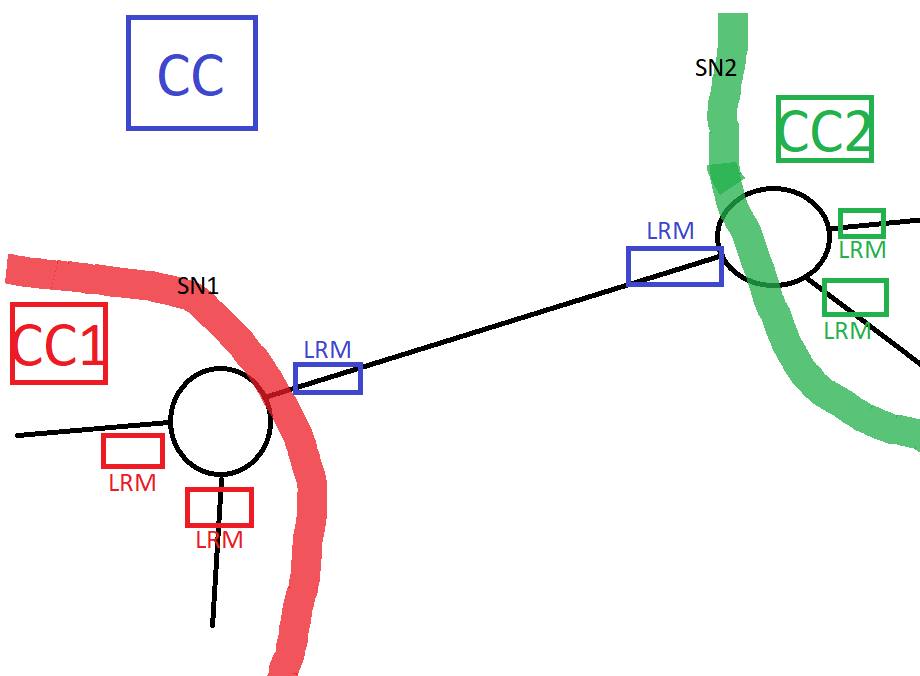

# TSST 2

## 1 Wstemp

Tu są takie początkowe idee tego wszystkiego. Wysyłam, żeby od razu skrytykować te pomysły zanim zaczniemy w to brnąć. Ogólnie strasznie pogmatwane to jest, ten projekt2, duża dowolność, czasem ASON się kłóci z tymi sieciami telefonicznymi, co AT pokazuje. Też zrobiłem tak sieć, żeby były w niej wszystkie bajery, jak poziomy hierarchii, partitioning (to jest na 100% wymagane), role węzłów i nie wiem czy one wszystkie są wymagane, oraz czy niektóre w połączeniu z pomysłami telekomunistów z lat 80 się nieco wykluczają, dlatego nie ma tu żadnego systemu podanego na wykładzie, a jedynie inspirację. To co tu jest łupane, wydaje mi się na ten moment, że jest do zrobienia, mniej więcej jakoś tam każdy problem mam przemyślany jak to może wyglądać, ale bez konkretów.

Wiedza którą tutaj szastam to są wykłady 7_201120, 8_201204, 9_201211. Ale cała teoria jaką z nich używam jest opisana. Dalsze wykłady, wydaje mi się nie są must-have do projektu, a czas nagli, dlatego zacząłem już coś rzeźbić.

Wysyłam taką małą jak na razie porcję, ~~bo więcej nie mam~~ bo:

- Większa szansa na znalezienie jakiś błędów w tym wszystkich, co trzy głowy to nie jedna
- Żebyście się mogli zapoznać z ogólną ideą. Dużo lepiej niż dostać na ryj 15 stron tekstu.
- Nie ma tu opisanych dokładnych zasad sterowania, temat jest do dyskusji i znowu co trzy głowy to nie jedna.

## 2 No to jazda

Opisując taki scenariusz jaki będzie prezentowany na obronie projektu to...

Najpierw klient wybiera ile slotów chce zająć na swoje połączenie oraz adres docelowy.

> W świecie to ma odzwierciedlenie takie, że klient żąda połączenia o przepustowości 100Gb/s.  Czyli widmo musie mieć szerokość 200GHz.
>
> Teraz należy wybrać modulację w zależności od odległości:
>
> - 0-100 km -> 64QAM
> - 101-200 km -> 32QAM
> - 201-300 km -> 16QAM
> - 301-400 km -> 8QAM
> - 401-500 km -> 4QAM
> - 501-600 km -> BPKS
>
> Załóżmy  że adres docelowy jest 217km od klienta, no to wybieramy 16QAM. (!Ale skąd CC/RC wie, ma tablice odległości dla każdej pary klientów?)
>
> Czyli każdy baud/impuls może zakodować naraz 4 bity. Więc potrzebujemy już tak naprawdę pasma o szerokości 50GHz.
>
> Z racji, że szczelina/slot ma 12.5 GHz oraz potrzebujemy jakiś odstęp między innymi połączeniami (W tym przykładzie wszystko na jednej podnośnej!), to połączenie żądane przez klienta zajmie 5 szczelin/slotów, które muszą być obok siebie, na całej długości.
>
> 
>
> Ale myślę, że my sobie pominiemy tą szampańską zabawę i klient będzie wpisywał ile szczelin potrzebuje.

## 3 RSA - Routing and Spectrum Allocation

Zakres długości fal jaki zajmuje jedno połączenie, nie zmienia się na całej drodze danego połączenia.

Czyli tak: III oknie mamy zakres fal 1480-1660nm. 

Załóżmy, że jakieś połączenie ze swojego rutera brzegowego zajęło pasmo (w przeliczeniu na zakres długości fali) 1500-1520nm. To jak po drodze przejdzie ono przez łącze, gdzie już jest połączenie, którego zakres długość fal się pokrywa to jest lipa.

My sobie załóżmy, że na łączu jest dostępnych 100 szczelin. Które sobie ponumerujemy od 0 do 99.

I trzeba będzie robić drogę tak, żeby dwa zakresy (np. 7-12) nie najechały na siebie.

///TODO Trzeba wymyślić na to sposób.

Np. że RC będą wiedziały przecież od LRM jakie są szczeliny zajęte, i tym info można się jakoś powymieniać z sąsiednimi RC.

## 4 Struktura sieci

### 4.1 Czysta struktura sieci

Szare to hosty, niebieskie to routery. Niektóre routery są ciemniejsze i nieco większe. W ten sposób zaznaczone są routery tranzytowe.

Co nam wprowadza pierwszy podział węzłów, czyli podział na **płaszczyzny hierarchii**.

> **Płaszczyzny/poziomy hierarchii** opisują kategorie węzłów. Im węzeł jest niżej w hierarchii tym bliżej jest end-usera, im wyżej tym bardziej tranzytuje ruch na coraz większe odległości.
>
> Zasada jest taka, że jeżeli mamy dwa węzły na tym samym poziomie hierarchii, to one z punktu widzenia kierowania ruchu zachowują się bardzo podobnie.
>
> - Jeżeli znajdują się one w tej samej strefie/podsieci, to ruch między nimi jest kierowany bezpośrednio ewentualnie przez jakiś węzeł z tej samej strefy/podsieci z tej samej płaszczyzny hierarchii.
> - Jeżeli są od siebie odległe (inne strefy/podsieci) to korzystam z węzłów hierarchicznie poziomu wyższego.

My zainspirowani sieciami telefonii stacjonarnej z lat 80/90 ustalamy dwa poziomy hierarchii.

### 4.2 Podsieci i strefy(domeny)

>**Strefa/domena*** - służą one po to, by rozdzielić fragmenty sieci. Ponieważ np: należą one do różnych operatorów, są zarządzane przez inny dział danego operatora, pełnią w sieci różne funkcję. W strefę mogą wchodzić węzły różnych poziomów hierarchii.
>
>*(raczej strefa, bo słowo "domena" jest bardzo dobrze umiejscowione w Internecie, ma tam nadane wyraźnie znaczenie, strefa jest bardziej ogólne).

My zakładamy, że strefy należą do różnych operatorów, stąd każda strefa ma swoje NCC i globalne CC.

> **Podsieć** - zbiór węzłów w obrębie jednej strefy o jednakowym poziomie w hierarchii, które są z jakiegoś powodu wyróżnione, czy to szczególna struktura, czy funkcja w sieci.

U nas podsieci są wyróżnione:

- ze względu na strukturę
  - SN1 - wielobok zupełny
  - SN2 - pierścień
- ze względu na funkcję
  - SN0 - obsługuje ruch tranzytowy (między SN1 i SN2 oraz między strefami A i B)
  - SN3 - obsługuje węzły klienckie operatora strefy B

### 4.3 Role węzłów

> **Role węzłów** - zdefiniowane są, ażeby łatwiej organizować ruch.
>
> **Węzeł wyjściowy** - zdefiniowany dla podsieci oznacza, że wszystkie połączenia poza tą podsieć muszą prowadzić przez ten węzeł. Pojęcie gateway w Internecie. Oczywiście podsieć może mieć dwa węzły wyjściowe, wtedy połączenia poza podsieć, muszą iść przez jeden lub przez drugi. Można też zdefiniować węzeł wyjściowy dla całej strefy.
>
> **Węzeł nadrzędny** - obsługuje zbiór węzłów, które pod niego podlegają w sensie poziomu hierarchii. Można być węzłem nadrzędnym dla jednego węzła lub dla całej podsieci. Może być tak, że podsieć ma dwa węzły nadrzędne (posiadanie tylko jednego <=> single point of failure).

### 4.4 Partitioning

> **Partitioning** - hierarchiczny podział sieci na podsieci. Wykorzystywany tam, gdzie nie chcemy lub nie możemy widzieć całej podsieci. Korzystam tylko z wiedzy na temat jej portów.

Potraktujemy naszą sieć globalną jako podsieć, jedną z SNx. Bo globalnie oraz w podsieciach będą obowiązywać te same zasady routingu.

SNy w partitionigu inaczej się przedstawia, ale z uwagi na zdanie wyżej narysuje rutery.

### 4.5 ASON

Na najbardziej globalnej strukturze sieci pokażmy elementy ASON.

A teraz jak to wygląda w podsieci.

W tym przypadku SN1

## 5 Zasady sterowania

### 5.1 Inspiracje 

#### 5.1.1 Inspiracja nr 1

*Szablon prezentacji* slajd 67/91 - Cele, kryteria i rozwiązania.

Omawiane na wykładzie 8_201204.

> Rysunek odpowiada sieci optycznej, gdzie nie tylko trzeba znaleźć trasę prowadzącą do adresu docelowego, ale również bezkonfliktowy zakres długości fal, dobrać modulację. 
>
> Zasada (przekładając na terminy z ASON) jest taka:
>
> - W węzłach są tylko CC, funkcja RC jest wyniesiona do pojedynczego komponentu, wspólnego dla całej sieci.
>
> - RC jest to po prostu jakiś serwer, który ma bazę danych, różne algorytmy i interfejsy, na których każdy z CC może zapytać o trasę do określonego adresu.
>
> - Scentralizowane RC często jest nazywane Path Computation Server, żeby podkreślić, że w tej sieci jest oddzielny komponent do wyliczania ścieżek.
>
> - Więc po prostu to jest tak, że CC węzła dostaje przedłużenie ConnectionRequest do jakiegoś adresu, zwraca się więc z prośbą do RC, wysyłając mu adres docelowy. To co może otrzymać to:
>
>   - Cała ścieżka tzw. Explicit Path. Wtedy węzły po drodze nie będą musiały pytać RC drugi raz.
>   - Pierwsze łącze ze ścieżki.
>
>   I to jest chyba, tak że pierwsza opcja to wynik jakiegoś algorytmu, a druga to prosta tablica kierowania połączeń w RC. Ma ona następujące kolumny:
>
>   `który_węzeł_pyta` | `o_jaki_adres_docelowy`  | `które_łącze_mu_odesłać`
>
>   Przykład
>
>   
>
>   CC węzła K dostaje ConnectionRequest do adresu docelowego A. Pyta on więc o drogę RC, które odsyła mu łącze X.
>
>   Na tej podstawie węzeł K zaktualizuję swoją tablice połączeń. Czyli, że ustawi, że teraz sygnał o tym zakresie długości fali (taki jaki było w ConnectionRequest wymagany), który przyszedł na ten port (ten, na który ConnectionRequest przyszło), ma być kierowany na ten port (ten, z którego wychodzi łącze jakie dostaliśmy od RC jako odpowiedź).
>
>   Tablica kierowania połączeń w RC może być wzbogacona czy łącze jest sprawne i wtedy może być kilka opcji dla danej pary węzeł_pytający-adres_docelowy. Mogą one być uporządkowane (wg. info jakie RC dostaje od LRM) lub losowo przydzielane.
>
> Proszę tylko nie mylić tablicy kierowania połączeń z tablicą połączeń. Tą pierwszą ma RC i na jej podstawie wypełnia tablice połączeń w węzłach, czyli ona jest w Control Plane. Ta druga jest w węźle i mówi, o tym jakie połączenia przechodzą przez dany węzeł i jak jest komutować, czyli ona jest w Data Plane, ma wpływ na to co jest ustawione w polu komutacyjnym.
>
>
> Skąd się bierze tablica kierowania połączeń w PCS? 
>
> - Jest MS i ludzie z niego wpisują taką tablicę i wsadzają do RC
> - RC informacjami od LRM, wyobraża sobie topologię i robi sobie tablicę sam
> - Nie ma żadnej tablicy, a odpowiedź to wynik jakiegoś algorytmu.

#### 5.1.2 Inspiracja nr 2

> Wyróżniamy 2 płaszczyzny hierarchii. Każda podsieć ma 2 lub 3 węzły nadrzędne, tranzytowe. Każdy węzeł podsieci jest podłączany do węzłów tranzytowych.
>
>
> Zasada:
>
> Jeśli mamy pokierować połączenie z węzła A do Z to losujemy jeden węzeł tranzytowy przez który to zrobimy. Np. A ma do wyboru dwa łącza.
>
> To jest tzw. **Mechanizm podziału obciążeń**.
>
> Widać, że w płaszczyźnie tranzytowej węzły nadrzędne podsieci lewej mają po 2 łączą do węzłów nadrzędnych sieci prawej, wobec tego tu znowu można zastosować mechanizm podziału obciążeń.
> **Wzajemny przelew**
>
> W węźle X, gdzie jest już tylko jeden wybór, może się okazać, że łącze XZ jest niedostępne (czy to awaria czy przeciążęnie) i wtedy można zrobić tzw. wzajemny przelew, który w tym przypadku skieruje połączenie do węzła Y (do drugiego węzła nadrzędnego) i on zrealzuje połączenie do węzła docelowego.

### 5.2 Nasze zasady

Z inspiracji 1 bierzemy kierowanie ruchu w podsieci (gdzie sieć globalną też traktujemy jako podsieć).

Z inspiracji 2 bierzemy 2 płaszczyzny hierarchii oraz mechanizm podziału obciążeń (wzajemny przelew sam się zaimplementuje, bo w podsieci tranzytowej robimy inspirację 1). Zmieniamy tą rzecz, że nie wszystkie węzły podsieci są połączone z nadrzędnymi, a jedynie węzeł pełniący rolę węzła wyjściowego.

## 6 Scemariusze

Polecam je tak czytać, że najpierw jeden monitor rysunek, drugi monitor opis krokowy, w głowie nieco wiedzy ASON'a i pod każdym krokiem, to co napisałem "quot'em", to takie pierwsze przybliżenie.

### 6.1 - Połączenie pomyślnie między-podsieciowe, wewnątrz-strefowe.

​	*Od 16 przestałem rysować, te strzałki, bo mało ważne, a bałagan*

#### 1.  CPCC_Ania do NCC - ConnectionRequestPYT(Ania, Bartek, 5 slotów)

Opcjonalnie: NCC do CPCC_Bartek - CallAcceptPYT(Ania) i jak Bartek odeśle CallAcceptODP(200 OK) to gituwa lecimy dalej.

> Ania żąda od sieci połączenia z Bartkiem.

#### 2.  NCC do P i D - Policy i Directory

Tu się nie bawimy w wysyłanie, Mycko lub AT gdzieś mówili, że to może być w NCC zasymulowane tylko logiem.

No ale ogólnie NCC ma jakąś tablicę i zamienia Ania i Bartek na porty brzegowe, którymi są oni dołączeni do sieci.

Ania - 11, Bartek - 21

Na tej podstawie NCC ma **adresy** dla połączenia. Teraz NCC wymyśla jakieś **id** dla połączenia, które jest globalne na całą sieć. **Liczba slotów** została określona w ConnectionRequest.

> NCC zamienia imię Bartek na adres docelowy, czyli nr portu brzegowego, którym jest on do sieci podłączony.

#### 3.  NCC do CC - ConnectionRequestPYT(id=1, src=11, dst=21, sl=5)

NCC zleca podsieć (tu akurat całej sieci) zestawienie połączenia.

W tym momencie CC zaczyna czekać na ConnectionRequestODP.

> NCC zleca CC globalnemu zestawienie połączenia, w jego podsieci (czyli całej sieci), między Anią i Bartkiem.

#### 4. CC do CC_1 - ConnectionRequestPYT(id=1, src=11, dst=21, sl=5)

CC zna porty węzłów w swojej podsieci, więc wie, że jak src=11, to musi zażądać zestawienie połączenia przez CC_1, który zajmuje się podsiecią SN1.

W tym momencie CC zaczyna czekać na ConnectionRequestODP.

> CC po porcie Ani, wie, że trzeba zacząć od SN1, czyli zwraca się do CC tej podsieci (ale w jego podsieci jest to węzeł), żeby zestawił on połączenie między portami u siebie.
>
> Mówi mu tak, masz zacząć stąd 11, a dojść do 21. Zrób połączenie między swoim portami, i przekaż następnemu po drodze do 21 węzłowi, gdzie ma się do Ciebie dołączyć.

#### 5. CC_1 do RC -  RouteTableQueryPYT(id=1, src=11, dst=21, sl=5)

CC_1 jest Connection Controllerem węzłowym, więc wysyła zapytanie do RC o drogę. A dokładniej, przez który węzeł ma przedłużyć połączenie, a dokładniej, którym łączem (a dokładniej będzie to łącze, które wychodzi z danego portu, który CC_1 dostanie w odpowiedzi od RC).

> CC_1 jak dostał misję to musi spytać o drogę, o następne łącze na drodze do 21.

#### 6. RC do CC_1 - RouteTableQueryODP(res=14, slots={5,10})

RC ma w tabeli wpis

| src  | dst  | res  |
| :--: | :--: | :--: |
|  11  |  21  |  14  |

Dodatkowo RC dostało w RouteTableQueryPYT jako parametr liczbę wymaganych slotów. Musi więc on poszukać 5 wolnych slotów (obok siebie) na wszystkich łączach, aż do adresu docelowego. 

Stąd parametry jakie RC zwraca w RouteTableQueryODP.

W tej chwili wszystkie od 0 do 99 sloty są wolne. Ale potem na podstawie wiedzy zebranej od LRM, RC będzie musiał decydować jak to mądrze zrobić. Dodatkowo, RC widzi, że to nowe połączenie (bo w swoim spisie nie ma jeszcze połączenia o id=1), więc może sobie już coś pokombinować, pozmieniać coś w tej swojej tablicy, żeby jak go zaraz znowu będą pytać optymalnie odpowiadać (bez pętli, omijając zepsute łącza).

Jeśli chodzi o mechanizm podziału obciążeń z inspiracji 2, to to losowanie dla węzła robi RC za niego.

Teraz CC_1 jak dostało odpowiedź ma 3 następujące misje:

- zarezerwować zasoby na łączu między jego podsiecią(węzłem), a podsiecią(węzłem) przez, które będzie przechodziło połączenie (czyli CC_0)
- przedłużyć połączenie, które dostał od CC do CC_0
- zlecić zestawienie połączenie w swojej podsieci(węźle), co generuje nowy wątek i się będzie działo współbieżnie (lub CC_1 dopiero przedłuży do CC_0 jak dostanie odpowiedź, że w podsieci(węźle) się udało zestawić połączenie)

> CC_1 wie, którym portem ze swojej podsieci wyjść, musi teraz tylko zestawić wewnętrzne połączenie, i rozkazać CC_0 dołączyć się do tego połączenie, oraz powiedzieć gdzie ma ono końcowo i się dostać. CC_0 zrobi tą samą akcję.

#### 7. CC_1 do LRM_14 - LinkConnectionRequestPYT(slots={5-10})

CC_1 zleca LRM_14 rezerwację zasobów na łączu. W odpowiedzi CC_1 dostanie port, który jest na drugim końcu łącza.

LRM_14 tutaj współbieżnie informuje o rezerwacji zasobu RC na styku LocalTopologyPYT(type=ADD, link={14,01}, slots={5-10}).

> CC_1 zestawia połączenie między sobą a następnym węzłem na drodze do 21.

#### 8. LRM_14 do CC_1 -  LinkConnectionRequestODP(res=01)

LRM_14 wie do jakiego portu jest podłączone jego łącze, więc odsyła ten port do CC_1, że ten wiedział, co dać jako parametr "src" w PeerCoordinationPYT do CC_0.

>CC_1 wie, z jakiego portu połączenie ma zacząć następny węzeł.

#### 9. CC_1 do CC_0 - PeerCoordinationPYT(id=1, src=01, dst=21, sl=5)

CC_1 przedłuża połączenie do CC_0.

CC_1 zaczyna czekać na PeerCoordinationODP.

> CC_1 rozkazuje CC_0 zrobić te same sztuczki co sam dostał od CC

#### 10. CC_0 do RC -  RouteTableQueryPYT(id=1, src=01, dst=21, sl=5)

> CC_0 pyta RC, które łącze jest następne na drodze do 21

#### 11. RC do CC_0 - RouteTableQueryODP(res=04, slots={5,10})

RC ma w tabeli wpis:

| src  | dst  | res  |
| :--: | :--: | :--: |
|  11  |  21  |  14  |

RC dzięki, temu, że dostało id połączenia, które jest globalne, wie, że musi przypisać mu te same sloty co wcześniej.

Teraz CC_0 jak dostało odpowiedź ma 3 następujące misje:

- zarezerwować zasoby na łączu między jego podsiecią(węzłem), a podsiecią(węzłem) przez, które będzie przechodziło połączenie (czyli CC_2)
- przedłużyć połączenie, które dostał od CC_1 do CC_2
- zlecić zestawienie połączenie w swojej podsieci(węźle), co generuje nowy wątek i się będzie działo współbieżnie (lub CC_0 dopiero przedłuży do CC_2 jak dostanie odpowiedź, że w podsieci(węźle) się udało zestawić połączenie)

> RC zwraca do CC_0 że łączem {04,24}, czyli następny węzeł to SN2.

#### 12. CC_0 do LRM_04 - LinkConnectionRequestPYT(slots={5-10})

CC_0 zleca LRM_04 rezerwację zasobów na łączu. W odpowiedzi CC_0 dostanie port, który jest na drugim końcu łącza.

LRM_04 tutaj współbieżnie informuje o rezerwacji zasobu RC na styku LocalTopologyPYT(type=ADD, link={04,24}, slots={5-10}).

> CC_0 rezerwuje zasoby na łączu wskazanym przez RC

#### 13. LRM_04 do CC_0 -  LinkConnectionRequestODP(res=24)

LRM_14 wie do jakiego portu jest podłączone jego łącze, więc odsyła ten port do CC_1, że ten wiedział, co dać jako parametr "src" w PeerCoordinationPYT do CC_0.

#### 14. CC_0 do CC_2 - PeerCoordinationPYT(id=1, src=24, dst=21, sl=5)

CC_0 przedłuża połączenie do CC_2.

CC_0 zaczyna czekać na PeerCoordinationODP.

> CC_0 przedłuża połączenie do CC_2 (tak mu RC kazało)

#### 15. CC_2 do RC -  RouteTableQueryPYT(id=1, src=24, dst=21, sl=5)

> CC_2 pyta o drogę

#### 16. RC do CC_2 - RouteTableQueryODP(res=21, slots={5,10})

RC ma w tabeli wpis:

| src  | dst  | res  |
| :--: | :--: | :--: |
|  11  |  21  |  14  |

CC_2 dostało w odpowiedź port, który był dst całego połączenia, co oznacza, że to koniec przygody.

CC_2 ma misję zestawić połączenie w swojej podsieci.

CC_2 nie rezerwuje żadnych zasobów na łączach.

Po prostu po udanej próbie zestawienia u siebie połączenie wyślę do CC_0 PeerCoordinationODP(res=OK).

> RC zwraca CC_2, port którym CC_2 ma wyjść ze swojej podsieci, okazuje się, że to cel podróży, czyli połączenie w sieci zestawione!

#### 17. CC_2 do CC_0 - PeerCoordinationODP(res=OK)

#### 18. CC_0 do CC_1 - PeerCoordinationODP(res=OK)

#### 29. CC_1 do CC - ConnectionRequestODP(res=OK)

#### 20. CC zleca zestawienie połączeń między Anią a portem 11 oraz, między Bartkiem a portem 21

Nie jednak nie zleca, światłowody to są tylko w sieci operatora, w węzłach brzegowych są transpondery, które zamieniają sygnały optyczne na coś tam innego. To już nie jest nasza sprawa.

#### 21. CC do NCC - ConnectionRequestODP(res=OK)

Ania dostaje info, że jest połączona.

**Przejdźmy teraz do tego, co się dzieje w podsieciach Tutaj SN1.**

W kroku 6 w sieci domenowej, napisałem, iż CC_1 zleca zestawienie połączenia w swojej podsieci. Tutaj wracamy do tego wątku. Konwencja nazywania kroków jest taka, że jeśli od wydarzenia 6, zaczyna się nowy wątek to dodaje się kropkę, i zaczyna numeracje. Taki fork.

> Dobra nieważne, porzucam idee współbieżnego że najpierw sieć zestawia połączenie pomiędzy swoimi podsieciami, a potem podsieci i tak w kółko, bo, to skomplikuje proces wycofania się z przechodzenia przez pewne węzły, gdy zabraknie tam zasobów podczas zestawiania połączenia.

#### 6.1. C_1 do C_11 - ConnectionRequestPYT(id=1, src=11, dst=14, sl=5)

#### 6.2. C_11 do RC_1 RouteTableQueryPYT(id=1, src=11, dst=14, sl=5)

#### 6.3. RC_1 do CC_11 - RouteTableQueryODP(res=111, slots={5,10})

RC_1 ma w tabeli wpis:

| src  | dst  | res  |
| :--: | :--: | :--: |
|  11  |  14  | 111  |

Oraz jak dostał, że połączenie o id=1, to spytał na NetworkTopology RC wyżej, o to jakie sloty przypisał temu połączeniu poza SN1.

Teraz CC_11 jak dostało odpowiedź ma 3 następujące misje:

- zarezerwować zasoby na łączu między jego podsiecią(węzłem), a podsiecią(węzłem) przez, które będzie przechodziło połączenie (czyli CC_2)

- przedłużyć połączenie, które dostał od CC_1 do CC_2

- zlecić zestawienie połączenie w swojej podsieci(węźle). Ale tu podsiecią jest ruter, do którego przylega CC_11, więc CC_11 zleci ruterowi dodanie wpisu do FIB, a jakiego wpisu?
  O takiego:

  | in_port | slots  | out_port |
  | :-----: | :----: | :------: |
  |   11    | {5-10} |   111    |

  

#### 6.4. CC_11 do LRM_111 - LinkConnectionRequestPYT(slots={5-10})

#### 6.5. LRM_11 do CC_11 -  LinkConnectionRequestODP(res=141)

#### 6.6. CC_11 do CC_14 - PeerCoordinationPYT(id=1, src=141, dst=14, sl=5)

#### 6.7 C_14 do RC_1 RouteTableQueryPYT(id=1, src=141, dst=14, sl=5)

#### 6.8 RC_1 do CC_14 - RouteTableQueryODP(res=14, slots={5,10})

RC_1 ma w tabeli wpis:

| src  | dst  | res  |
| :--: | :--: | :--: |
| 141  |  14  |  14  |

CC_14 dostało jako odpowiedź port, który był, dst całego połączenia (w sensie podsieci), czyli że to koniec przygody.

CC_14 ma misję zestawić połączenie w swojej podsieci, czyli wypełnić FIB routera czymś takim.

| in_port | slots  | out_port |
| :-----: | :----: | :------: |
|   141   | {5-10} |    14    |

CC_14 nie rezerwuje żadnych zasobów na łączach.

Po prostu po udanej próbie zestawienia u siebie połączenie wyślę do CC_11 PeerCoordinationODP(res=OK).

#### 6.9 CC_14 do CC_11 - PeerCoordinationODP(res=OK)

#### 6.10 CC_11 do CC_1 - ConnectionRequestODP(res=OK)

### 6.2 Połączenie pomyślnie, wewnątrz-podsieciowe.

Tu trzeba zadbać, żeby RC globalne sprytnie wykorzystywało wiedze o użytym w tej podsieci slotach na łączach.

#### 1. CPCC do NCC - ConnectionRequestPYT(Ania, Franek, 12 slotów Ania robi live 'a)

#### 2. NCC do P i D - Policy i Directory

#### 3. NCCC do CC - ConnectionRequestPYT(id=2, src=11, dst=12, sl=12)

#### 4. CC do CC_1 - ConnectionRequestPYT(id=2, src=11, dst=12, sl=12)

#### 5. CC_1 do RC -  RouteTableQueryPYT(id=2, src=11, dst=12, sl=12)

#### 6. RC do CC_1 - RouteTableQueryODP(res=12, slots={11,23})

RC ma w tabeli wpis:

| src  | dst  | res  |
| :--: | :--: | :--: |
|  11  |  12  |  12  |

RC mogło by już zapamiętać sobie, że w podsieci są łącza, które wykorzystują już sloty {11,23}, ale od są styki NetworkTopology.  Dodatkowo, RC globalne, nie może wykluczyć zakresu slotów {11,23} dla podsieci Sn1, ze względu na jedno połączenie, które w niej z tych slotów korzysta. Akurat to połączenie jest między 11 a 12 (spójrz na rysunek SN1), ale na innych łączach ten zakres byłby przecież git. Gdyby tak RC wykluczało, to sieć by się obciążała dużo szybciej.

Więc RC dostanie od RC_1 na NetworkTopology, że następnym razem jak będzie do zrobienia połączenie 11,12 to już nie na {11,23}, czy coś //TODO trzeba to jeszcze przemyśleć.

CC_1 otrzymuje jako res, port, który był dst całego połączenia, więc jedyne co CC_1 musi zrobić to zestawić połączenie u siebie oraz zwrócić do CC ConnectionRequestODP, że gituwa. Oczywiście dopiero jak zestawi u siebie.

#### 7. CC_1 do CC - ConnectionRequestODP(res=OK)

#### 8. CC do NCC - ConnectionRequestODP(res=OK)

#### 9. NCC do CPCC_Ania ConnectionRequestODP(res=OK)

Połączenia w podsieci nie będę omawiał, bo jest identyczne. W tym przypadku jedyne co się zmieniło, to to że finał nadchodzi dużo szybciej.

### 6.3 Połączenie pomyślne, między-strefowe

Tu będzie tak, że NCC jak odbierze ConnectionRequest od Ani, i zobaczy, że adresat docelowy jest spoza domeny to zrobi CallCoordination do NCC strefy2. Czyli NCC robi CallCoordinationPYT(Ania, Babacki, 2 sloty).

//TODO W PeerCoordination może lepiej jak będzie przekazywana nie liczba slotów tylko konkretny zakres.

#### 6.3.1 Opis - 1 przybliżenie

Jeśli pomijamy jakieś kroki, to znaczy, że to się nie różni od scenariusza 1

- CPCC Ani żąda połączenia do Babackiego z strefy 2

- NCC_s1 wykonuje Directory i okazuje, się że Babacki należy do innej strefy. NCC_s1 pyta NCC_s2 czy git.
- NCC_s1 zleca CC_s1 ConnectionRequestPYT(id=4, src=11, dst=35, slots=4)
- CC_s1 zleca CC1 ConnectionRequestPYT(id=4, src=11, dst=35, slots=4)
- CC1 pyta RC o drogę. RC widzi, że port=35 jest z innej strefy. Więc wyśle RouteTableQueryODP(res=14, dst_u_nas=06, slots={90-93})
  - skąd RC wie jak kierować do 35? otóż stykiem NetworkTopology
  - po co to dst_u_nas, żeby CC, którego w końcu dostanie od RC res=dst_u_nas, to znaczy, że to koniec zestawiania połączenia w naszej strefie, CC zarezerwuje wtedy łącze między strefowe, dzięki LRM, będzie wiedziało jaki port jest na drugim końcu łącza, co CC zwróci w PeerCoordinationODP, i wtedy CC_s1 będzie wiedziało, co dać w PeerCooridnationPYT do CC_s2 jako src
- No i połączenie tu idzie normalnie aż w końcu jakieś CC dostanie od RC res=dst_u_nas, CC zarezerwuje wtedy łącze, dostanie od LRM port, od którego należy zacząć połączenie w strefie 2.
- To ostatnie CC zwraca w PeerCoordination ten port. Aż wróci on od CC1 do CC_s1 jako ConnectionRequestODP
- Wtedy CC_s1 robi PeerCoordination do CC_s2

No dobra, dodaliśmy parametr dst_u_nas do RouteTableQueryODP. Co teraz z nim w sytuacji nominalnej? A no to, że w sytuacji nominalnej dst_u_nas jest równe dst (czyli dst całego połączenia), co oznacza, że nie przedłużamy połączenia o kolejną strefę, czyli CC nie rezerwuje łącza, robi tak jak jest normalnie, a jako port_którym_strefa2_się_dołącza_do_połączenia zwraca NULL (i wtedy CC analizując PeerCoordinationODP lub ConnectionRequestODP będą specjalnie się zachowywać, gdy to !=NULL).

Strefa 2 jak dostaje ConnectionRequest to co robi?

Tu jest sytuacja nominalna, Strefa1 zachowuje się jak zwykły host. Efekt jest ten sam CC dostaje żądanie zestawienia połączenia skąd dokądś. 

### 6.4 Połączenie nieudane, wewnątrz-strefowe

Tu jak jakiemuś CC w swojej podsieci się nie uda zrobić połączenia, to zwróci w PeerCoordinationODP(res=REFUSED). Wtedy CC, które taką odpowiedź dostało spyta RC o inną drogę (nie wiem jak to miało by wyglądać w protokole, oraz jak RC miało by trackować, które drogi już dało na to połączenie, a które nie, dobra wiem). Ale ogólnie RC zwracając drogi, wie o zasobach itp, więc czemu miało by dać złą ścieżkę, prędzej powie, że się nie da, niż CC ma to zrobić.

### 6.5 Awaria łącza

To było dobrze gdzieś opisane na jakimś wykładzie, ale wydaje mi się, że to tak jakby dokleimy jak będzie czas, najpierw trzeba zrobić nominalne scenariusze. Żebyśmy mieli cokolwiek.

//TODO

### 6.6 Call Teardown!!!

## 7 Opis komponentów ASON

SDL, MSC co się da. Tak, żeby po tym można było tylko to czytać i napisać.

Opis styków i protokołów na nich.

### 7.1 Przybliżenie 1 - role

#### 7.1.1 CPCC - Calling Party Call Controller

To jest komponent siedzący na hoście klienta. Klient wypełnia tabelkę z parametrami połączenia (adresy źródłowy i docelowy, potrzebna liczba szczelin/slotów).

CPCC wysyła żądanie połączenia do NCC.

Jest jeszcze Called Party Call Controller, po stronie odbiorcy połączenia.

#### 7.1.2 NCC - Network Part Call Controller

Komponent przyjmujący żądania połączeń od CPCC. Wykonuje on CAC (Call Admission Control). Najpierw wykonuje zapytanie do serwera Policy (czyli czy klient może wykonać połączenie, w sensie czy to nasz klient, czy płaci itp.), potem wykonuje zapytanie do serwera Directory, który zamienia adresy ludzkie na porty, którymi klienci dołączeni są do sieci.

Następnie NCC zleca zestawienie połączenia komponentowi CC.

#### 7.1.3 CC - Connection Controller

Za pomocą komponentów pomocniczych zestawia połączenie. Dowiaduje się o ścieżkę dla danego połączenia, rezerwuje zasoby na łączach, zleca dodanie wpisu do FIB'ów w węzłach.

Wszystkie te akcje wykonuje pośrednio, za pomocą odpowiednio:

- RC
- LRM
- CC niższego poziomu lub router

#### 7.1.4 RC - Routing Controller

Wymyśla ścieżkę dla połączenia. CC zwraca się do RC z pytaniem o ścieżkę do danego adresu docelowego, a RC mówi mu, którym portem CC powinno wyjść z podsieci/węzła, którym się opiekuje.

RC musi wiedzieć o topologii sieci, czyli: jakie łącza istnieją, ile mają wolnych szczelin i o jakich zakresach lambd itp. RC to wszystko wie, dzięki współpracy z LRM.

#### 7.1.5 LRM - Link Resource Manager

Opiekuje się zasobami na danym łączu. 

Za jego pomocą CC rezerwuje zasoby na łączu.

On informuje RC o stanie łączy w sieci.

### 7.2 Przybliżenie 2 - role i styki

Ogólnie styki działają tak, że komponent ma styk, na który można się zwrócić. Jeśli jakiś komponent korzysta ze styku innego komponentu, to cała wymiana danych(ODP i PYT), dzieje się w ramach jednego styku. Komponent pytający nie ma specjalnego styku na otrzymywanie odpowiedzi.

#### 7.2.1 CPCC - Calling Party Call Controller

To jest komponent siedzący na hoście klienta. Klient wypełnia tabelkę z parametrami połączenia (adresy źródłowy i docelowy, potrzebna liczba szczelin/slotów).

CPCC wysyła żądanie połączenia do NCC.

**Styki, z których korzysta**:

- **NCC::ConnectionRequest** 
  CPCC przesyła tam adres źródłowy, adres docelowy oraz liczba potrzebnych szczelin

**Styki, które oferuje:**

- **CPCC::CallAccept**
  Korzysta z niego NCC, gdy chce spytać czy klient odbiorca, chce przyjąć połączenia //TODO nie wiem czy to wymagane

#### 7.2.2 NCC - Network Part Call Controller

Komponent przyjmujący żądania połączeń od CPCC. Wykonuje on CAC (Call Admission Control). Najpierw wykonuje zapytanie do serwera Policy (czyli czy klient może wykonać połączenie, w sensie czy to nasz klient, czy płaci itp.), potem wykonuje zapytanie do serwera Directory, który zamienia adresy ludzkie na porty, którymi klienci dołączeni są do sieci.

Następnie NCC zleca zestawienie połączenia komponentowi CC.

**Styki, z których korzysta**:

- **CC::ConnectionRequest** 
  NCC zleca zestawienie połączenia do CC. Wysyła tam id połączenia, adresy źródłowy i docelowy, liczbę potrzebnych szczelin
- **NCC::CallCoordination**
  Gdy NCC otrzyma żądanie połączenia, do klienta, który nie należy do jego strefy, zwraca się do NCC tej strefy, żeby on też zrobił Policy.
  - A Directory? Nie musi już, bo Directory ze sobą rozmawiają i D_s1, wie jaki adres.

**Styki, które oferuje:**

- **NCC::ConnectionRequest**
  Korzysta z niego CPCC, gdy żąda połączenia.
- **NCC::CallTeardown**
  Wysyła CPCC, żeby zakończyć połączenie.
- **NCC::CallCoordination**
  Korzysta z niego NCC innej strefy, żeby przedłużyć połączenie do tej strefy.

#### 7.2.3 CC - Connection Controller

Za pomocą komponentów pomocniczych zestawia połączenie. Dowiaduje się o ścieżkę dla danego połączenia, rezerwuje zasoby na łączach, zleca dodanie wpisu do FIB'ów w węzłach lub zestawienie połączenia w węźle swojej podsieci.

Wszystkie te akcje wykonuje pośrednio, za pomocą odpowiednio:

- RC
- LRM
- CC niższego poziomu lub router

**Styki, z których korzysta**:

- **CC::ConnectionRequest** 
  Gdy CC płaszczyzny wyższej zleca zestawienie połączenia CC poziomu niższego. Czyli węzłowi swojej podsieci (który też może być podsiecią).
  U nas są dwa case'y wykorzystania tego styku:

  - Gdy CC globalne (na strefę) zleca zestawienie połączenia CC pierwszego węzła na trasie połączenia w globalnej podsieci
  - Gdy CC węzła w podsieci globalnej, zleca zestawienie połączenia CC pierwszego routera na trasie połączenia w swojej podsieci.
  - Trzeci taki udawany, to gdy CC opiekujące się routerem, zleca zrobienie wpisu do FIB.

- **CC::PeerCoordination**
  Używane przez węzły hierarchicznie na tym samym poziomie, żeby przedłużyć połączenie, aż do ostatniego węzła podsieci, której zostało zestawienie tego połączenia zlecone.

- **LRM:::LinkConnectionRequest**

  Tym stykiem CC podsieci rezerwuje zasoby na łączach podsieci. Czyli mówi, od teraz sloty{4-10}, na tym  łączy są zajęte, o czym dowiaduje się RC podsieci i już tamtędy takie połączenia nie poprowadzi.

Czyli ConnectionRequest zleca CC wyższe, żeby zestawić połączenie w jakiejś podsieci. A PeerCoordination to kolaboracja węzłów podsieci, w celu zestawienie w niej połączenia.

**Styki, które oferuje:**

- **CC::ConnectionRequest**
  Na ten styk NCC lub CC wyższego poziomu, może zwrócić się, aby zestawić w tej podsieci połączenie. Zauważ, że NCC to takie CC wyższego poziomu dla całej strefy.
- **CC::PeerCoordination**
  Na ten styk, zwraca się CC tego samego poziomu, gdy chce przedłużyć przez nas połączenie. 

#### 7.2.4 RC - Routing Controller

Wymyśla ścieżkę dla połączenia. CC zwraca się do RC z pytaniem o ścieżkę do danego adresu docelowego, a RC mówi mu, którym portem CC powinno wyjść z podsieci/węzła, którym się opiekuje.

RC musi wiedzieć o topologii sieci, czyli: jakie łącza istnieją, ile mają wolnych szczelin i o jakich zakresach lambd itp. RC to wszystko wie, dzięki współpracy z LRM.

**Styki, z których korzysta**:

- **RC::NetworkTopology**
  Na tym styku odbywa się wymiana informacji routingowych między węzłami tego samego poziomu / tej samej podsieci.
  Na tym styku między innymi RC strefy dowiaduje się o ścieżce, do adresów spoza swojej strefy.
  Ale nie wiem jeszcze o co dokładnie można pytać itp.

**Styki, które oferuje:**

- **RC::RouteTableQuery**
  Z tego styku korzystają CC węzłowe podsieci, którą RC się opiekuje. RC zwraca następny węzeł, przez który dany węzeł musi przedłużyć połączenie.
- **RC::LocalTopology**
  Na ten styk LRM łączy należących do podsieci, którą RC się opiekuje przekazują informację o topologii sieci. Czyli jakie łącza są dostępne, ile jest na nich dostępnych szczelin/slotów i jakie to są zakresy itp.
- **RC::NetworkTopology**
  Na tym styku odbywa się wymiana informacji routingowych między węzłami tego samego poziomu / tej samej podsieci.
  Na tym styku między innymi RC strefy dowiaduje się o ścieżce, do adresów spoza swojej strefy.

#### 7.2.5 LRM - Link Resource Manager

Opiekuje się zasobami na danym łączu. 

Za jego pomocą CC rezerwuje zasoby na łączu.

On informuje RC o stanie łączy w sieci.

**Styki, z których korzysta**:

- **RC::LocalTopology**
  Każde łącze ma RC swojej podsieci. I do niego mówi o stanie łącza itp.

**Styki, które oferuje:**

- **LRM::LinkConnectionRequest**

  Tutaj może zwrócić się CC w celu rezerwacji zasobów na łączu. CC podsieci może rezerwować tylko łącza swojej podsieci, o co z tym chodzi?

  LRM, mimo, że należą do jednego routera, to do innych podsieci.

  

### 7.3 Przybliżenie 3 - Protokoły na stykach i struktury danych

Styki działają tak, że komponent się zwraca na jakiś styk do jakiegoś komponentu i potem na tym styku dostaje odpowiedź.

Dlatego rozróżniamy w protokole PYT i ODP. 

*Mieszanie polskiego i angielskiego mmmmmmm, zmienimy to potem jak wleci fajny pomysł.

Typy parametrów:

|     Nazwa      |                             Opis                             |
| :------------: | :----------------------------------------------------------: |
|      port      |                         numer portu                          |
|      name      |                        nazwa klienta                         |
|       sl       |                        liczba slotów                         |
|     slots      |                   konkretny zakres slotów                    |
|      res       | typ wyliczeniowy: "OK" lub "REFUSED" można potem dodać kody do REFUSED Używane w wiadomościach typu ODP "res" od "response" |
|       id       |                        id połączenia                         |
|    allocate    | W LRM::LinkConnectionRequest Służy do odróżnienia czy zasoby zająć czy zwolnić Może być boolean albo enum |
| ArrayOf<Slots> |               Tablica parametrów typu 'slots'                |

#### 7.3.1 CPCC - Calling Party Call Controller

**CPCC::CallAccept**

Korzysta z niego NCC, gdy chce spytać czy klient odbiorca, chce przyjąć połączenia

- **CallAcceptPYT(srcName, sl)**
  - **srcName**: name - nazwa klienta, który chce się z hostem połączyć
  - **sl**: sl - liczba slotów wymaganych do realizacji połączenia
- **CallAcceptODP(res)**
  - res: res - odpowiedź hosta

#### 7.3.2 NCC - Network Party Call Controller

**NCC::ConnectionRequest**
Korzysta z niego CPCC, gdy żąda połączenia.

- **ConnectionRequestPYT(srcName, dstName, sl)**
  - **srcName**: name - nazwa klienta, który żąda połączenia
  - **dstName**: name - nazwa klienta, z którym srcName chce się połączyć
  - **sl**: sl - liczba slotów jaką srcName potrzebuje, aby zapewniona była odpowiednia dla niego przepustowość
- **ConnectionRequestODP(res, id)**
  - **res**: res - odpowiedź sieci, na to czy klient może zrealizować połączenia. Możemy dać 20% szansy, że Ania nie płaci rachunków. NCC też odpowie nie, gdy nie ma klienta o podanym dstName. `res` przyjmuje wartości: "Ania nie płaci rachunków", "Adres docelowy nieznany".
  - **id**: id - id jakie NCC nadało żądnemu połączeniu

**NCC::CallTeardown**
Wysyła CPCC, żeby zakończyć połączenie.

- **CallTeardownPYT(id)**
  - **id**: id - id połączenia, które ma zostać przerwane
- **CallTeardownODP**(res)
  - res: res - odpowiedź OK, gdy sieć zakończy połączenie

**NCC::CallCoordination**
Korzysta z niego NCC innej strefy, żeby przedłużyć połączenie do tej strefy.

- **CallCoordinationPYT(srcName, dstName, sl)**
  - takie same jak w NCC::ConnectionRequestPYT
- **CallCoordinationODP(res)**
  - res: res - OK, gdy pozwalamy Ani się połączyć z Babackim, REFUSED gdy nie.

**Struktury danych**

- Serwer Directory ma słownik, mapujący `dstName: name` na `dst: port`,. Jeśli dla podanego przez klienta `dstName` nie znajdzie odwzorowania, NCC odrzuci połączenie. Directory też wie, czy dstName jest spoza domeny, i wie z której.
- Tablica wszystkich połączeń [id, srcName, src, dstName, dst] //TODO ale po co mu to?
- Adres styku ConnectionRequest CC strefy.
- Adresy styków CallCoordination NCC innych stref.

#### 7.3.3 CC - Connection Controller

**CC::ConnectionRequest**
Na ten styk NCC lub CC wyższego poziomu, może zwrócić się, aby zestawić w tej podsieci połączenie. Zauważ, że NCC to takie CC wyższego poziomu dla całej strefy.

- **ConnectionRequestPYT(id, src, dst, sl)**
  - **id**: id - id połączenia
  - **src**: port - port, od którego połączenie w danej podsieci się zaczyna. Gdy wysyła NCC - port, którym podłączony jest srcName
  - **dst**: port - port, na którym połączenie w danej podsieci  się kończy. Gdy wysyła NCC - port, którym podłączony jest dstName
  - **sl**: sl - liczba slotów wymagana do zapewnienia przepustowości połączenia jaką klient wymaga
- **ConnectionRequestODP(res)**
  - **res**: res - jeśli udało się zestawić połączenie, to OK, jeśli nie to REFUSED.

**CC::PeerCoordination**
Na ten styk, zwraca się CC tego samego poziomu, gdy chce przedłużyć przez nas połączenie. 

- **PeerCoordinationPYT(id, src, dst, slots)**
  - **id**: id - id połączenia
  - **src**: port - adres źródłowy połączenia w podsieci
  - **dst**: port - adres docelowy połączenia w podsieci
  - **slots**: slots - zakres slotów jakie zostały zarezerwowane dla tego połączenia
- **PeerCoordinationODP(res, nextZonePort)**
  - **res**: res - OK gdy się udało przedłużyć połączenie przez węzeł, REFUSED gdy się nie udało.
  - **nextZonePort**: port - port z następnej strefy, który będzie src portem dla połączenia w tamtej domenie. Port z następnej strefy, którym następna strefa się dołącza do połączenia zestawionego w tej strefie. Jeśli połączenie jest wewnątrz strefowe tu zapisywany jest NULL.

**Struktury danych**

CC jak dostanie ConnectionRequest to musi wiedzieć po src, do którego CC węzłowego swojej podsieci się zwrócić.

- Dict mapujący `src` na adresy styków ConnectionRequest należących do CC węzłowych swojej podsieci

- Typ CC. Czy jest to CC strefowe, czy jest to CC węzłowe w sieci strefowej, które ma pod sobą podsieć, czy jest to CC przyczepione do routera.
- Dict, dzięki któremu CC po dostaniu odpowiedzi od LRM::LinkConnectionRequest, wie do którego CC się zwrócić jako następnego.

//TODO Zone to chyba średnia nazwa, w kodzie Domain będzie lepsze hmm?

#### 07.3.4 RC - Routing Controller

**RC::RouteTableQuery**
Z tego styku korzystają CC węzłowe podsieci, którą RC się opiekuje. RC zwraca następny węzeł, przez który dany węzeł musi przedłużyć połączenie.

- **RouteTableQueryPYT(id, src, dst, sl || slots)**
  - **id**: id - id połączenia, żeby RC dawał dla tego samego połączenia, cały czas te same sloty
  - **src**: port - port, który pyta RC o drogę
  - **dst**: port - port do którego src, chce się dostać
  - **sl || slots**: sl || slots - RC musi jakoś odróżniać czy dostał typ sl, czy slots. Gdy sl to musi wymyśleć slots (chyba, że już jest dla tego połączenia), gdy slots, to musi oddać to co dostał.
- **RouteTableQueryODP(id, gateway, slots, dstZone)**
  - **id**: id - id połączenia, dla którego wygenerowano odpowiedź
  - **gateway**: port - port którym połączenie musi wyjść z węzła (rozpoznawanego po src), który pytał. Ten port wskazuje na następne łącze w ścieżce.
  - **slots**: slots - zakres slotów jaki CC węzła musi zarezerwować na łączu, które dostało w odpowiedzi.
  - **dstZone**: port - ostatni port należący do strefy przez, który idzie połączenie do innej strefy. Jeśli połączenie nie jest międzystrefowe, to dstZone będzie takie samo jako dst połączenia

**RC::LocalTopology**
Na ten styk LRM łączy należących do podsieci, którą RC się opiekuje przekazują informację o topologii sieci. Czyli jakie łącza są dostępne, ile jest na nich dostępnych szczelin/slotów i jakie to są zakresy itp. LRM wysyła LocalTopology, gdy: obudzi się do życia, zajmie lub zwolni zasoby na łączu.

Łącze to relacja między dwoma portami.

- **LocalTopologyPYT(port1, port2, slotsArray)**
  - **port1**: port - port po stronie routera, na którym siedzi LRM
  - **port2**: port - port po drugiej stronie łącza
  - **slotsArray**: ArrayOf<slots> - lista zajętych już zakresów slotów na łączu
- **LocalTopologyODP(res)**
  - res: res - Potwierdzenie przyjęcia wiadomości.

**RC::NetworkTopology**

Na tym styku odbywa się wymiana informacji routingowych między węzłami tego samego poziomu / tej samej podsieci.
Na tym styku między innymi RC strefy dowiaduje się o ścieżce, do adresów spoza swojej strefy.

​	//TODO

**Struktury danych**

- Tablica wszystkich linków w podsieci, którą RC się opiekuje. Żeby RC wiedział jakie ścieżko może dawać
  - Link to obiekt [port1: port, port2: port, slotsArray: ArrayOf<slots>]
- Połączenia w podsieci i jakie mają slots. Żeby RC wiedział jakie dał już slots dla danego połączenia.
  - Connection to obiekt [id, src, dst, slots, dstZone]
- Tablica kierowania połączeń
  - Jej kolumny to |src | des | gateway|
    - src: port  - port, który pyta o drogę
    - des: port - port docelowy połączenia, jakie w tej sieci należy zestawić
    - gateway: port - odpowiedź
  - Czyli jakiś węzeł, który dostał połączenie na src, na podstawie dst pyta się RC, którym portem ma wypuścić to połączenie. I potem węzeł w swojej podsieci zestawi połączenie pomiędzy src i gateway.

#### 7.3.5 LRM - Link Resource Manager

**LRM::LinkConnectionRequest**

Tutaj może zwrócić się CC w celu rezerwacji zasobów na łączu.

- **LinkConnectionRequestPYT(slots, allocate)**

  - **slots**: slots - sloty jakie na łączu trzeba zarezerwować.

    Każdy LRM przypisany jest do jednego łącza, więc nie trzeba precyzować łącza. Id połączenia też nie jest potrzebne, LRM ma tylko trzymać info o dostępnych slotach, jego nie obchodzi co przez niego leci.

  - allocate: allocate - zmienna, który rozróżni czy zasoby trzeba zająć (TRUE) czy zwolnić (FALSE)

- **LinkConnectionRequestODP(end)**

  - **end**: port - port, który jest na drugim końcu przed chwilą zarezerwowanego łącza. Dzięki niemu CC wie do kogo zrobić PeerCoordination.
    - //HINT czyli CC ma strukturę, która to odzwierciedla.

**Struktury danych**

- port1: port
- port2: port

- slotsArray: ArrayOf<slots>
- adres styku LocalTopology RC podsieci, do której LRM należy

### 7.4 Przybliżenie 4 - diagram SDL

### 7.5 Opis całościowy

