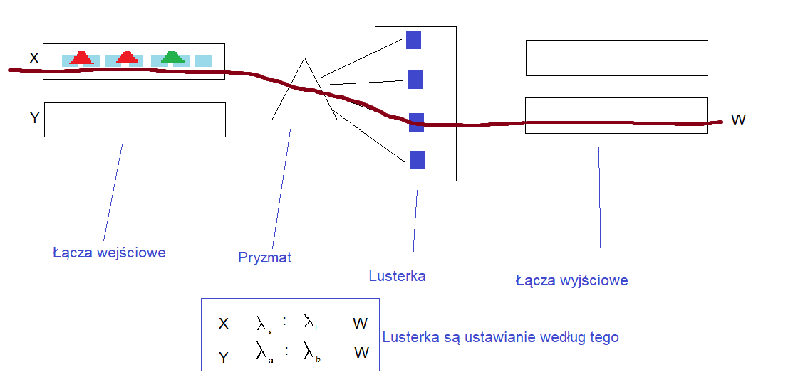
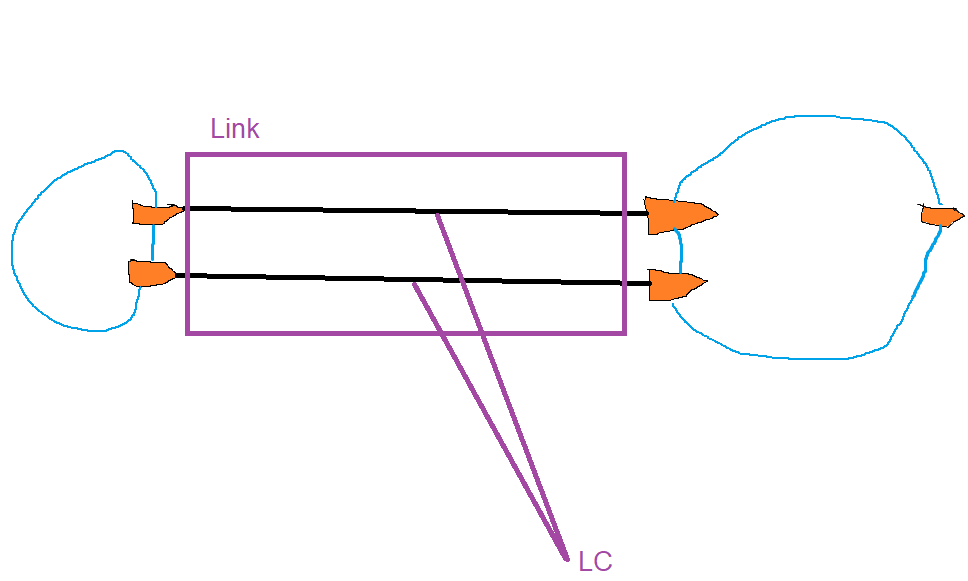
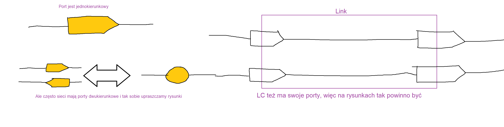
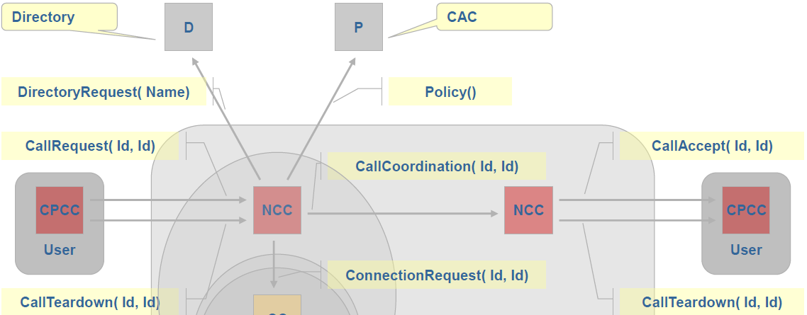
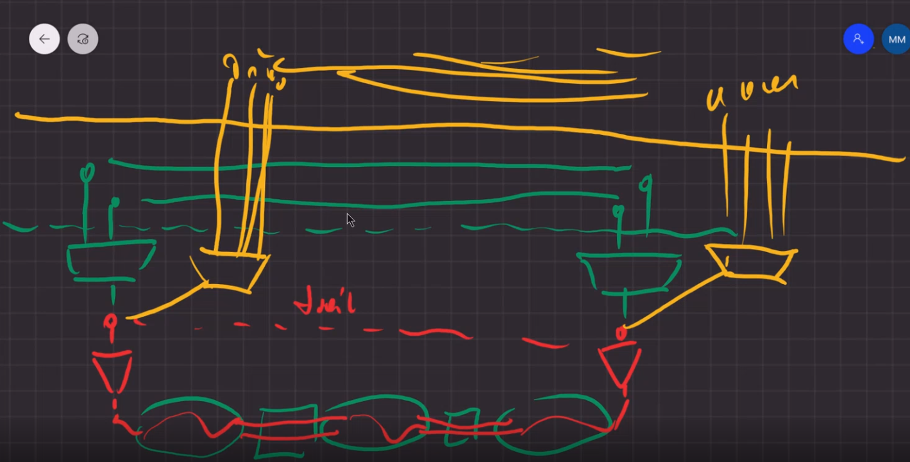
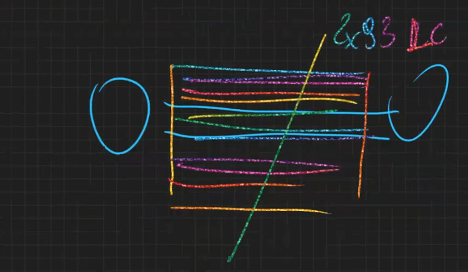

# TSST

Najpierw omówimy podstawowe technologie transportowe, a potem poznamy modele architektury sieci, które są niezależne od technologii transportowej.

1. Technologie transportowe
2. Modele architektury sieci

# 1. Technologie transportowe

Są 2 technologie transportowe:

- transport pakietów z ich komutacją
- transport sygnałów (sieci optyczne)

My się zastanawiamy jak tą chmurkę między hostami zrealizować.

Są dwie opcje:

- Komutacja pakietów
- Sieci optyczne

## 1.1 Komutacja pakietów

Apka korzystając z funkcji systemu operacyjnego wysyła dane przez socket do socketu innej apki na innym kompie. OS tworzy pakiet z danymi i nagłówkiem. Sieć ma zapewnić mu możliwość przesłania tego pakietu.

! Każdy pakiet przesyłany jest indywidualnie oraz na podstawie nagłówka !

**forwarding** - przekazywanie pakietu z wejścia na wyjście

**routing** - kierowania ruchu, trasowanie

**Routing** to proces wypełniania tablic (robią to demony routingu), a forwarding to przekazywanie pakietów (w pojedyńczym urządzeniu to sie dzieje) na podstawie tych tablic.

Komutacja w środku routera. Nas na tym przedmiocie nie interesuje żadna konkretna postać nagłówka.

> "Co się okazuje w sieciach programowalnych (SDN) (tego co jest podstawą 5G) każdy router można zaprogramować tak, że (wiadomo nagłówek służy do przeszukiwania FIB) ale to które pola nagłówka router do tego wyszukiwania wykorzysta to można zaprogramować. Np. nie tylko adres docelowy, ale też priorytet pakietu,adres źródłowy itp."
>
> "Co więcej! router może zmieniać zawartość nagłówka, żeby potem kolejne routera coś tam robiły
>
> Co więcej! czasami tablic nie trzeba wypełniać od razu, są one ogromne więc czasami jak user wyjechał na tydzień to przecież pakiety z jego hosta w tym tygodniu się nie pojawią, więc można tablice wypełniać dopiero na żądanie. 
>
> W sieciach programowalnych jest taki koncept:
>
> Mówimy do routera tak - jak dostaniesz pakiet, któego nagłówka nie umiesz zinterpretować, to wyślij go do specjalnego serwera nazywanego sterownikiem i on doda do tablicy routera co trzeba, odda pakiet i jest gituwa"

- Układy scalone dokonujące komutacji w routerach programowalnych można programować w sensie, że taki sam układ w 2 innych routerach robi inne rzeczy. Służy do tego np. język P4. :mag_right:

### 1.1.1 Architektura funkcjonalna routera

**Pole komutacyjne** - to tu pakiety są kopiowane z modułu wejściowego na odpowiedni moduł wyjściowy

**Moduły IN/OUT** - tu są kolejki wejściowe i wyjśćiowe

**Sterowanie** - czyli komputer, na którym wykonują się dwa rodzaje aplikacji. Apka sterowania, ta która konfiguruje router w czasie rzeczywistym (bo ta apka mówi, co zrobić z pakietem, z którym nie wiadomo co zrobić). Apka zarządzania komunikuje się z systemem zarządzania i odbiera od niego komendy. Apka sterowania przechowuje tablice w wersjia master. W celu wydajność każdy moduł IN/OUT ma swoją w wersji slave, gdyż do master byłyby korki.

**Zasailanie** - zużycie energi przez router: moduły IN/OUT 60%, sterowanie, pole komutacyjne 15%, porty 10%, do tego dochodzi chłodzenie routera +50%.

### 1.1.2 Sterowanie kierowaniem pakietów (routing)

Może być realizowane na różne sposoby, taki najbardziej internetowy to, że apki sterowania w routerach wymieniają między sobą różne informacje i w ich oparciu ustalają tablice.

Np. Router patrzy jakie ma adresy (w sensie urządzenia) dołączone do swoich interfejsów (to wie apka zarządzania) i mówi "znam drogę do adresu A o koszcie x" i rozsyła to info do routerów sąsiadów. Jeżeli router, który takie info odbierze nie zna drogi do A, to dodaje odpowiedni wpis do tablicy, a jeśli zna to sprawdza czy nowa droga nie jest lepsza. No i tak w kółko. Znaczy.. dalej info otrzymane rozsyłają tylko te routery, które coś zmieniły w tablicy.

Tablice trzeba cały czas modyfikować: bo łącza ulegają awariom, bo dochodzą nowe urządzenia, bo resetujemy routery. Człowiek tego nie ogarnie, a gdzie tam, stąd potrzeba na **płaszczyznę sterowania**.

> Ale to, że każdy router ma swoją apke sterowania i one gadają to jest model rozproszony, rozwiązanie internetowe. Natomiast w SDN przechodzi się do modelu scentralizowanego. Apki sterowania odbierają tylko rozkazy a sterowanie robi specjalny serwer.
>
> Rutery robią pomiary (np. ile bitów jest wysyłane na dany adres) i taki serwer może zażadać tych pomiarów.

### 1.1.3 Pole komutacyjne

 Na moduł wejściowy przychodzi pakiet o adresie docelowym A, moduł ten w swojej tablicy patrzy, że pakiety o takich adresie trzeba dać na moduł OUT o numerze 10

Dzieje się to tak, że do pakietu doklejamy na początek bity, mówiące o tym numerze i potem w polach komutacyjnych zdejmujemy te bity i kierujemy na ich podstawie. Moduł pola komutacyjnego ustawia jakieś tam bramki i trzyma ten stan aż pakiet wyjdzie. Następny moduł (tzw. moduł kolejnej sekcji) analizuje już kolejny bit (bo tamten shift'nięty). Na koniec moduł OUT usuwa ostatni bit numerkowy i przesyła pakiet dalej.

### 1.1.4 Moduły IN/OUT

Pakiety mogą mieć swoje klasy (innych szybkości transmisji wymagamy od HTTP a innych od VoD). Klasy rozpoznaje się po numerze portu, a jeśli nie da się to router robi **Deep Packet Inspection**.

Czasem może być tak, że pakiety o tym samym adresie docelowym wyjdą innym portem wyjściowym.

W kolejkach wyjściowych jest **Scheduler**, który może obsługiwać 3 jakości obsługi. Szybkość łącza to 10, jakości najwyższej przypisywane jest 5, średniej - 3 a niskiej 2. Teraz scheduler jak kolejkuje pakiety to losuje pakiet, której klasy obsłuży jako następny z prawdopodobieństwami odpowiednio 50%,30%,20%. Takie coś nazywa się **WFQ (Weighted Fair Queues)**

! Kolejki mogą się przepełniać i wtedy dochodzi do packet lossów !

Parametry jakości transportu:

- delay
- jitter
- packet loss
- bit error rate

I wlaśnie klasy (nadawane pakietom w warstwie apki albo przez pierwszy router (port lub DPI)) poprawiają nieco te parametry.

### 1.1.5 Zmienność ruchu w sieci

W sieci obserwuje się krótkookresowe (w skali, minut, godzin, dni) i długookresowe (miesiące, lata) zmiany ruchu. Mogą to być zmiany regularne lub zmiany losowe. Zmienia się ruch całkowity, ale też i ruch poszczególnych usług, wielkość oraz rozkład w sieci.

Długookresowo możliwa jest rozbudowa sieci. zmiana struktury sieci i przepustowości łączy.

Krótkookresowo możliwa jest inżynieria ruchu (**Traffic Engineering**). Można zmieniać kierowanie ruchu poprzez zmianę wag łączy lub można też tworzyć łącza wirtualne (tzw. tunele). 

Po co tunele? Bo rano jest duży ruch między Wrockiem a Olsztynem, a Szczecin-Wrocław mały. Zaś wieczorem na odwrót. Np. wieczorem operatorzy robią tunele dla Netflixa, w czasie szkoły (201201) dla Teamsów, Zoomów itp.

Trzeba tu wprowadzić rozróżnienie na dwie techniki: **bezpołączeniowa vs połączeniowa**

- bezpołączeniowa - pakiety lecą indywidualnie. Wiadomo, więc jak zmieniają się jakieś FIBy to 2 pakiety o tych samych source i dest. adresach mogą iść inną drogą.
- połączeniowa - najpierw zestawiamy połączenie między dwoma hostami, przydzielając jakieś szczególne zasoby w sieci i potem dopiero wysyłąne są pakiety ciągle tą samą ścieżką.

> W SDN zanika ten podział, bo tam ustalamy połączenie, że pakiety będą lecieć tą samą ścieżką, ale nie czekamy na zestawienie tego połączenie i dopiero wysyłamy tylko jazda odrazu, a rutery za pomocą serwera sterowania ustalają trasę na bieżąco.

### 1.1.6 Łącza wirtualne - tunele

Sram już tym MPLS'em napisze tylko to co nie utrwaliło mi sie podczas projektu w głowie i teraz patrze, że nie potrafię tego wyrecytować jak ktoś mnie o 3 rano obudzi. 

Tablice tuneli to chyba zawsze wypełnia MS.

Internet teraz to głównie IP/MPLS.

MPLS jest połączeniowy, IP nie.

Jak ktoś myli GMPLS i MPLS:

"MPLS jest technologią obsługi danych, a GMPLS to model obsługi sterowania możliwy do zrealizowania na różnych technologiach DP takich jak: MPLS, ATM, EON" "Ogólnie z DP skojarz: ATM, MPLS, EON a z CP: ASON i GMPLS" 

#### 1.1.6.1 ATM

Asynchroniczny tryb transferu.

Wtedy to telefonia dominowała sieci, więc:

- pakiety są stałej wielkości (nie trzeba flag początkowych ani końcowych)
- detekcja i korekcja stosowana tylko dla nagłówków
- w nagłówku (5bajtów) jest numer połączenia (w sumie to 2, jeden dla userów (kanał wirtualny), drugi dla operatorów (ścieżka wirualna))
- 48bajtów dla danych w pakiecie
- technika połączeniowa

**VC (Vritual Connection)** - połączenia dla userów

**VP (Virtual Path)** - połączenia dla operatorów (nim idzie kilka VC)

No więc jak widać w ATM hierarchia połączeń była dwustopniowa, nie to co MPLS, gdzie nie ma ograniczeń.

### 1.1.7 Podsumowanie

Takie podsumowanie, które trzeba mieć w pamięci przechodząc zaraz do transportu sygnałów.

W komutacji pakietów drogi wyznaczane były na podstawie nagłówka pakietu i tablicy FIB w ruterze. Płaszczyzna sterowania służyła do ustalania zawartości tych tablic. 

Między routerami są łącza i dla łącza pakiet to po prostu ciąg 0 i 1, które dopiero w ruterze są interpretowane. Pakiety lecą jeden po drugim.

## 1.2 Transport sygnałów

Kontynuując 1.1.7 zależy nam na takim łączu transmisyjnym, żeby można było przesyłać szybko, na dużą odległość i bez przekłamań bitów.

 np. 100Gb/s, a BER = 10^-12

Tak duży BER pozwala odpuścić sobie kodowanie korekcyjne.

! W ATM kodowany był nagłówek, bo przekłamanie adresu wyśle go do kogoś innego !

### 1.2.1 Światłowody

##### 1.2.1.1 Włókno

Do przesyłania są wykorzystywane fale optyczne z zakresu 800-1700 nm. (Widzialne to 400-700)

n1 i n2 czyli współczynniki załamania fali materiału są tak dobrane, aby ich różnica była rzędy 1%, dzięki czemu dochodzi do **efektu całkowitego **

**wewnętrznego odbicia**. 

Zazwyczaj n1 =1.465, n2=1.45 ===|n=c/v|--=>  v= 200 000 km/s

##### 1.2.1.2 Kabel

W jednym jest 100 włókien, Całość okryta pancerze. Kosz 10 tysięcy w kilometrze ejj, w 2014.

#### 1.2.1.3 Cechy

- szerokie pasmo (zakres częstotliwości) => duża przepustowość
- niskie tłumienie i (w przeciwieństwie do miedzi) niezależne od szybkości bitowej sygnału
- ogromna odporność na zewnętrzne zakłócenia elektryczne
- niski koszt włókna i akceptowalny kabla
- małe rozmiary i waga
- precyzyjna i kosztowna instalacja (20% kosztów całej sieci to sama instalacja)

### 1.2.2 Transmisja światłowodowa

Fala to sinus a my wysyłamy impulsy takiego sinusa, które trwają czas T

 Gdy masz szybkość 10Gb/s, i lamda = 1500nm, to f=200 THz, więc czas trwania impulsu T = 0.1ms

Jeżeli w nadajniku nakłada się sygnał prostokątny i sinusa o częstotliwości f, to wychodzi nam takie widmo

Im krótszy czas trwania impulsu tym większa jego częstotliwość, a więc i szerokość pasma B = 2/T = 2*f.

Szybkość bitowa rośnie gdy, maleje czas impulsu, a co za tym idzie rośnie szerokość pasma.

### 1.2.3 Sieć światłowodowa

W kablu jest 100 włókien, a my potrzebujemy np. tylko 2.

W naszej sieci kablowo-światłowodowej możemy sobie zestawić połączenie, które będzie przebiegało przez wiele kabli i krosownic, bo krosownice łączą nie kable a włókna!!!

Przy okazji nadajniki różnią się:

- kosztem 
- szerokością widma
- mocą

Laser mają dużą moc, ale wąskie widmo/pasmo (jedna częstotliwość, monochromatyczność)

LED jest tania, i ma większe pasmo (ale większe pasmo to z kolei ogranicza zasięg, w X>X>X>X się dowiesz czemu).` ///TODO`

Jedno połączenie kablowe ma w sobie 100 włókien, którymi można poprowadzić **połączenie światłowodowe**.

**Krosownica**  łączy ileś łączy światłowodowych, one tam są ze sobą odpowiednio zespawane.

To co tu widzimy to taka komutacja kanałów w wersji przestrzennej. Każdy sygnał dostaje swój tor transmisyjny. Analogia to bezkolizyjne połączenia drogowe, tak jakby mówisz do klienta "No dobrze, to na każdym odcinku drogi mamy jeden pas tylko i wyłącznie dla Ciebie, zero skrzyżowań, zero czekania na światłach"

> Widać na przykładzie sieci drogowej, że to dość słabe rozwiązanie, musielibyśmy mieć bardzo dużo pasów jak by było dużo userów. Natomiast userami takiej sieci kablowej są operatorzy (albo wielkie firmy), więc nie jest ich super dużo i można sobie na coś takiego pozwolić.
>
> ? Ponieważ pojemność pojedynczego światłowody jest ogromna? to rozwiązanie to wzbogaca się realizując sieć optyczną.

No i zauważ, że taka sieć nie jest w ogóle elastyczna.

### 1.2.4 Tłumienie

Powodem tłumienia jest rozpraszanie fali na materiale światłowody (i domieszkach) oraz absorpcja jej energii przez jego atomy. Ogranicza ono zasięg transmisji. 

Tłumienie zależy od długość fali, na tej podstawie zdefiniowana 3 okna transmisyjne. W każdym oknie używane są inne typy nadajników i odbiorników.

I okno:

- LED
- Multimode 3dB/km
- 800-900nm

II okno:

- Mutlitmode 1dB/km
- SingleMode 0.4dB/km
- 1250-1350nm

III okno:

- Laser
- SingleMode 0.3 dB/km
- 1480-1660nm

Jak widać w SingleMode jest mniejsze tłumienie.

 Przypomnienie 

### 1.2.5 Wzmacniacze optyczne

Wystarczy z domieszkować pokrycie trochę erbem, co wywołuje efekt laserowy gdy przesyłam dwa sygnały. Jeden dostarcza energii domieszkom, drugi ją pochłania (ten z danymi). Są to wzmacniacze **EDFA (Erbium Doped Fiber Amplifier)**. Potrafią one wzmocnić (na domieszkowanym odcinku) + 20-50 dB.

 Np. sygnał zasilający 1500nm, użytkowy 980nm-1480nm

Taki wzmacniacz nie wymaga żadnych urządzeń pomiędzy odbiornikiem i nadajnikiem, które trzeba by było zasilać.

 W 3 oknie tłumienie to 30dB na 100km, więc co 100km stawiamy EDFA'y

Poziom sygnału z nadajnika:

- Laser 0dBm
- LED -10dBm

a odbiornik mają czułość - 45dBm i -35dBm, co nam daje budżet mocy ile sygnał może się osłabić, czyli laser 30 000 razy (od ostatniego EDFA, który wzmocni go do 0dBm do odbiornika), a LED może się osłabić 25dB czyli jak korzystamy z LED i nie mamy EDFA, a tłumienie to 3dB/km to łącze max może mieć 25/3 = 8km tylko.

Erb pobiera energię z sygnały zasilającego z fal innego zakresu, a potem oddaje ją dla sygnału użytkowego na innym zakresie fal.

### 1.2.6 Dyspersja

Czas trwania impulsu T wydłuża się wraz z odległością, bo:

- nadajnik nie jest idealny,  i nie robi fali o jednej lambdzie tylko fala ma różne składowe
- światłowód nie jest idealny, więc składowe mają inny czas propagacji (to jest **dyspersja chromatyczna**)
- czy fala propaguje pionowo czy poziomo i n jest zależne od tego, więc jest różna szybkość propagacji składowych, to jest **dyspersja polaryzacyjna**
- jeśli jest kilka modów to nadajnik może je wstrzykiwać pod różnym kątem => różne kąty odbicia => inna długość drogi => inny czas dobiegu na metę, to się nazywa **dyspersja między modowa**

Dyspersja powoduje nakładanie się impulsów co uniemożliwia odkodowanie

Stąd czas trwania impulsu nie może być zbyt mały.

Dyspersja ogranicza szerokość pasma lub zasięg.

**Dyspersja** - rozmycie impulsów,bo różne składowe dochodzą do odbiornika w różnym czasie.

Możemy ją ograniczać przez:

- lepsze lasery
- SM zamiast MM
- przekrój kołowy, a nie eliptyczny

### 1.2.7 Modulacja

Wydawało by się, że częstość impulsów powiązana jest z szybkością bitową, ale nie musi tak być, gdy wprowadzimy modulację.

**Modulacja** - wyróżnienie N= 2^K typów impulsów i przypisanie każdemu typowi innej sekwencji K bitów. Jeden impuls może oznaczać więcej niż jeden bit. Są różne modulacje:

- ASK  - Amplitude Shift Keying
- PSK - Phase Shift Keying
- QAM - Quadrature Amplitude Modulation, kombinacja tych wyżej

im więcej typów impulsów zostaje wyróżnione tym mniejsza odporność na zakłócenia, bo różnice między sąsiednimi typami są coraz mniejsze.

 Np. Mamy modulacje 16QAM i chcemy szybkość b=100GB/s  Każdy impuls to sekwencja 4 bitów, a więc 100GB/s możemy nieść przy użyciu strumienia 25 Gbd/s, więc 25*10^9 impulsów na sekundę, więc T=1/25GHz = 0.04ms. Czas trawnia impulsu to 0.04ms a więc zajmowane pasmo to 2 *(1/T) = 50GHz

### 1.2.8 Zwielokrotnienie

Dzielimy zakres dostępny częstotliwości na szczeliny:

W EON mają on 12.5 GHz

Kiedyś było **DWDM (Dense Wavelenght Division Multiplexing)** ze szczeliną 50GHz.

Teraz szczeliny są mniejsze ale pojedynczy sygnał może zająć więcej niż jedną.

 Kontynuująć poprzedni przykład to pasmo co wyszło 50GHz, to się zmieść w 4 szczelinach

### 1.2.9 Sieć optyczna EON

Można zrobić komutatory optyczne, które mają odbiornik sygnałów optycznych, zamieniają sygnał na elektryczny, komutują go na odpowiedni port i stamtąd nadajnik wysyła znowu sygnał optyczny.

Ale można też zrobić taki ruter optyczny w następujący sposób: Na wejściu jest pryzmat, który rozdziela sygnały optyczne o różnych długościach fali, czyli wychodzą one z pryzmatu pod różnymi kątami, tam trafiają na lusterka, które zależnie od zawartości tablicy komutacji odbijają je na odpowiednie porty wyjściowe (lusterka są odpowiednio obracane).

Taka sieć w kontraście do tej "drogowej" jest nazywana **EON (Elastic Optical Network)**. 

#### 1.2.9.1 Komutacja sygnałów optycznych

Na porty wejściowe dochodzą światłowody, w nich wykorzystywane jest pewne okno transmisyjne, to okno podzielone jest na szczeliny. Każdy sygnał ma ileś podnośnych a każda podnośna zajmuje ileś szczelin.

I teraz ruter komutujący sygnały opisany w 1.2.9 to może wyglądać tak:

#### 1.2.9.2 Architektura funkcjonalna węzła optycznego

Transpondery służą do przyłączania urządzeń spoza sieci optycznej, wewnątrz nich jest zamiana sygnału optycznego od urządzenia w pobliżu (np. 850 I okno) na sygnał elektryczny, jakieś przetwarzanko, nadanie długość fali i cyk nadajnikiem do pola komutacyjnego. W kolejnym węźle nie musimy przechodzić przez moduł transpondera, bo już jesteśmy wewnątrz sieci. Z transpondera korzysta się tylko na brzegu sieci.

#### 1.2.9.3 Transponder

Dochodzą światłowody z okna I.

Zamieniamy sygnały optyczne na elektryczne. W bloku cyfrowym możemy łączyć lub dzielić sygnały. np. sygnał 100GB/s rozdzielić na dwa po 50GB/s czyli będą dwie podnośne.

W modułach podnośnych są lasery tam robimy sygnały.

Sprzęgacz to takie pryzmat^-1.

Sygnały wychodzą jednym światłowodem i zaraz spotykają pole komutacyjne.

Jeżeli w bloku cyfrowym łączymy jakieś dwa cyfrowe/elektryczne sygnały w jeden, to to ma tylko wtedy sens, gdy one idą do tej samej lokalizacji końcowej, no bo jak już połączymy to one dopiero na brzegu je rozdzielimy.

### 1.2.10 Korekcja błędów transmisji

W sieci komutacji pakietów mogliśmy co ruter-łącze-ruter robić **Backward Error Correction**, czyli dodawać reszty kodowe i jeśli reszta naliczona różni się od przysłanej, to prosić o retransmisje.

Tu nie ma czasu na retransmisje, więc jedyna co można zrobić to dodać nadmiarowe bity, żeby odbiornik, tam gdzie będziemy sygnał dekodowali z powrotem na cyfrowy stwierdzić czy jakieś bity są przekłamane i ewentualnie jest skorygować. Taka akcja To **Forward Error Correction**.

Kodowanie nadmiarowe polega na naliczaniu reszty kodowej w oparciu o kod korekcyjny np. Hamminga (w Bluetooth), i dołączeniu jej do danych, odbiorca wykorzystuje ją do wykrycia i poprawienia przekłamanych bitów.

Konsekwencje są takie, że jeśli chcemy 100GB/s i stosujemy kodowanie nadmiarowe, które na każde 100 bitów dodaje 20, to nasz sygnał, który chcemy przesłać musi mieć szybkość 120GB/s. Ale warto to  robić mimo potrzeby na większe pasmo, bo niski BER + detekcja i korekcja to jedyna słuszna droga, gdy brak czasu na retransmisje, bo sygnał lecą cały czas.

### 1.2.11 Podsumowanie

Omówiona została kolejna po komutacji pakietów technika transportowa. Do jej reprezentantów należą sieci DWDM i EON.

Płaszczyzna sterowania można omówić tylko raz, bo ASON i GMLPS są ogólne, niezależne od Data Plane i nie ważne czy transport jest realizowany w technologii IP/MPLS, ATM, DWDM czy EON.

# 2. Modele architektury sieci

Modelujemy komponenty, funkcje, ich zasady i relacje między nimi w odniesieniu do ogólnej sieci (nie wiążąc ich z konkretną technologią).

Po co nam takie modele i architektury generyczne?

Żeby w rozmowach mieć wspólny model odniesienia, łatwiej się gada.

## 2.1 Generyczna architektura funkcjonalna sieci transportowej

"Data plane jest odpowiedzialna tylko za przeniesienie danych stąd tam, bez zastanawiania się czemu, czemu tędy itd. od tego są inne plane'y"

Użyjemy do obrazowania modelu DP zalecenia **G.805** - generyczna architektura funkcjonalna sieci transportowej stworzona przez ITU-T :mag: Definiuje ono model generyczna, ogólny, możliwy do rozszerzenia (jak klasa bazowa)

G.805 zakłada jedną rzecz, że sieć transportowa zorientowana jest połączeniowo, czyli zanim ruch zacznie iść musi zostać ustanowione połączenie, skonfigurowany musi być stan wszystkich urządzeń przez które będę przechodziły dane. Tu się wliczają i **połączenia trwałe**, ustanawiane na lata, miesiące ale też i **połączenia komutowan**e, ustanawiane na chwilę przed przesyłem danych.

Jest jeszcze **G.809** dla sieci bezpołączeniowych. Jest jeszcze **G.800** (Unified), tworzy model zarówno dla połączeniowych jak i bezpołączeniowych, ale nikt go nie zna nawet KaBe!

Są też specjalizowane techniczne modele np:

- G8010 - do modelowania sieci Ethernet
- G8110 - do modelowania sieci MPLS

Control Plane musi "nadzorować" Data Plane, czyli musi znać model DP, żeby zestawiać połączenia i robić routing. Musi nie tylko wiedzieć, co w danej chwili się dzieję, ale też co można zrobić. Czyli trochę więcej niż model DP.

Dlatego później omawiany model **G.8080** definiuje rozszerzenia do G.805, że CP mógł funkcjonować.

Management Plane ma też modele, potrzebuje on info nie tylko o topologii sieci, ale też info o temperaturze urządzeń, zasilaniach, obecności wody w urządzeniu itp. co z punktu widzenia model CP i DP jest nieistotne. Ale model **M.3100** to na ZST będzie.

## 2.2 G.805

Te modele zazwyczaj definiują wiele modeli, komponentów funkcjonalncych są to tzw. "zwierzaki". Zwierzaka można po tym, że na swoją definicję ma odzielną linie, jest italics i bold tak jak ten zwierzak pod spodem

### 2.2.1 SN i SNC (SubNetwork i SubNetwork Connection)

***SN*** - **subnetwork**, podsieć to coś co ma porty i jest w stanie tworzyć SNC

***SNC*** - **subnetworkk connection**, połączenie wewnątrz podsieci

Najmniejsza z możliwych SN, ma swoją nazwę - **Matrix** (**Matryca komutacyjna**), a jej SNC to **Matrix Connection**. (Chodzi tu o pole komutacyjne)

Ogólnie taki hierarchiczny podział na podsieci nazywamy **Partitioning**. 

Partitioning wykorzystujemy wszędzie tam, gdzie nie chcemy lub nie możemy wszystkiego widzieć. Np. w sieci międzydomenowej nie możemy zobaczyć co jest w środku każdego AS'a, bo to nie nasze, więc traktujemy to jako SN i tyle, elo.

### 2.2.2 Link i LC (Link i Link Connection)

***LC*** - **Link Connection** - połączenie łączem, coś co sprawia, że między dwoma portami można wymieniać dane

***Link*** - łącze, ale takie, że np. te dwa LC zostały podłączone kablami ethernet do routerów będącymi tymi SNami, ale nie mówimy na to kabel (bo to ma być model funkcyjny), jest to relacja, pomiędzy parą SNów. Jeśli pomiędzy parą SNów jest Link to można między nimi robić LC, czyli łączyć porty SNów.

Żeby zestawić połaczenie z Warszawy (podłączonej do lewego portu SN1) do Szczecina (górny prawy port SN3), trzeba wziąć jakieś LC'sy i połączyć nimi SN'y. Jeżeli teraz jakieś dane wprowadzone zostaną w Warszawie, to w Szczecinie wylezą. Tym oto sposobem utworzyliśmy np. tunel MPLS (czyli LSP).

! w kontekście MPLS, *link* to kabel ETH, a *LC* to różne numery etykiet na danym łączu.

Uwaga 

### 2.2.3 TT - Trail Termination Function

***TT***  - **Trail Termination Function**, funkcja zakończenia szlaku. Są one m.in. po to, żeby poprawnie zakończyć warstwy protokołów.

Np. tunel może być MPLS i tym tunelem przesyłane są pakiety IP, to musimy jakoś ten tunel zakończyć 

Np. akcja z TTL'ami. Do posieć MPLS wchodzi pakiet IP, który ma jakąś wartość TTL, no i w środku podsieci pakiet kierowany jest według shim headera, który ma już swój TTL. Więc przy wchodzeniu do podsieci trzeba zainicjować TTL z MPLS wartością TTL z nagłówka IP i vice versa, przy wychodzeniu trzeba podmienić TTL w nagłówku IP 

TT robie też rzeczy administracyjne jak śledzenie ile user zużywa sieci itp.

Wytwarza ona zarówno informację charakterystyczną jak i administracyjną. W sensie dodając do adapted client information informację administracyjną wytwarza się characteristic information.

### 2.2.4 CP TCP i NC

***CP*** - **Connection Point**

***TCP*** - **Termiantion Connection Point**

Ogólnie CP i TCP należą do klasy **Reference Point**

***NC*** - **Network Connection** - twór pomiędzy dwoma TCP, jest to relacja pomiędzy dwoma TCP

Np. tunel w MPLSie, ale nie można tego nazwać terminem MPLS, bo to model ogólny, generyczny 

NC to łańcuch a dowolny podłańcuch nazywamy ***TC - Tandem Connection***

NC tworzymy tworząc SNC w podsieciach, które JUŻ SĄ połączone LC'ami. Czyli LC między SN'ami już są amy tworząć SNC w tych podsieciach zrobimy NC.

### 2.2.5 AP i Trail

***Ap - Acces Point*** - punkt dostępu (trail'a do warstwy)

***Trail*** - to co isnieje pomiędzy dwoma AP

NC to takie łańcuch dowolnie długi SNC i LC. Jak położyliśmy kable to już mamy NC. Terach chcemy udostępnić to NC (połączenie sieciowe) dla klienta. Musimy wprowadzić pewien nadzór nad tym co się dzieje z danymi w NC, za to odpowiedzialne jest TT.

Różne funkcje mogą być ustawione na TT. np. TTL'e, korekcja błędów, id połączenia, kanał zarządzania pomiędzy końcami. 

AP jest po to, że jak wrzucimy do AP dane w jakimś formacie określinym to wyjdą one z drugiego AP w takim samym formacie.

W pierwszym AP trzeba dane klienta dostosować do naszego szlaku, dodać jakieś bity, podzielić na bloki itp. a drugie AP musi tą akcję całą odwrócić.

Trail tworzy NC + 2xTT + 2x TCP + nxCP.

NC istnieje pomiędzy dwoma TCP.

### 2.2.6 Layering i Multiplexing

Z punktu widzenia warstwy IP otrzymaliśmy LC.

***Layering*** - podział sieci na warstwy (jak wyżej)

***Multiplexing*** - w wyniku adaptacji traila, możemy na nim zorganizować 1 lub wiele połączeń warstwy klienta.

A teraz LC z warstwy MPLS, to może być adaptacja traila z wartwy ETHERNET tak naprawdę.

! Czyli adaptując traile warstwy N-1, można robić LC wartwy N

> Trail to platforma samochodowa i w zależności jakie nadwozie wybierzemy możemy nią wozić ludzi na krzesełkach albo ziemniaki w workach

### 2.2.7 Acces Group

***AG - Acces Group*** - grupa dostępowa, często w jednym urządzeniu jest realizowane wiele AP. Np. jeden pory wrzuca wartswie niższej ruch usera i ma kilka portów klienckich. To taki zestaw nazywamy AG.

### 2.2.8 CLN, SLN, CI, ACI, AI, CI

***CLN - Client Network Layer***

***SLN - Service(serwer) Layer Network***

***CI - Client Information*** - info podawane od klienta

***ACI - Adapted Client Information*** - info od klienta po adaptacji

***AI - Administrative Information*** - dodawane jest to w TT

***CI - Characteristic Information*** - to już leci sobie trailem jazda

### 2.2.9 Layer Network

Dzielimy sieć na warstwy (klienta serwera, IP MPLS ETH).

Zaglądając do środka warstwy możemy sobie wyobrazić, że to coś (czyli te LC'sy, SN'y) to tworzy sieć i taką sieć to my nazywamy ***Layer Network***

Network Layer to warstwa sieci, a Layer Network to sieć warstwy - model zasobów, które w ramach tej warstwy funkcjonują.

### 2.2.10 Podział komponentów G.805

- Topologiczne
  - AG - Acces Group (grupa funkcji zakończeń szlaku)
  - SN - SubNetwork
  - Link- łącze (czyli grupa LC - połączeń łącznikowych)
  - Layer Network
- Funkcjonalne
  - AP - Access Point
  - TT - Trail Termination
- Transportowe
  - LC - Link Connection (to typ prosty z tej kolekcji, reszta to typy złożone)
  - SNC - SubNetwork Connection
  - NC - Network Connection
  - Trail - szlak
  - (TC) - Tandem Connection (podłańcuch NC)
  
  > Link to jest np. pojedynczy światłowód, a Link Connection to jest konkretny sygnał w nim (tj. zajmujący konkretne pasmo częstotliwościowe)

## 2.3 G.809

Omówimy w stosunku do G.805, czym się różni?

G.805 dotyczy sieci połączeniowych, a G.809 bezpołączeniowych!

### 2.3.1 Modele warstwy

Zamiast **SN** jest **Flow Domain**. Zamiast **Trail** jest **Connectionless Trail**.

### 2.3.2 Komutacja

Nie ma Link, tylko **Flow**. Zamiast CP jest **Flow Point**.

### 2.3.3 Layering

Istotne jest to, że flowy mogą się mergować lub rozdzielać w ramach jednej warstwy, a połączenia nie.

### 2.3.4 Podsumowanie

Zajrzyj do ArchitekturaFunkcjonalnaTransportu_Prezentacja.pdf/5-7 

## 2.4 Architektura funkcjonalna płaszczyzny sterownia

### 2.4.1 Rodzaje połączeń

**Provisioned/ Hard Permanent** - połączenia trwałe. Przychodzi klient do operatora i negocjują umowę, operator płaszczyzną zarządzania konfiguruje urządzenia płaszczyzny transportowej i zestawia połączenie na długie lata.

**Signalled/Switched** - klient z komputera prosi o szybkie połączenie (podnosi komputer do ucha), sygnalizuje płaszczyźnie sterowania, że potrzebne jest połączenie takie a takie. Control Plane w jakiś sposób tenteguje tu tego w środku i połączenie jest. Czyli jest to połączenie komutowane.

**Hybrid/Soft Permanent**- rozwiązanie pośrednie, mimo, że mamy sieć, który potrafi komutować to pojawiają się potrzeby zestawiania połączeń trwałych. No i tu pojawia się problem, bo w Data Plane tworzone są połączenia komutowane przez CP to jak tu teraz wpleść połączenia hard z MP? (To jak dwoje ludzi chce kierować samochód). No więc MP podejmuje tylko decyzję, że trzeba zestawić połączenie hard permanent, a już samo połączenie to zrobi CP, bo ono już wie jak to zrobić żeby się nie pogryzły komutowane z hardami.

Hardy i Switched różnią się choćby czasem zestawiania: kilka godzin, dni tygodni vs parę sekund.

### 2.4.2 Wymagania co do architektury funkcjonalnej sterowania

Co userzy i operatorzy chcą a  tego w przypadku hard permanent connections uzyskać nie mogą?

- krótki czas realizacji usług (nie jakieś kopanie rowów)
- dynamiczny przydział zasobów (jeśli czegoś nie używamy, zwalniamy od razu to)
- odtwarzanie połączeń (szybkie naprawienie awarii, service assurance) (w hardach naprawa kabla trwa oj długo, a my chcemy żeby user nawet awarii nie zauważył)
- zestawianie połączeń kiedy na rynku mamy wielu dostawców, trzeba umieć przechodzić przez granice sieci różnych operatorów
- usługi dodatkowe: sieci wirtualne VPN, zamknięte grupy userów
- niezależność protokołów sterowania od technologii transportu

### 2.4.3 Scenariusz zestawiania połączenia wg. ITU-T

Klient najpierw sygnalizuje sieci operatora, że chce połączenie (np. Ty chcesz się połączyć z stroną facebook.com, żeby zrobić HTTP GET'a). Jakiś komponent z warstwy sterowania sieci operatora przyjmuje to zgłoszenie. Rozpoczyna się faza  **Call Control - sterowanie zgłoszeniem**. CP sprawdza co to za user, patrzy czy infra da radę, potem jest **CAC (Call Admission Control)** czyli autoryzacja, czy user ma prawo skorzystać z usługi (czy to nasz klient, czy ma to obiecane w umowie, czy płaci rachunki). Jeśli wszystko przejdzie pomyślnie to przechodzimy do fazy **Connection Control - sterowania połączeniem**. Tu CP wykonuje **routing**, czyli wymyślana jest trasa dla połączenia, **signalling**, czyli ustawiany jest stan urządzeń sieciowych, **monitoring/restoration**, CP monitoruje czy nie ma awarii i reaguje na takowe.

## 2.5 G.8080 (ASON)

Standard ITU-T, G.8080 jak również i ASON (Automatically Switched Optical Network). Zalecenie było opracowane w kontekście sieć optycznej w DP, ale jest ono ogólne.

To o czym mówimy, to są bloki funkcjonalne, ASON nie mówi, co to mają być za urządzenia, gdzie mają być zlokalizowane, tylko jakie mają funkcję. To, które urządzenie będzie realizowało funkcje danego bloku to już decyzja implementatorów.

### 2.5.1 Call Control

***CPCC - Calling Party Call Controller*** - komponent funkcjonalny siedzący u klienta i kontaktujący się z płaszczyzną sterowania sieci operatora prosząc o połączenie. Wypełnia on tablkę z parametrami połączenia i wysyła ją NCC.

***NCC - Network Call Controller*** - komponent funkcjonalny sieci operatora, który przyjmuje prośbę zestawienia połączenia od ***CPCC***

***Connection Request*** - prośba wysyłana przez CPCC do NCC. Tak się nazywa też styk, czyli interfejs w serwerze NCC, które na takie prośby czeka. Takowa prośba wygląda np. tak {Bartek, 10GB/s}, bo chcemy połączenie z Bartkiem o szybkości 10GB/s 

***Policy*** - serwer (komponent funkcjonalny), z którego korzysta NCC, w celu wykonania CAC.

***Directory*** - serwer (komponent funkcjonalny), z którego korzysta NCC w celu translacji adresu   NCC wysyła "Bartek" a dostaje 198.10.12.14 . Mapuje adresy poziomu usera, na adresy poziomu sieci.

***Call Coordination*** - jeśli na drodze do adresu docelowego jest kolejny operator, to trzeba się do niego zwrócić i powiedzieć "Moja Ania z Twoim Bartkiem chce zrobić połączenie takie i takie (takiej pojemności itp.)". Wtedy NCC kolejnego operatora też robi jakieś Directory i Policy. 

Jeżeli Directory (pierwszej sieci, sieci Ani) zwróci adres z tej samej domeny, to przechodzimy do następnej fazy. Jeśli zwróci adres z innej domeny, to NCC nie jest w stanie sam zapanować nad callem i musi to zrobić współpracując z NCC sieci Bartka. Więc NCC musi przedłużyć CallRequest, a służy do tego interfejs NCC o nazwie CallCoordinaiton.

***Call Accept*** - opcjonalnie, możemy spytać Bartka czy chce takie połączenie realizować, od takich zapytań oraz odpowiedzi na nie jest właśnie ten styk, interfejs. Ten drugi NCC (w sieci operatora Bartka), robi do CPCC Bartka CallAccept? i jeśli ten odpowie, że tak no to NCC wraca do NCC pierwszego.

***CPCC - Called Party Call Controller*** - komponent funkcjonalny taki jak CPCC, ale po stronie odbiorcy (czyli Bartka)

***Call Teardown*** - w każdej chwili połączenie może zostać przerwane przez jednego z klientów, dlatego NCC ma właśnie taki styk od tego.

Ogólnie to styki wyglądają tak, że każdy serwer oczekujący na daną wiadomość ma swój specjalny interfejs do tego, więc on wie, że jak coś przyjdzie na to, to jest wiadomość tego typu. 

Trzeba też pamiętać, że jest to wymiana danych czyli np. NCC robi do CPCC CallAcceptPytanie(Id,Id) a CPCC odpowiada CallAcceptOdpowiedź.

(Id,Id) - to identyfikator połączenia, po prostu Id klientów tym  połączeniem połączonych.

(Name) - wiadomo imię to Bartek

### 2.5.2 Interfejsy w G.8080

***UNI - User to Netwrok Interface*** - na tym interfejsie sieć raczej nie ufa userowi, robi CAC, operator nie pokazuje userowi nic o strukturze sieci

***e-NNI - extrernal Network to Network Interface*** - te interfejsy nie zdradzają nic o sieci, o topologii mówią tylko tyle ile jest konieczne do zrobienie połączenia.

***i-NNI i interngal Net to Net Interface*** - gdy operator ma dwie podsieci (np. jedna w technologii NEC a druga Juniper), tu już jest większe zaufanie.

//TODO

**UNI** - klient musi mieć styk UNI w Control Plane, żeby móc poprosić sieć o realizację połączenia. Jeśli klient nie ma styku UNI z siecią w warstwie transportowej, to nie ma tam nawet kabla, czyli nie da się nic zrobić totalnie. Ale już samo posiadanie styku UNI przez klienta w Data Plane umożliwia mu otrzymanie od sieci połączenie hard.

Uni musi umieć robić uwierzytelnianie i tyle.

Do zestawiania hardów nie potrzeba wcale Control Plane. Do zestawiania softów klient też nie potrzebuje Uni w Control Plane, a jedynie UNI w Management Plane.

The following information elements have to be supported by the interfaces:

-  connection service messages **(UNI**, **E-NNI**, **I-NNI**);

- authentication and connection admission control (**UNI, E-NNI**);

-  end-point name and address (**UNI**);

- reachability information (**E-NNI**);

- topology information **(I-NNI**);

- network resource control information **(I-NNI**).

### 2.5.3 ASON rozszerza G.805

ASON rozwija nieco DP z G.805 na potrzeby swojego CP.

#### 2.5.3.1 SNP 

Jak LC z G.805 jest reprezentowane w warstwie usera?

Mamy SNy w warstwie serwera: 

W G.8080 takie coś się nie nazywa CP tylko ***SNP - SubNetwork Port***

! Warstwa serwera i usera to takie pojęcia, że np. MPLS dla IP jest wartstwą serwera, a MPLS dla ETH jest warstwą klienta ! (czyli warstwa serwera w odniesieniu do warstwy N, to warstwa N-1, a klienta to N+1)

Czym się różni CP od SNP?

- CP reprezentuje konkretną konfigurację DP, taka która istnieje. CP wtedy nie może opisywać innej/
- SNP - to element płaszczyzny transportowej, który w danej chwili może istnieć ale nie musi.

**Jakie są tego konsekwencje/następności?**

W G.805 było tak, że user może widzieć to co na zielono, czyli dwa połączenia jednokierunkowe.

W G.8080, Control Plane może widzieć to co na zielono, ale też to co na żółto (czyli 17 LC).

W G.805 pokazywaliśmy **JAK JEST**, że jest jakiś trail, jakaś adaptacja (np. MPLS do IP) i mamy dwa strumienie jednokierunkowe IP/

W G.8080 Control Plane ma możliwość zestawiania połączeń na bieżąco, więc ona widzi **JAK MOŻE BYĆ**, czyli widzi wszystkie możliwości zestawienie tego traila, nie tylko że jest on użyty w sposób zielony, ale że może być użyty w sposób żółty.

Mamy jedną sieć warstwy serwera (białą), i zasoby tej sieci mogą być użyte w jakieś warstwie sieci żółtej albo zielonej w zależności od tego ja się tu (szare kreski) przeprowadzi konfiguracje. Więc sieć biała lub jej cześć (w sensie trail czy coś) może zostać wykorzystana albo w sieci żółtej albo zielonej.

Nigdy nie może się zdarzyć tak, że zasób z sieci białej będzie mógł wspierać dwa połączenie jedno w warstwie żółtej, drugie w zielonej na raz. Albo tu albo tu. Ale jeśli jeszcze nie istnieje połączenie to Control Plane warstwy zielonej lub żółtej mogą poprosić CP warstwy białej, żeby ze swoich SNP tych potencjalnych zrobiła SNP kinetyczne, realne. Tym się różni SNP od CP.

#### 2.5.3.2 SNPP i SPNPP-Link

W warstwie serwera w wyniku adaptacji traila niebieskiego powstały 3 LC w wartwie usera, oraz w wyniku traila zółtego też 3.

W G.805 można napisać, że między tymi SNami mamy dwa linki (topologiczne).

Link pomarańczowy zawiera LC powstałe z adaptacji traila zółtego, a Link niebieski w warstwie usera zawiera adaptacja trail'a niebieskiego z wartwy serwera.

! Ogólnie w G.805 jest tak, że wszystkie LC powstałe na bazie jednego traila warstwy serwera tworzą jeden Link wartwy usera. !

Natomiast w G.8080 może być inaczej, elastycznie.

Np. te dwa górne LC używamy do administracji siecią. Z punktu Cp są one nierozróżnialne i należą do wspólnej puli. Myśmy tą wspólną pulę zamknęli w ***SNPP-Link***. A zbiór SNP, które tą pulę tworzą to ***SNPP - SubNetwork Point Pool***.

Czyli w G.8080 możemy sobie dowolnie grupować na podstawie: tego do czego używamy, albo do jakich adresów docelowych chcemy tymi LC przesyłać.

### 2.5.4 Connection Control

Najpierw Control Plane robi Call Controll a potem następna faza to Connection Control.

Po fazie Call Control, już wiemy, że user ma prawo do żądania połączenia, wiemy dokąd itd. Teraz trzeba je zestawić!

Czyli NCC dostał CallAccept od Bartka co teraz robi?

Kluczowy komponent to ***CC - Connection Controller***. To on za pomocą innych komponentów zestawia połączenie, po otrzymaniu na interfejs ***ConnectionRequest()*** prośby od NCC.

"Może być tak, że najpierw NCC domeny Bartka zestawia połączenie, a potem mówi do NCC domeny Ani, gdzie ma swoje doczepić, ale można też zacząć od domeny Ani."

Sposób zestawiania połączenie jest hierarchiczny to znaczy najpierw robimy routing w podsieci operatora tej dużej, decydując przez jakie podsieci tej sieci ma połączenie przechodzić, a potem tak samo robimy w każdej z tych podsieci, aż w końcu dojdziemy do najmniejszego możliwego SN(G.805) czyli Matrix i tam tylko ustawią się FIBy i koniec tej rekurencji (znaczy to nie jest rekurencja, bo podsieci nic nie zwracają do sieci).

! Więc w zasięgu operatora (czyli w domenie) połączenie zestawiane jest hierarchicznie, natomiast między domenami to jest taki **Hop-by-Hop**, czyli domena zestawi u siebie połączenie i potem tak jakby z tego domenowego poziomu abstrakcji przeskoczy do kolejnej domeny.

***ConnectionRequest*** jest wysyłane najpierw przez NCC do CC, a potem przedłużane przez CC do kolejnego CC i tak dalej. W parametrach ConnectionRequest (tego pierwszego) w szczególności są SNPP, którymi dołączeni są Ania i Bartek. Potem w CC kolejnych poziomów parametrami są SNPP, będące brzegami podsieci, które podsieć tam u siebie ma za zadanie połączyć.

Ze styków CC korzysta NCC (ConnectionRequest()) lub inny CC(PeerCoordination()).

#### 2.5.4.1 Routing Controller

No dobra, CC dostaje ConnectionRequest i co teraz musi zrobić? Musi wymyśleć ścieżkę.

Do tego zadania deleguje ***RC - Routing Controller***.

RC ma jakiś obszar, którym się "opiekuje" (można zrobić tak, że jest jeden na wszystkie podsieci od pewnej sieci w dół, albo że każda podsieć ma swój).

CC prosząc o ścieżkę korzysta z interfejsu RC o nazwie ***RouteTableQuery()***.

To co RC zwraca na ten interfejs to jest lista SNPP, którymi trzeba przejść w danej podsieci, żeby połączyć SNPP przekazane do RC jako parametry wejściowe. RC zwraca "sekwencje pól SNPP".

Ale jeśli RC wysyła coś do CC to nie znaczy, że korzysta z jego styku, ta wymiana się dzieję na styku RC o nazwie RouteTableQuery(). CC nie ma żadnego styku, na który RC mógłby się zwrócić.

No i teraz CC zwróci się do CC każdej z podsieci przez, które trzeba przejść na interfejs ConnectionRequest z parametrami jakie dostał od RC dla tej podsieci.

No i ten proces idzie tak aż do najmniejszej możliwej podsieci (SN G.805) czyli pojedynczy router a raczej jego Matrix.

No dobra, ale skąd ten RC taki mądry, dlaczego jest on w stanie zrealizować routing. RC musi wiedzieć, że:

- łącze jest
- jaką ma nominalną przepustowość
- jaka jest przepustowość dostępna w tej chwili
- czy łącze jest sprawne

Do tego potrzebujemy komponent:

#### 2.5.4.2 Link Resource Manager

Każde łącze ma swojego takiego komponenta od zarządzania jego zasobami, to za jego pomocą RC się dowiaduje o istnieniu i stanie łącza.

Gdy tylko LRM się obudzi, to wywołuje interfejs RC o nazwie ***LocalTopology()*** i mówi "Słuchaj mam łącze takie i takie". 

W rezultacie RC jest sobie w stanie wyobrazić topologię sieci.

**Kolejną funkcją LRM jest przyjmowanie zgłoszeń od CC w celu zestawienia połączenia na danym łączu.**

CC wysyła te zgłoszenie na interfejs LRM o nazwie ***LinkConnectionRequest()***

 Dygresja

Jeśli LRM przyjmie zgłoszenie od CC i zrobi LC, to z dostępnej przepustowości wynoszącej uprzednio np. 50GB/s zostanie np. 20. LRM musi od razu o tym informować, żeby RC jak dostanie RouteTableQuery(), to żeby od razu miał info o aktualnej topologi a nie musiał najpierw pytać o to LRMy.

Z LRM komunikuje się tylko CC lub inny LRM, w sensie on do niego coś wysyła. LRM do RC wysyła info, ale RC do LRM nigdy nie. Ale nadal można powiedzieć, że RC i LRM współpracują, bo RC by nie działał bez LRM.

RC bezpośrednio do LRM nie ma żadnego styku, tylko to jest tak, że RC ustala SNPP (na podstawie info o topolce jakie ciągle dostaje od LRM), wysyła to do CC, a CC sam już do LRM wysyła, że chce tamtędy zrobić połączenie.

#### 2.5.4.3 NetworkTology()

Druga kwestia, która czyni, że RC jest taki mądry to wymiana informacji routingowych między podsieciami (tego samego poziomu). Służy do tego interfejs RC o nazwie **NetworkTopology()**

RC gadają ze sobą jakie prefixy są u nich dostępne  Implementuje to np. BGP

Oprócz tego, też RC podsieci różnego poziomu ze sobą rozmawiają za pomocą tego interfejsu.

Jeśli RC wyższego poziomu zleca jakieś zadania RC niższego poziomu to musi wiedzieć, że przez podsieć niżej jest przejście między dwoma SNPP, które on musi połączyć w swojej sieci. W tym celu RC niżej gadają NetworkTopology() do tych wyżej, żeby pokazać jakie usługi oferują.

#### 2.5.4.4 Odbudowa połączenie po awarii linku

Idzie sobie w naszej sieci połączenie zielone, ale cyk kabel kaputt.

Pierwsze o tym dowiaduje się LRM tego łącza, i mówi to do RC i do CC. RC aktualizuje swoje wyobrażenie topologii, a CC dowie się, że, że LC na tym linku padły wszystkie.

Co CC powinno zrobić?

- zwolnić zasoby wszystkich linków wchodzących w skład zielone połączenia (mówimy tu o CC tej podsieci), bo po co je trzymać jak i tak połączenie nie działa.
- spytać swojego RC "Mordo, a jesteś w stanie teraz wyznaczyć na nowo drogę między zleconymi mi SNPPami?"
  - W naszym przypadku tak, więc CC robi to samo co w przypadku zestawiania połączenia tylko, że na nowo. Znowu wysyła LinkConnectionRequest do LRMów itd. i ConnectionRequest do CC niższych poziomów.
  - a jeśli się nie da, to CC stykiem ConnectionRequestOdpowiedź trzeba poinformować CC wyżej, że nie ma zleconego połączenia podsieciowego. No i wtedy CC robi rekurencyjnie to samo. A no i stykiem LocalTopology() trzeba dać info, że dana podsieć nie ma przejścia na zewnątrz.

### 2.5.5 Packet/Protocol Controller

***PC - Packet/Protocol Controller*** - funkcja pakowania wiadomości wymienianych między komponentami. Czyli związek architektury G.8080 z prawdziwymi, fizycznymi rozwiązaniami komunikacji jest ukryty właśnie tu.

Każdy komponent ma swojego PC, który wyciąga z PDU :mag:, info dla niego potrzebne.

### 2.5.6 Joint federation vs cooperative federation

***joint federation - hierarchical setup*** - hierarchiczne zestawianie połączenia, nie wymaga PeerCoordination (wysyłanych przez CC). 

***cooperative federation - step-by-step setup*** - niehierarchiczne zestawianie połączenia, opiera się na styku **peerCoordination()** oraz **callCoordination()**

NCC zawsze wysyła ConnectionRequest() do CC.

CallCoordination jest potrzebne ttylko gdy są dwie domeny!

### 2.5.7 Styki podsumowanie

//TODO

CPCC:

- CallAccept - wysyła NCC pytając Called Part Call Controller czy chce przyjąć połączenie

NCC:

- ConnectionRequest - wysyła CPCC, prosząc o połączenie, parametry to parametry połączenia {Bartek, 10Gb/s}
- CallCoordination - wysyła NCC do NCC żeby przedłużyć call z jednej domeny do drugiej
- CallTeardown - wysyła CPCC, żeby zerwać połączenie, lub NCC, żeby przedłużyć

CC:

- ConnectionRequest - wysyła NCC do CC w celu zestawienia połączenia w danej sieci, lub CC do CC niższej sieci. W parametrach jest SNPP, które trzeba ze sobą połączyć
- PeerCoordination - wysyła inny CC zamiast ConnectionRequest, gdy jest z innej domeny (tym CC odróżnia czy to ktoś z tego samego poziomu (peerCoordtination), (być może ktoś z innej domeny) chce się połączyć czy to ktoś z góry lub NCC chce zrobić połączenie (ConnectionRequest)). Nawet w jednej domenie jak mamy połączenie cooperative federation to CC używają PeerCoordination.

RC: 

- RouteTableQuery - wysyła CC do RC prosząć o ścieżke w danej podsieci. Parametry to, 2 SNPP, które trzeba w tej podsieci połączyć, a RC zwraca na ten interfejs listę SNPP przez które trzeba w danej podsieci przejść, żeby to zrobić.
- LocalTopology - na ten styk LRM wysyła info do RC "Słuchaj mam łącze takie i takie"
- NetworkTopology - wymiana info routingowego między RC różnych podsieci: tego samego poziomu - np. BGP (E-BGP -inne domeny, styk E-NNI), poziomu niżej - żeby poinformować jakie usługi sieć niżej gwarantuje

LRM:

- LinkConnecitionRequest - wysyła CC do LRM w celu zestawienia połączenia na danym łączu, czyli RC tylko daję ścieżke, a alokację zasobów robi CC. LRM wysyła na ten interfejs listę SNP z których korzysta czyli uwaga!!! **RC wybiera którymi SNPP będzie szło połączenie a LRM wybiera konkretne SNP na połączenie**
- SNPNegotation - LRM czasem gadają ze sobą przy przedłużaniu calla, ale tego Mycek nie mówił

## 2.6 GMPLS

O ile G.8080 (ASON) jest z ITU-T, to GMPLS jest z IETF. To też architektura sterowania. Problem, który się rozwiązuje jest taki sam, chcemy mieć płaszczyznę sterowania, która jest w stanie samodzielnie zestawiać połączenie z różnymi wymaganiami na nie stawianymi, czyli tak jak wcześniej je omawialiśmy zanim przeszliśmy do samego ASON.

Natomiast tu podejście jest inne, w przypadku ASON'a mamy problem i tworzymy rozwiązanie od zera, a tu mamy problem, mamy warsztat , przychodzi klient, to zamiast mu zaprojektować od zera, to patrzymy co mamy i zastanawiamy się jak z tych rzeczy co już mamy zrobić to co klient chce.

IETF zakłada, że jest wiele rozwiązań protokołów, konstrukcji, dokumentów RFC i tak naprawdę GMPLS mówi, jak te rzeczy zorkiestrować, czyli użyć w skoordynowany sposób, jaką interpretację dodatkową tym różnym rzeczom trzeba nadać i jak mają się te rzeczy zachowywać, żeby taka płaszczyzna sterowania zdolna do komutacji połączeń mogła zaistnieć.

**Przypominka z G.8080**

Przypomnijmy rodzaje połączeń:

- trwałe - zestawiane przez MP, trwające latami, miesiącami
- komutowane - żądane przez agenta usera, który komunikuje się z CP, mówi jej co user by chciał, CP robi różne rzeczy, żeby spełnić jego zachcianki
- hybrid/soft permanent - XDD nie powiedział, obraził się

Były też różne interfejsy e-NNI it , UNI itp.

G.8080 wprowadził rozszerzenia do G.805, które są potrzebne, żeby G.8080 dobrze widział DP.  Np. SNP G.8080 a nie CP G.805..

8:12 - 11:34 < Dygresja do projektu2

Były dwie warstwy:

- warstwa sterowania zgłoszeniem - Call Control 
- warstwa zestawiania połączenia  

### 2.6.1 GMPLS - nazwa

Generalized MPLS, czyli uogólniony MPLS. Zasady, które są znane z MPLS, adaptujemy również do sieci, które stosują inne techniki transportowe. No dobra, ale jakie to są zasady?

**Otóż takie:**

Weźmy sobie sieć IP/MPLS, węzły tej sieci to LSR (Label Switching Routers)

Każdy interfejs ma jakiś identyfikator lokalny, Np. w ćw BGP f0/0. Każdy interfejs też identyfikowany, ma np. jeden lub więcej adresów IP. Każdy interfejs po drodze jest ?wskazywany?.

No i teraz wyobraźmy sobie, że zestawiamy połączenie, pomiędzy

interfejsem.

**Jak to można zrobić?**

Na dwa sposoby:

**pierwszy**

No i NMS na początku wymyśla routing, czyli wymyśla, którędy połączenie mają zostać zrobione a potem ustala FIB'y. Czyli pierwsza możliwość zestawiania połączenie to jest z MP. Koncepcyjnie jest to proste, ale nie bardzo pasuje do naszego tematu.

**drugi**

Tu zestawia Control Plane, a nie MP. Musi ona zrobić routing i także signalling, co jest signalling? No w przypadku MPLS, jest to sprawienie, żeby w każdym węźle pojawił się...

W przypadku realizacji z MP, to robi NMS. A tutaj jak?

Mamy dwa podstawowe protkoły do tego wykorzystywane:

- LDP - Label Distrubution Protocol
- RSVP - "Reservation" protocol

 Drygresja RSVP -  RSVP is an initialism derived from the French phrase Répondez s'il vous plaît, to require confirmation of an invitation..

Są jeszcze wersja wzbogacone o jakieś dodatkowe bajery, pomagające w realizacji Traffic Engineering'u

- LDP-TE
- RSVP-TE

Ale jak się spojrzy na to co one mogą, to się okazuje, że one są bardzo podobne.

"*No i .. już abstrahując już od walki szkoły Otwockiej z Falenicką*, to się okazuje, że RSVP przeżywa tą walkę natomiast LDP nie jest już rozwijany, pomijamy my go więc.

**Jak więc użyć RSVP, żeby zestawić połączenie?**

Załóżmy, że pewien węzeł wie jakie to ma być połączenie i dokąd  (zna interfejs ten fioletowy w ostatnim węźle) oraz którędy, załóżmy, że to którędy to jest sekwencja interfejsów, które też zna czyli po kolei jak na rysunku.

No i teraz ten węzeł, który **wie** wysyła wiadomość RSVP, która się nazywa **PATH**, no i w niej jest zapisane różne rzeczy: wygania na połączenie (pasmo, zabezpieczenia, inne) oraz taki obiekt, który się nazywa **ERO (explicit route object)**, w którym jest zapisane, że to połączenie przechodzi przez interfejsy w takiej kolejność jaki widzimy na rysunku wyżej.

No dobra, i co się dzieje dalej?

Drugi od lewej węzeł odbiera tę wiadomość PATH i przedłuża kolejny PATH do kolejnego węzła. Dzięki obiektowi ERO, każdy kolejny węzeł, wie gdzie dalej przekazać PATH.

No i w końcu, PATH dociera do ostatniego węzła (ten który ma interfejs będący *dokąd* u węzła, który *wie*) i on godzi się na realizację tego połączenia (tak zakładamy teraz) i zaczyna odpowiadać - "Zgadzam się, wysyłam wiadomość **RESV** i jeżeli chcesz w tym połączeniu wysyłać to ustawiaj label na 10".

No i poprzedni router dostanie RESV i sam wyśle je też i tak w kółko

Cała zabawa jest inicjowana w węźle, który *wie*, potem PATHy lecą aż do węzła *dokąd*, sąsiedzi po kolei ofc. mogą już podjąć jakieś akcje przygotowawcze, ale no najpierw przedłużają PATH, na koniec, węzeł *dokąd* rozpoczyna zabawe w wysyłanie RESV (gdy wszystko gituwa) razez z etykietą (w naszym przypadku), po której rozróżniane będą pakiety.

Protokół RSVP należy do klasy protokołów **soft-state** (w przeciwieństwie do **hard-state**, nie trzeba przeprowadzać jawnego (przez admina) czyszczenia wpisu w FIB, gdy połączenie nie jest już potrzebne). Oznacza to, że taka sekwencja wymiany wiadomości PATH i RESC jak wyżej musi się wydarzać cyklicznie (T=10/15s). Każda taka sekwencja odświeża stan FIB'ów pozwalając tym wpisom, żyć przez następne 20/30s. Bo jeśli takie odświeżenie się przez dwa cykle nie pojawi, no to router jest zobowiązany "zapomnieć" ten wpis i zwolnić zasoby związane z tym połączeniem. Jeśli połączenie ma jakąś gwarancje na przepustowość to najczęściej na interfejsie wyjściowym jest odpowiednia kolejka utworzona, która gwarantuje tą przepustowość dla danego połączenia. Więc jedno co trzeba zwolnić to miejsce w FIB a drugie to tą kolejkę zmodyfikować.

Soft-state pozwala modyfikować te rezerwacje pasma w trakcie połączenia. Potrzeba więcej to prosimy i mamy, nie trzeba dużo to prosimy i cyk zmniejszamy bufory.

### 2.6.2 Co jest to ERO?

**ERO** - sekwencja obiektów typu **abstract node**

A abstract node to może być:

- interfejs
- LSR
- subnetwork
- AS

Także w naszym casi'e ERO zawierał adresy interfejsów, ale w ogólności to może być AS i tak się uzyskuje w RSVP taki mechanizm co bym go nazwał {skalowalność, rekurencja, hierarchiczność}.

 Np.

Tu ERO składa się z trzech LSRów i jednego AS'a. My to AS100

Każdy abstract node zawiera jescze **nop type specifier** ( specyfikator typu nop'a). No i mamy dwa typy: **loose** lub **strict**, luźny i dokładny i co to oznacza?

 Np.

 Specyfikujemy ERO na poziomie routerów 

s - strcit, l - loose

To oznacza tyle, jak jestem w węźle 1 to ja musze strict pójść do 2, nic nie może być pomiędzy mną a 2. Ale ja już jestem w 3 to jest loose, mogę sobie pójść np. przez 7 i 8 albo od razu. A 4 znowu musi bezpośrednio do 5.

### 2.6.3 Skąd się bierze to ERO?

Skąd on wie?

Należy sobie wyobrażać, że gdzieś jest realizowana funkcja jak gdyby RC (Routing Controllera), który na podstawie wymagań połączenia i stanu sieci wyznacza nam sekwencję tych abstract node;ów. Ale w przypadku GMPLS, nie ma słowa RC, to było tylko info "dla nas - studentów", żeby sobie dobrze skojarzyć o co chodzi.

W przypadku IETF takim komponentem, który realizuje taką funkcję jest **PCE** (**Path Computation Element**). 

Może on być implementowany w routerze, może być w podsieci. 

 Np. w podsieci to by było tak:

No i oni by sobie gadali, PCE klient mówi, do serwera parametry połączenia, a serwer daje ERO.

No i taka to jest rola PCE.

### 2.6.4 Skąd PCE wie, jak sieć wygląda?

Topologia i w jakim stanie są łącza (w szczególność ile jeszcze dostępnej jest przepustowości na nich).

Znamy takiego zwierzaka jak OSPF. Dzięki OSPF routery wiedzą jak wygląda sieć. I teraz jeśli taki PCE uda dla jednego z routerów OSPF (lub więcej dla pewności), że też jest routerem OSPF, to oni też będą do niego gadać. PCE będzie wiedział to samo co każdy węzeł sieci. Do niego info routingowe też dotrze.

Więc ostatecznie PCE buduje sobie obraz sieci, który się nazywa **TDB ( Traffic DataBase)** i teraz jeśli ktoś go prosi o drogę z jakimiś parametrami stąd tam to on zagląda do TDB i jazda.

Jest tu pewien problem, bo Mycek mówił o paśmie o zapewnieniu niezawodności, a jeśli spojrzymy na rzeczy rozgłaszane przez OSPF, to tam takich parametrów nie ma. No więc co jest nam potrzebne? 

Nowy lepszy OSPF, który będzie zawierał parametry łączy.

### 2.6.5 OSPF-TE

OSPF-Traffic Engineering

W OSPF-TE, obiekt który reprezentuje istnienie i parametry łącza, to nie jest łącze tylko to się nazywa **TE-Link**.

No i ten TE-Link ma parametry:

- administrative weight - waga administracyjna
- bandwidth - czyli jaką pojemność to łącze ma
- unreserved bandwith - ile tej pojemności jest dostępne w danej chwili
- max LSP bandwith - ile maksymalnie jedna ścieżka LSP może zażądać pojemność na tym łączu (po co to jest? *)
- resource color - lista kolorów (pul), do których łącze należy (po co to jest? **)
- SRLG -  Shared Risk Link Group (***) dowolnie wiele może ich być, tych SRLG.

fsd

*między dwoma węzłami jest wiele łączy, żeby nie reprezentować każdego oddzielnie wprowadzamy **bundle Link**. No i bundle-Link jest reprezentowany jako TE-Link, bandwidthy dotyczą całego Bundle-Link, natomiast zwróć uwagę, że LSP nie może zająć dwóch **component linków**, może ona iść tylko jednym i to właśnie wyznacza pojemność dla jednego LSP, nie może ona przekraczać przepustowość pojedynczego component linka.

**mamy sieć i każdy kolor łącza pełni inną funkcję.

*** są dwa linki między węzłami i dwa połączenia podstawowe i zabezpieczające (żeby była niezawodność) no i każde pójdzie jednym z linków. Ale należy pamiętać, że to są łącza w danej warstwie sieci, czyli powstały w wyniku adaptacji warstwy serwera. No i jeśli powstaną one w wyniku adaptacji jednego trail'a. Jeśli ten trail padnie, to oba linki padną i wtedy lipa. Trzeba więc łącza tak łączyć w pary, żeby były różne SRLG, a dwa łącza mają ten sam SRLG, gdy powstały z tego samego traila. Grupa łączy ze wspólnym ryzykiem uszkodzenia.

No dobra czyli PCE widzi topologie sieci jako węzły połączone TE-Linkami. Teraz jest pytanie jak opisuje się wymagania na zestawiane połączenia.

### 2.6.6 Traffic Trunk 

Obiekt, który opisuje wymagania na połączenie, to co węzeł przesyła w żądaniu do PCE. 

Zestaw wymagań:

- bandwith - ile pojemność nam potrzeba (peak rate, average rate ...)
- resource class - (czyli kolory dopuszczalnych łączy)
- resistance (X, fault detection, fault notification, automatic recovery (hot-stand-by albo inne))
- priority (ważność)
- preemption  (active/passive) - czy połączenie powinno wywłaszczać inne połączenia istniejące o niższym priorytecie, w przypadku gdy nie można zrealizować tego połączenia

### 2.6.7 CSPF

No więc, mamy już taki scenariusz, ale jak PCE wyszukuje te ERO?

Na podstawie metody, która się nazywa **CSPF** - **Constraint Shortest Path First**

No więc jako input mamy traffic trunk oraz TDB(czyli Te-Links), i jakie są podejmowane kroki

- Wyrzucam łącza w niedobrym kolorze, zbyt cienki
- A na reszcze wykonuje Shortest Path First

### 2.6.8 Taka sztuczka na koniec

Można zrobić tak, że prowadząc między dwoma ruterami jakieś LSP, zrobimy TE-Link'a między nimi o np. tak

Takie sztuczne łącze, które powstaje na poziomie OSPF po udostępnieniu łącza LSP nazywa się **Forwarding adjacency**, takie dodatkowe sztuczne łącze, które wzbogaca nam topologie.

### 2.6.9 Podsumowanie

 "Mineło półtora godziny, i już wyobrażamy sobie jaka działa zestawianie połączeń w płaszczyźnie sterowania przypadku zwykłego MPLS w sieciach IP/MPLS"

Mamy specjalny komponent **PCE** odpowiedzialny za routing. który dowiaduje się o topologii sieci, o **TE-Linkach** uczestnicząc w sesji protokołu routingowego **OSPF-TE** z jednym lub więcej węzłami i tym buduje sobie obraz sieci.

 Z drugiej strony węzeł, który chce zestawić połączenie prosi **PCE** o znalezienie drogi dla tego połączenia przekazując mu opis wymagań czyli **Traffic Trunk**. **PCE** tenteguje sobie w sposób **CSPF**, znajduje **ERO ** lub ich listę i zwraca do węzła. No i teraz węzeł na podstawie tego **ERO** korzystając z protokołu **RVSP**, próbuje takie połączenie zrealizować. Jeśli mu się nie uda bierze kolejne **ERO** z listy jeżeli taki mu **PCE** dostarczył.

## 2.7 Adaptacja zasad GMPLS do sieci WDM (Wavelength Division Multiplexing)

Taką adaptację czasem się nazywa **MPLS - Multi Protocol Lambda Switching.**

Na pierwszy rzut oka wydaje się to "kompletnie kaskaderskim zadaniem", ale załóżmy, że etykieta to długość fali

 Np. są 93 lambdy między dwoma węzłami, i węzeł odpowiada w RESV, ślij do mnie lambdą o numerze 17

Jest cały zestaw rzeczy, z którymi sobie trzeba poradzić robiąc takie założenie.

#### 1

W IP/MPLS, jeżeli są obok siebie dwa węzły to mają one ze sobą **adjacency** (sąsiedztwo), jeżeli istnieje między nimi łącze to to się nazywa **data adjacency** z tego sąsiedztwa wynikają dwa inne:  w sensie **routing adjacency** jak i **signalling adjacency**.  Czyli, że w ramach rutingowe sąsiedztwa mogą one gadać OSPF-TE, ale też RSVP w ramach sąsiedztwa sygnalizacyjnego.

Ale już krosownice mają interfejsy optyczne, między którymi z założenia nie istnieje sieć pakietowa. Tutaj z data adjacency wcale nie wynikają routing i signalling adjacencies.  Więc, żeby krosownice mogły sobie pogadać musi między nimi istnieć jakiś *packet network*. Ofc może ona wykorzystywać kanał zrobiony na jednej z tych lambd, ale może to być też całkowicie odizolowana sieć. 

No i teraz tak, jak w IP/MPLS padnie kabel, to węzły do niego podłączone, od razu o tym wiedzą. W WDM jeśli sieć sygnalizacyjna jest izolowana, to jeśli lambdy padną,  i informacja użytkownika nie jest przesyłana to węzły mogą w ogóle tego nie zdetekować.

Więc pierwszą komplikacją jest to, że musimy zorganizować sieć do sygnalizacji i routingu oraz to, że awaria na poziomie transportowym wcale nie jest widoczna na poziomie sterowania.

Żeby się dało opanować to rozłączenie, rozgraniczenie sieci sygnalizacyjnej i sieci transportowej to między krosownicami na potrzeby adaptacji do sieci WDM wprowadza się dodatkowy protokół, który się nazywa **LMP - Link Management Protocol** 

I krosownice gadają tym protokołem, żeby ustalić identyfikatory tych łączy po obydwu stronach, stan łączy, zajmują te łącza (tzn. że jakby ktoś chciał z drugiej strony to łącze, to nie bo zajęte), sprawdzają czy awarie są (śledzą stan)  i się o tym informują.

**Więc trzeba zrobić sieć sterowania (ona musi być pakietowa) i protokół LMP**

#### 2

 Drugi problem to takie, że jak mamy dwa węzły i między nimi dwa światłowody

To to jest 93 Link Connections (w kategoriach G.805). Więc nie damy czegoś takiego do OSPF-TE, no bo on by sobie z taką ilością nie poradził.

Żeby to ominąć wprowadzamy **Bundle link**, który się składa z **component linków** (to już było wspominane). I na poziomie OSPF-TE reprezentujemy Bundle link jako TE-Link.

**Więc trzeba używać Bundle Linki jako TE-linki, a nie pojedyncze lambdy**

#### 3

Żeby realizować połączenie to trzeba znać adresy interfejsów, natomiast w WDM takich adresów nie ma. Więc co się robi?

**Więc adresujemy interfejsy optyczne jako 32bitowe albo adresy IPV4 albo numbered (czyli liczba po prostu)**

#### 4

WDM wprowadza pewne ograniczenia komutowania.

W urządzeniach MEMS, jedną z cech takiego switch'a jest to, że potrzebuje on 10ms, na to, żeby lusterko po obróceniu się przestało drgać. 

No a przecież przez 10ms to może tyle przesłać, że ooo Panie.

no więc podczas zestawiania połączenia używa się takiego patentu **label suggestion**

Czyli R1 wysyłając PATH zasugeruje "Słuchaj, jeśli możesz to weź Ty użyj 17" i od razu ustawi u siebie lusterko na taki case, jakby tam udało się 17 ustalić na łączu. No i jak R2 dostanie PATH to jeśli się da to ustawi 17 i w RESV o tym powie, że git i mamy wtedy zaoszczędzony czas ustawiania lusterka u R1. A jeśli się nie uda R2 ustawić 17, no to no cóż, nie tym razem.

**Więc w RSVP trzeba używać mechanizmu label suggestion**

#### 5

WDM wprowadza pewne ograniczenia komutowania.

Urządzenie MEMS, może nie być w stanie wszystkich lambd obsłużyć ograniczenia sprzętowe.

no więc, węzeł może w PATH podać, jakie lambdy mu pasują i powiedzieć "Słuchaj, użyj lambd z tego zbioru {zbiór}, bo inaczej to lipa".

To się nazywa **label restrcition **

**Więc w RSVP trzeba używać mechanizmu label restrcition **

#### 6 

Zazwyczaj jest tak, że łącza optyczne są robione jako dwukierunkowe. W związku z tym jest takie rozszerzenie do RVSP, że router R1 do PATH dokleja jaką lambdę trzeba użyć do połączenia w tą stronę (do niego), a R2 w RESV mówi jaką lambdę w jego stronę. 

**Więc w RSVP trzeba stosować to rozszerzenie **

### 2.7.1 Jakie jeszcze można zrobić adaptacje GMPLS oprócz WDM

W ramach GMPLS'a klasyfikuje się sieci wg. nastepujących typów tzw. **Switching Capabilities**

- PSC (P-packet) np. IP/MPLS
- LSC (L-lambda) np. WDM
- TDM (Time division multiplex) np. SDH
- L2SC (L2 - Layer two) np. Ethernet, ATM
- FSC (F-fibre) np. AFDM

1:58:30 - 2:04:40 Podsumowanie architektur