# GMPLS 

O ile G.8080 (ASON) jest z ITU-T, to GMPLS jest z IETF. To też architektura sterowania. Problem, który się rozwiązuje jest taki sam, chcemy mieć płaszczyznę sterowania, która jest w stanie samodzielnie zestawiać połączenie z różnymi wymaganiami na nie stawianymi, czyli tak jak wcześniej je omawialiśmy zanim przeszliśmy do samego ASON.

Natomiast tu podejście jest inne, w przypadku ASON'a mamy problem i tworzymy rozwiązanie od zera, a tu mamy problem, mamy warsztat , przychodzi klient, to zamiast mu zaprojektować od zera, to patrzymy co mamy i zastanawiamy się jak z tych rzeczy co już mamy zrobic to co klient chce.

IETF zakłada, że jest wiele rozwiązań protokołów, konstrukcji, dokumentów RFC i tak naprawdę GMPLS mówi, jak te rzeczy zorkiestrować, czyli użyć w skoordynowany sposób, jaką interpretację dodatkową tym różnym rzeczom trzeba nadać i jak mają się te rzeczy zachowywać, żeby taka płaszczyzna sterowania zdolna do komutacji połączeń mogła zaistnieć.

**Przypominka z G.8080**

Przypomnijmy rodzaje połączeń:

- trwałe - zestawiane przez MP, trwające latami, miesiącami
- komutowane - żądane przez agenta usera, który komunikuje się z CP, mówi jej co user by chciał, CP robi różne rzeczy, żeby spełnić jego zachcianki
- hybrid/soft permanent - XDD nie powiedział, obraził się

Były też różne interfejsy e-NNI it , UNI itp.

G.8080 wprowadził rozszerzenia do G.805, które są potrzebne, żeby G.8080 dobrze widział DP.  Np. SNP G.8080 a nie CP G.805..

8:12 - 11:34 < Dygresja do projektu2

Były dwie warstwy:

- warstwa sterowania zgłoszeniem - Call Control 
- warstwa zestawiania połączenia  

### GMPLS - nazwa

Generalized MPLS, czyli uogólniony MPLS. Zasady, które są znane z MPLS, adaptujemy również do sieci, które stosują inne techniki transportowe. No dobra, ale jakie to są zasady?

**Otóż takie:**

Weźmy sobie sieć IP/MPLS, węzły tej sieci to LSR (Label Switching Routers)

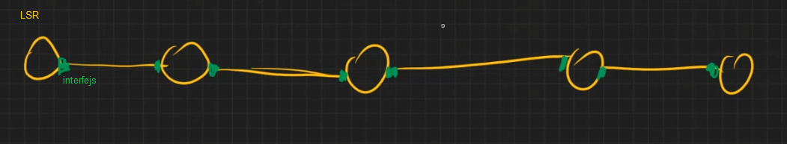

Każdy interfejs ma jakiś identyfikator lokalny, Np. w ćw BGP f0/0. Każdy interfejs też indetyfikowany, ma np. jeden lub więcej adresów IP. Każdy interfejs po drodze jest ?wskazywany?.

No i teraz wyobraźmy sobie, że zestwiamy połączenie, pomiędzy

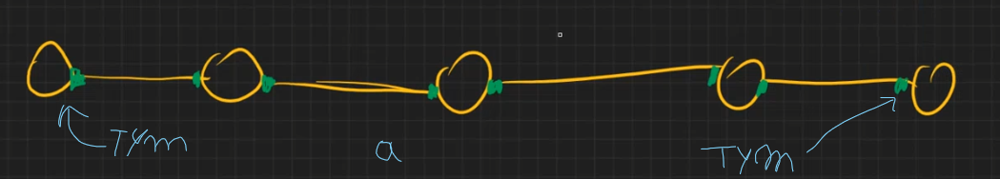

interfejsem.

**Jak to można zrobić?**

Na dwa sposoby:

**pierwszy**

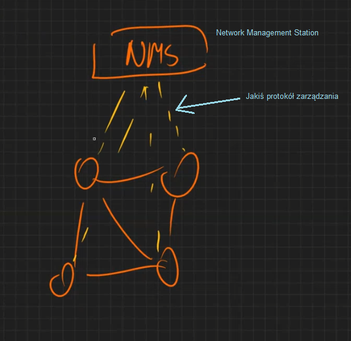

No i NMS na początku wymyśla routing, czyli wymyśla, którędy połączenie mają zostać zrobione a potem ustala FIB'y. Czyli pierwsza możliwość zestawiania połączenie to jest z MP. Koncepcyjnie jest to proste, ale nie bardzo pasuje to naszego tematu.

**drugi**

Tu zestawia Control Pane, a nie MP. Musi ona zrobić routing i także signalling, co jest signalling? No w przypadku MPLS, jest to sprawienie, żeby w każdym węźle pojawił się...

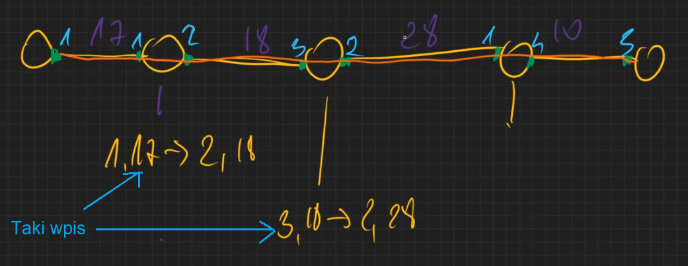

W przypadku realizacji z MP, to robi NMS. A tutaj jak?

Mamy dwa podstawowe protkoły do tego wykorzystywane:

- LDP - Label Distrubution Protocol
- RSVP - "Reservation" protocol

 Drygresja RSVP -  RSVP is an initialism derived from the French phrase Répondez s'il vous plaît, to require confirmation of an invitation..

Są jeszcze wersja wzbogacone o jakieś dodatkowe bajery, pomagające w realizacji Traffic Engineering'u

- LDP-TE
- RSVP-TE

Ale jak się spojrzy na to co one mogą, to się okazuje, że one są bardzo podobne.

"*No i .. już abstrahując już od walki szkoły Otwockiej z Falenicką*, to się okazuje, że RSVP przeżywa tą walkę natomiast LDP nie jest już rozwijany, pomijamy my go więc.

**Jak więc użyć RSVP, żeby zestawić połączenie?**

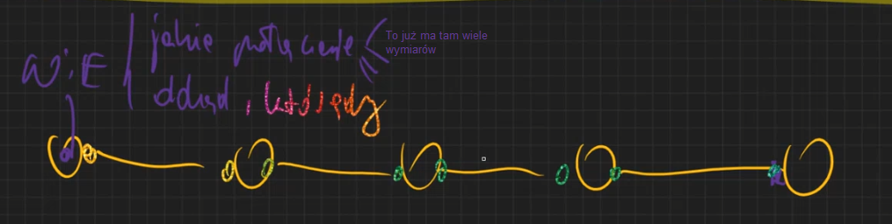

Załóżmy, że pewien węzeł wie jakie to ma być połączenie i dokąd  (zna interfejs ten fioletowy w ostatnim węźle) oraz którędy, załóżmy, że to którędy to jest sekwencja interfejsów, które też zna czyli po kolei jak na rysunku.

No i teraz ten węzeł, który **wie** wysyła wiadomość RSVP, która się nazywa **PATH**, no i w niej jest zapisane różne rzeczy: wygania na połączenie (pasmo, zabezpieczenia, inne) oraz taki obiekt, który się nazywa **ERO (explicit route object)**, w którym jest zapisane, że to połączenie przechodzi przez interfejsy w takiej kolejność jaki widzimy na rysunku wyżej.

No dobra, i co się dzieje dalej?

Drugi od lewej węzeł odbiera tę wiadomość PATH i przedłuża kolejny PATH do kolejnego węzła. Dzięki obiektowi ERO, każdy kolejny węzeł, wie gdzie dalej przekazać PATH.

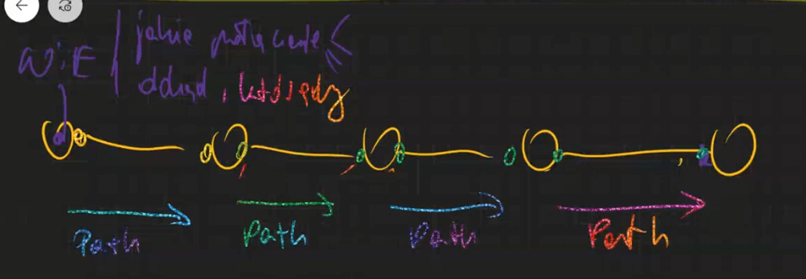

No i w końcu, PATH dociera do ostatniego węzła (ten który ma interfejs będący *dokąd* u węzła, który *wie*) i on godzi się na realizację tego połączenia (tak zakładamy teraz) i zaczyna odpowiadać - "Zgadzam się, wysyłam wiadomość **RESV** i jeżeli chcesz w tym połączeniu wysyłać to ustawiaj label na 10".

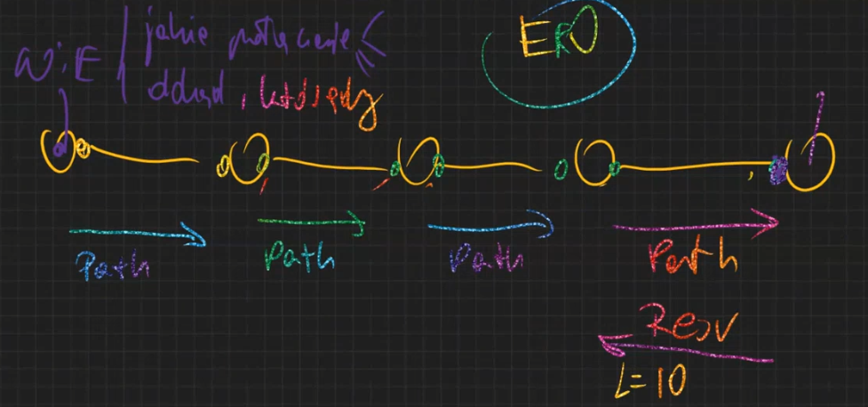

No i poprzedni router dostanie RESV i sam wyśle je też i tak w kółko

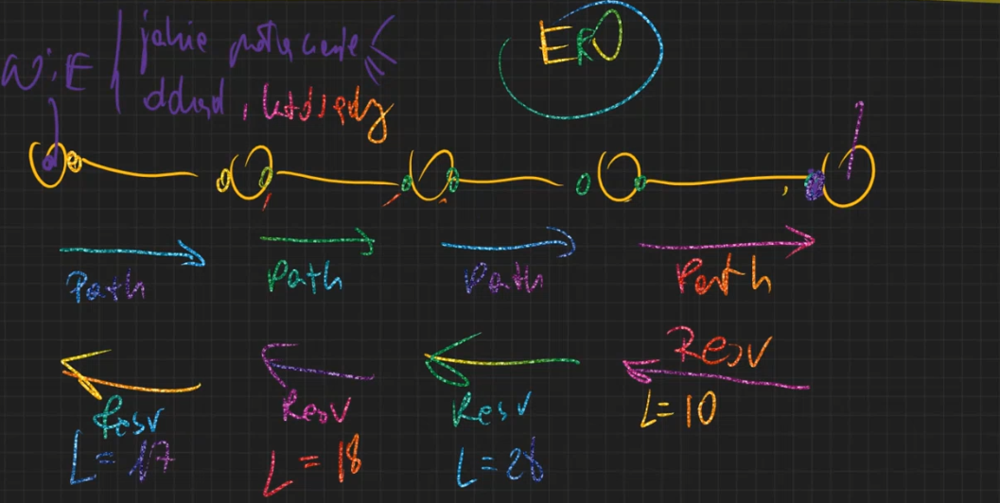

Cała zabawa jest inicjowana w węźle, który *wie*, potem PATHy lecą aż do węzła *dokąd*, sąsiedzi po kolei ofc. mogą już podjąć jakieś akcje przygotowawcze, ale no najpierw przedłużają PATH, na koniec, węzeł *dokąd* rozpoczyna zabawe w wysyłanie RESV (gdy wszystko gituwa) razez z etykietą (w naszym przypadku), po której rozróżniane będą pakiety.

Protokół RSVP należy do klasy protokołów **soft-state** (w przeciwieństwie do **hard-state**, nie trzeba przeprowadzać jawnego (przez admina) czyszczenia wpisu w FIB, gdy połączenie nie jest już potrzebne). Oznacza to, że taka sekwencja wymiany wiadomości PATH i RESC jak wyżej musi się wydarzać cyklicznie (T=10/15s). Każda taka sekwencja odświeża stan FIB'ów pozwalając tym wpisom, żyć przez następne 20/30s. Bo jeśli takie odświeżenie się przez dwa cykle nie pojawi, no to router jest zobowiązany "zapomnieć" ten wpis i zwolnić zasoby związane z tym połączeniem. Jeśli połączenie ma jakąś gwarancje na przepustowość to najczęściej na interfejsie wyjściowym jest odpowiednia kolejka utworzona, która gwarantuje tą przepustowość dla danego połączenia. Więc jedno co trzeba zwolnić to miejsce w FIB a drugie to tą kolejkę zmodyfikować.

Soft-state pozwala modyfikować te rezerwacje pasma w trakcie połączenia. Potrzeba więcej to prosimy i mamy, nie trzeba dużo to prosimy i cyk zmniejszamy bufory.

### Co jest to ERO?

**ERO** - sekwencja obiektów typu **abstract node**

A abstract node to może być:

- interfejs
- LSR
- subnetwork
- AS

Także w naszym casi'e ERO zawierał adresy interfejsów, ale w ogólności to może być AS i tak się uzyskuje w RSVP taki mechanizm co bym go nazwał {skalowalność, rekurencja, hierarchiczność}.

 Np.

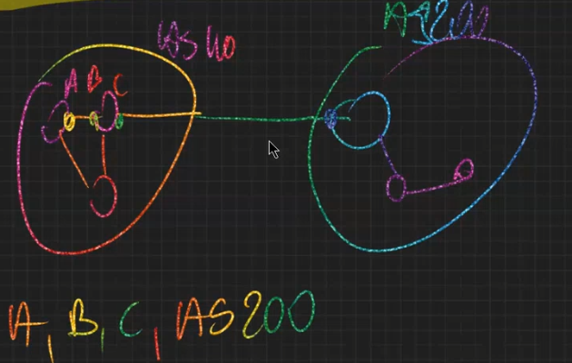

Tu ERO składa się z trzech LSRów i jednego AS'a. My to AS100

Każdy abstract node zawiera jescze **nop type specifier** ( specyfikator typu nop'a). No i mamy dwa typy: **loose** lub **strict**, luźny i dokładny i co to oznacza?

 Np.

 Specyfikujemy ERO na poziomie routerów 

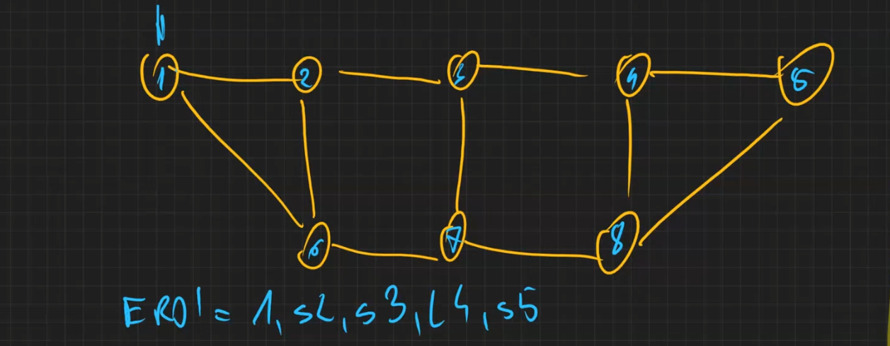

s - strcit, l - loose

To oznacza tyle, jak jestem w węźle 1 to ja musze strict pójść do 2, nic nie może być pomiędzy mną a 2. Ale ja już jestem w 3 to jest loose, mogę sobie pójść np. przez 7 i 8 albo od razu. A 4 znowu musi bezpośrednio do 5.

### Skąd się bierze to ERO?

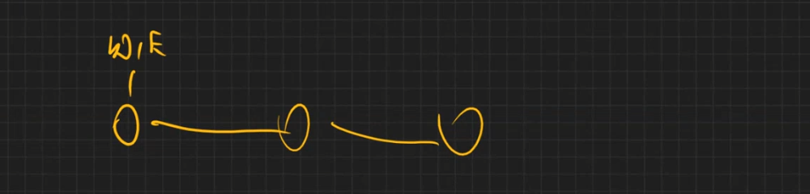

Skąd on wie?

Należy sobie wyobrażać, że gdzieś jest realizowana funkcja jak gdyby RC (Routing Controllera), który na podstawie wymagań połączenia i stanu sieci wyznacza nam sekwencję tych abstract node;ów. Ale w przypadku GMPLS, nie ma słowa RC, to było tylko info "dla nas - studentów", żeby sobie dobrze skojarzyć o co chodzi.

W przypadku IETF takim komponentem, który realizuje taką funkcję jest **PCE** (**Path Computation Element**). 

Może on być implementowany w routerze, może być w podsieci. 

 Np. w podsieci to by było tak:

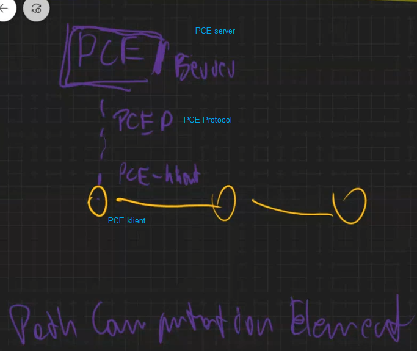

No i oni by sobie gadali, PCE klient mówi, do serwera parametry połączenia, a serwer daje ERO.

No i taka to jest rola PCE.

### Skąd PCE wie, jak sieć wygląda?

Topologia i w jakim stanie są łącza (w szczególność ile jeszcze dostępnej jest przepustowości na nich).

Znamy takiego zwierzaka jak OSPF. Dzięki OSPF routery wiedzą jak wygląda sieć. I teraz jeśli taki PCE uda dla jednego z routerów OSPF (lub więcej dla pewności), że też jest routerem OSPF, to oni też będą do niego gadać. PCE będzie wiedział to samo co każdy węzeł sieci. Do niego info routingowe też dotrze.

Więc ostatecznie PCE buduje sobie obraz sieci, który się nazywa **TDB ( Traffic DataBase)** i teraz jeśli ktoś go prosi o drogę z jakimiś parametrami stąd tam to on zagląda do TDB i jazda.

Jest tu pewien problem, bo Mycek mówił o paśmie o zapewnieniu niezawodności, a jeśli spojrzymy na rzeczy rozgłaszane przez OSPF, to tam takich parametrów nie ma. No więc co jest nam potrzebne? 

Nowy lepszy OSPF, który będzie zawiarał parametry łączy.

### OSPF-TE

OSPF-Traffic Engineering

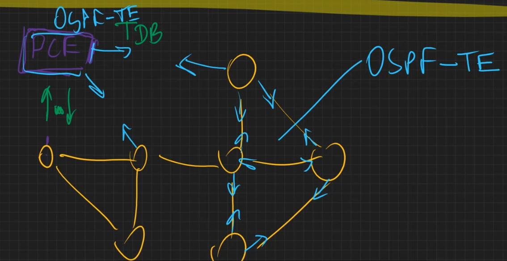

W OSPF-TE, obiekt który reprezentuje istnienie i parametry łącza, to nie jest łącze tylko to się nazywa **TE-Link**.

No i ten TE-Link ma parametry:

- administrative weight - waga administracyjna
- bandwidth - czyli jaką pojemność to łącze ma
- unreserved bandwith - ile tej pojemności jest dostępne w danej chwili
- max LSP bandwith - ile maksymalnie jedna ścieżka LSP może zażądać pojemność na tym łączu (po co to jest? *)
- resource color - lista kolorów (pul), do których łącze należy (po co to jest? **)
- SRLG -  Shared Risk Link Group (***) dowolnie wiele może ich być, tych SRLG.

fsd

*między dwoma węzłami jest wiele łączy, żeby nie reprezentować każdego oddzielnie wprowadzamy **bundle Link**. No i bungle-Link jest reprezentowany jako TE-Link, bandwidthy dotyczą całego Bundle-Link, natomiast zwróć uwagę, ze LSP nie może zająć dwóch **component linków**, może ona iść tylko jednym i to właśnie wyznacza pojemność dla jednego LSP, nie może ona przekraczać przepustowość pojedyńczego component linka.

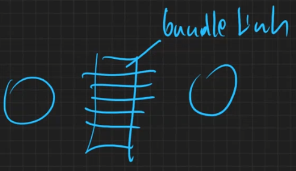

**mamy sieć i każdy kolor łącza pełni inną funkcję.

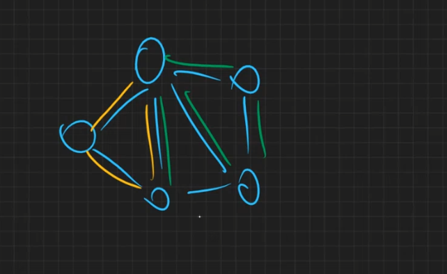

*** są dwa linki między węzłami i dwa połączenia podstawowe i zabezpieczające (żeby była niezawodność) no i każde pójdzie jednym z linków. Ale należy pamiętać, że to są łącza w danej warstwie sieci, czyli powstały w wyniku adaptacji warstwy serwera. No i jeśli powstaną one w wyniku adaptacji jednego trail'a. Jeśli ten trail padnie, to oba linki padną i wtedy lipa. Trzeba więc łącza tak łączyć w pary, żeby były różne SRLG, a dwa łącza mają ten sam SRLG, gdy powstały z tego samego traila. Grupa łączy ze wspólnym ryzykiem uszkodzenia.

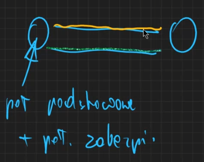

No dobra czyli PCE widzi topologie sieci jako węzły połączone TE-Linkami. Teraz jest pytanie jak opisuje się wymagania na zestawiane połączenia.

### Traffic Trunk 

Obiekt, który opisuje wymagania na połączenie, to co węzeł przesyła w żądaniu do PCE. 

Zestaw wymagań:

- bandwith - ile pojemność nam potrzeba (peak rate, average rate ...)
- resource class - (czyli kolory dopuszczalnych łączy)
- resistance (X, fault detection, fault notification, automatic recovery (hot-stand-by albo inne))
- priority (ważność)
- preemption  (active/passive) - czy połączenie powinno wywłaszczać inne połączenia istniejące o niższym priorytecie, w przypadku gdy nie można zrealizować tego połączenia

### CSPF

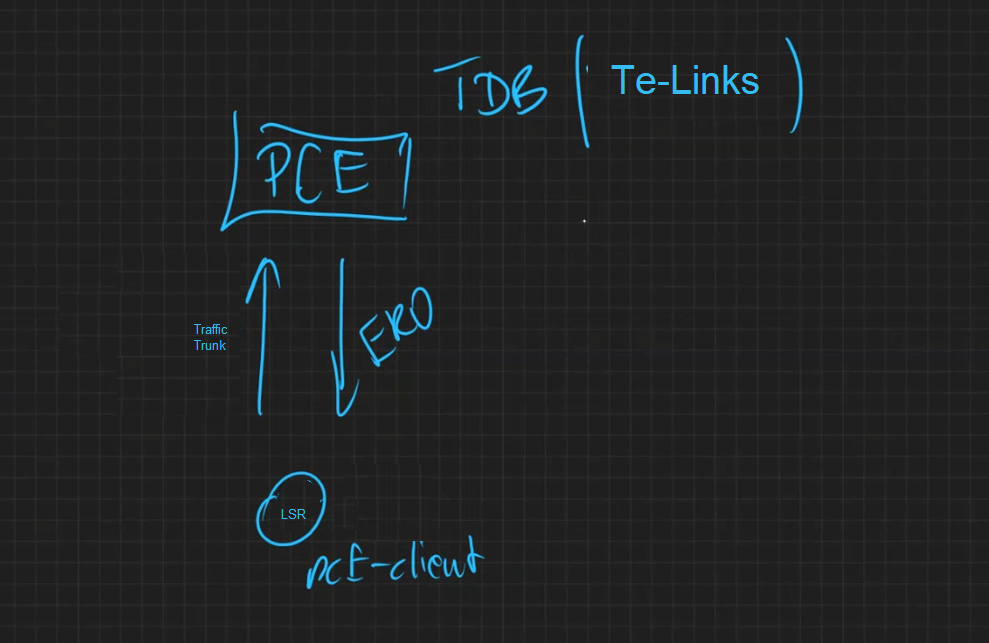

No więc, mamy już taki scenariusz, ale jak PCE wyszukuje te ERO?

Na podstawie metody, która się nazywa **CSPF** - **Constraint Shortest Path First**

No więc jako input mamy traffic trunk oraz TDB(czyli Te-Links), i jakie są podejmowane kroki

- Wyrzucam łącza w niedobrym kolorze, zbyt cienki
- A na reszcze wykonuje Shortest Path First

### Taka sztuczka na koniec

Można zrobić tak, że prowadząc między dwoma ruterami jakieś LSP, zrobimy TE-Link'a między nimi o np. tak

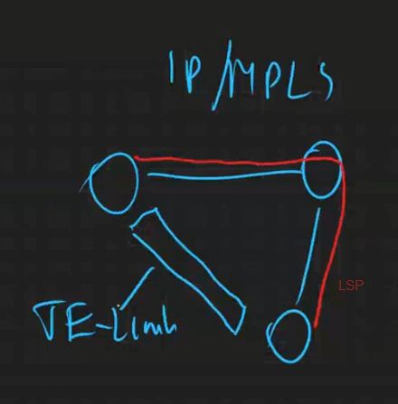

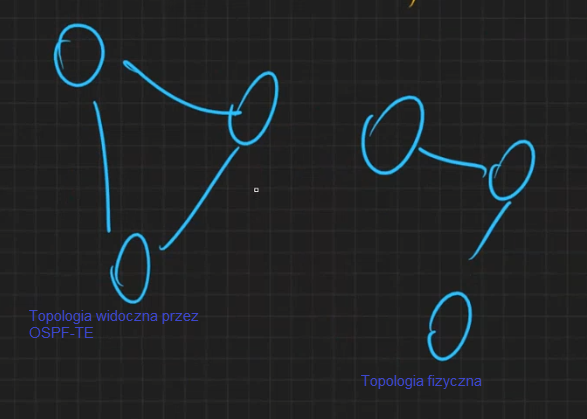

Takie sztuczne łącze, które powstaje na poziomie OSPF po udostępnieniu łącza LSP nazywa się **Forwarding adjacency**, takie dodatkowe sztuczne łącze, które wzbogaca nam topologie.

### Podsumowanie

 "Mineło półtora godziny, i już wyobrażamy sobie jaka działa zestawianie połączeń w płaszczyźnie sterowania przypadku zwykłego MPLS w sieciach IP/MPLS"

Mamy specjalny komponent **PCE** odpowiedzialny za routing. który dowiaduje się o topologi sieci, o **TE-Linkach** uczesnicząc w sesji protokołu routingowego **OSPF-TE** z jednym lub więcej węzłami i tym buduje sobie obraz sieci.

 Z drugiej strony węzeł, który chce zestawić połączenie prosi **PCE** o znalezienie drogi dla tego połączenia przekazując mu opis wymagań czyli **Traffic Trunk**. **PCE** tenteguje sobie w sposób **CSPF**, znajduje **ERO ** lub ich listę i zwraca do węzła. No i teraz węzeł na podstawie tego **ERO** korzystając z protokołu **RVSP**, próbuje takie połączenie zrealizować. Jeśli mu się nie uda bierze kolejne **ERO** z listy jeżeli taki mu **PCE** dostarczył.

## Adaptacja zasad MPLS do sieci WDM (Wavelength Division Multiplexing)

Taką adaptację czasem się nazywa **MPLS - Multi Protocol Lambda Switching.**

Na pierwszy rzut oka wydaje się to "kompletnie kaskaderskim zadaniem", ale załóżmy, że etykieta to długość fali

 Np. są 93 lambdy między dwoma węzłami, i węzeł odpowiada w RESV, ślij do mnie lambdą o numerze 17

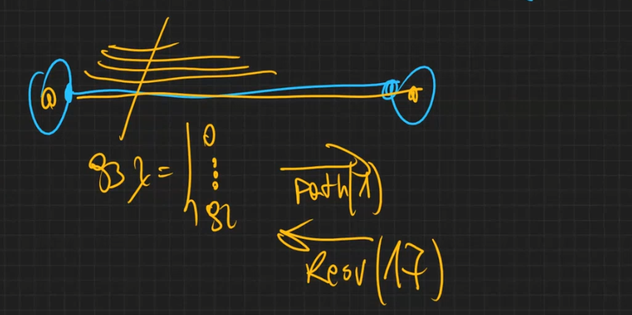

Jest cały zestaw rzeczy, z którymi sobie trzeba poradzić robiąc takie założenie.

#### 1

W IP/MPLS, jeżeli są obok siebie dwa węzły to mają one ze sobą **adjacency** (sąsiedztwo), jeżeli istnieje między nimi łącze to to się nazywa **data adjacency** z tego sąsiedztwa wynikają dwa inne:  w sensie **routing adjacency** jak i **signalling adjacency**.  Czyli, że w ramach rutingowe sąsiedztwa mogą one gadać OSPF-TE, ale też RSVP w ramach sąsiedztwa sygnalizacyjnego.

Ale już krosownice mają interfejsy optyczne, między którymi z założenia nie istnieje sieć pakietowa. Tutaj z data adjacency wcale nie wynikają routing i signalling adjacencies.  Więc, żeby krosownice mogły sobie pogadać musi między nimi istnieć jakiś *packet network*. Ofc może ona wykorzystywać kanał zrobiony na jednej z tych lambd, ale może to być też całkowicie odizolowana sieć. 

No i teraz tak, jak w IP/MPLS padnie kabel, to węzły do niego podłączone, od razu o tym wiedzą. W WDM jeśli sieć sygnalizacyjna jest izolowana, to jeśli lambdy padną,  i informacja użytkownika nie jest przesyłana to węzły mogą w ogóle tego nie zdetekować.

Więc pierwszą komplikacją jest to, że musimy zorganizować sieć do sygnalizacji i routingu oraz to, że awaria na poziomie transportowym wcale nie jest widoczna na poziomie sterowania.

Żeby się dało opanować to rozłączenie, rozgraniczenie sieci sygnalizacyjnej i sieci transportowej to między krosownicami na potrzeby adaptacji do sieci WDM wprowadza się dodatkowy protokół, który się nazywa **LMP - Link Management Protocol** 

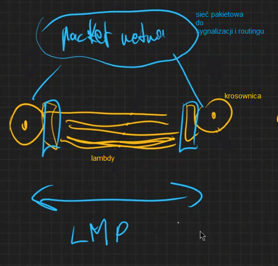

I krosownice gadają tym protokołem, żeby ustalić identyfikatory tych łączy po obydwu stronach, stan łączy, zajmują te łącza (tzn. że jakby ktoś chciał z drugiej strony to łącze, to nie bo zajęte), sprawdzają czy awarie są (śledzą stan)  i się o tym informują.

**Więc trzeba zrobić sieć sterowania (ona musi być pakietowa) i protokół LMP**

#### 2

 Drugi problem to takie, że jak mamy dwa węzły i między nimi dwa światłowody

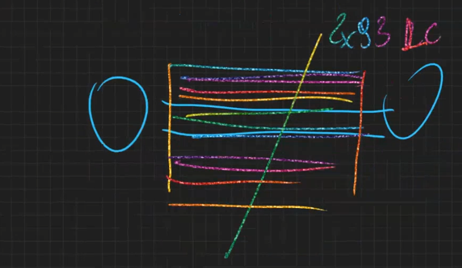

To to jest 93 Link Connections (w kategoriach G.805). Więc nie damy czegoś takiego do OSPF-TE, no bo on by sobie z taką ilością nie poradził.

Żeby to ominąć wprowadzamy **Bundle link**, który się składa z **component linków** (to już było wspominane). I na poziomie OSPF-TE reprezentujemy Bundle link jako TE-Link.

**Więc trzeba używać Bundle Linki jako TE-linki, a nie pojedyńcze lamdy**

#### 3

Żeby realizować połączenie to trzeba znać adresy interfejsów, natomiast w WDM takich adresów nie ma. Więc co się robi?

**Więc adresujemy interfejsy optyczne jako 32bitowe albo adresy IPV4 albo numbered (czyli liczba po prostu)**

#### 4

WDM wprowadza pewne ograniczenia komutowania.

W urządzeniach MEMS, jedną z cech takiego switch'a jest to, że potrzebuje on 10ms, na to, żeby lusterko po obróceniu się przestało drgać. 

No a przecież przez 10ms to może tyle przesłać, że ooo Panie.

no więc podczas zestawiania połączenia używa się takiego patentu **label suggestion**

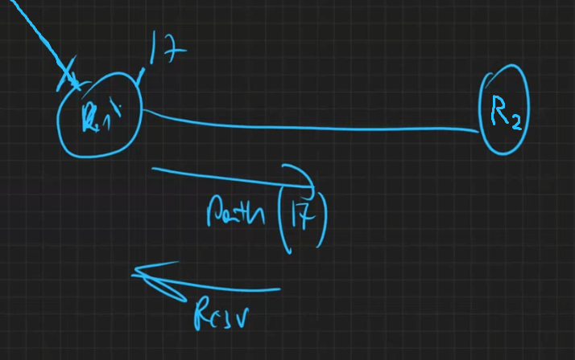

Czyli R1 wysyłając PATH zasugeruje "Słuchaj, jeśli możesz to weź Ty użyj 17" i od razu ustawi u siebie lusterko na taki case, jakby tam udało się 17 ustalić na łączu. No i jak R2 dostanie PATH to jeśli się da to ustawi 17 i w RESV o tym powie, że git i mamy wtedy zaoszczędzony czas ustawiania lusterka u R1. A jeśli się nie uda R2 ustawić 17, no to no cóż, nie tym razem.

**Więc w RSVP trzeba używać mechanizmu label suggestion**

#### 5

WDM wprowadza pewne ograniczenia komutowania.

Urządzenie MEMS, może nie być w stanie wszystkich lambd obsłużyć ograniczenia sprzętowe.

no więc, węzeł może w PATH podać, jakie lambdy mu pasują i powiedzieć "Słuchaj, użyj lambd z tego zbioru {zbiór}, bo inaczej to lipa".

To się nazywa **label restrcition **

**Więc w RSVP trzeba używać mechanizmu label restrcition **

#### 6 

Zazwyczaj jest tak, że łącza optyczne są robione jako dwukierunkowe. W związku z tym jest takie rozszerzenie do RVSP, że router R1 do PATH dokleja jaką lambdę trzeba użyć do połączenia w tą stronę (do niego), a R2 w RESV mówi jaką lambdę w jego stronę. 

**Więc w RSVP trzeba stosować to rozszerzenie **

## Jakie jeszcze można zrobić adaptacje GMPLS oprócz WDM

W ramach GMPLS'a klasyfikuje się sieci wg. nastepujących typów tzw. **Switching Capabilities**

- PSC (P-packet) np. IP/MPLS
- LSC (L-lambda) np. WDM
- TDM (Time division multiplex) np. SDH
- L2SC (L2 - Layer two) np. Ethernet
- FSC (F-fibre) np. AFDM

1:58:30 - 2:04:40 Podsumowanie architektur