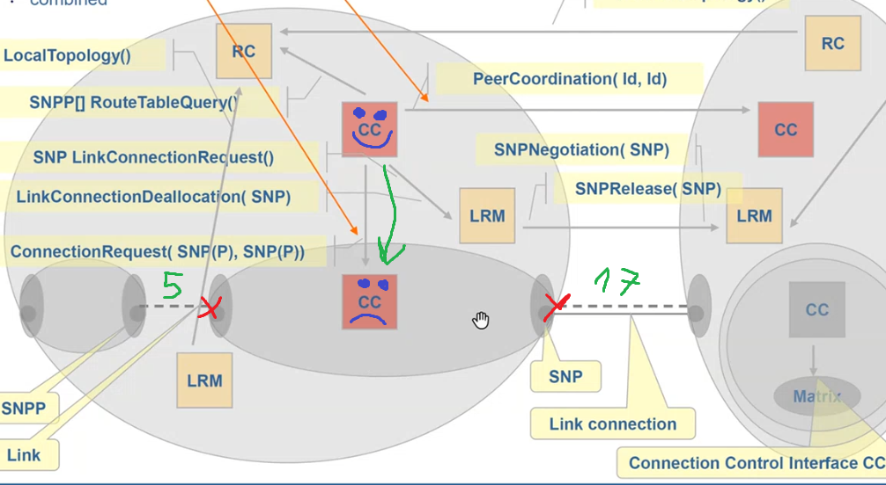
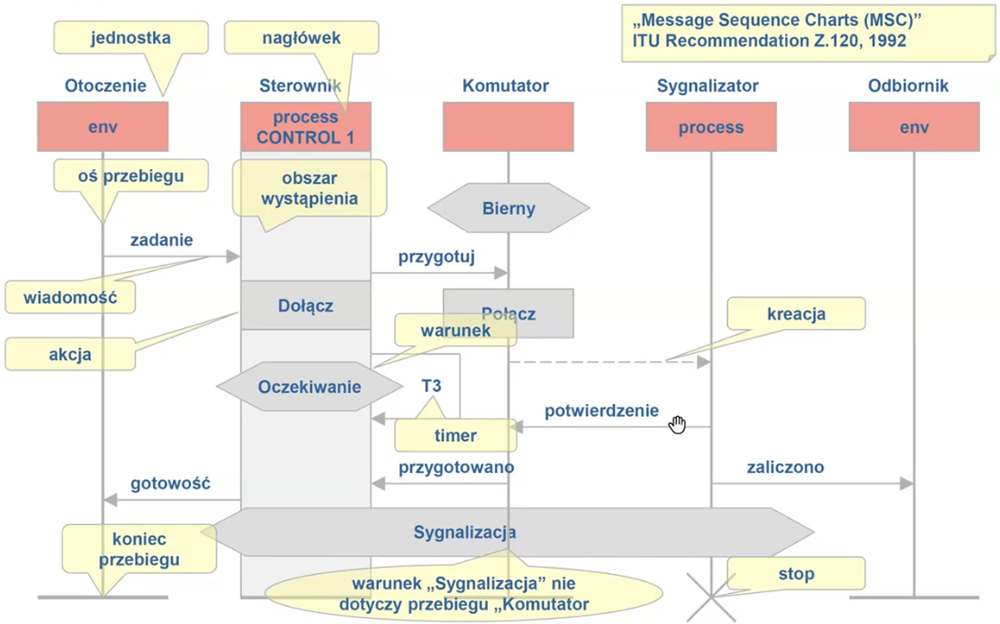
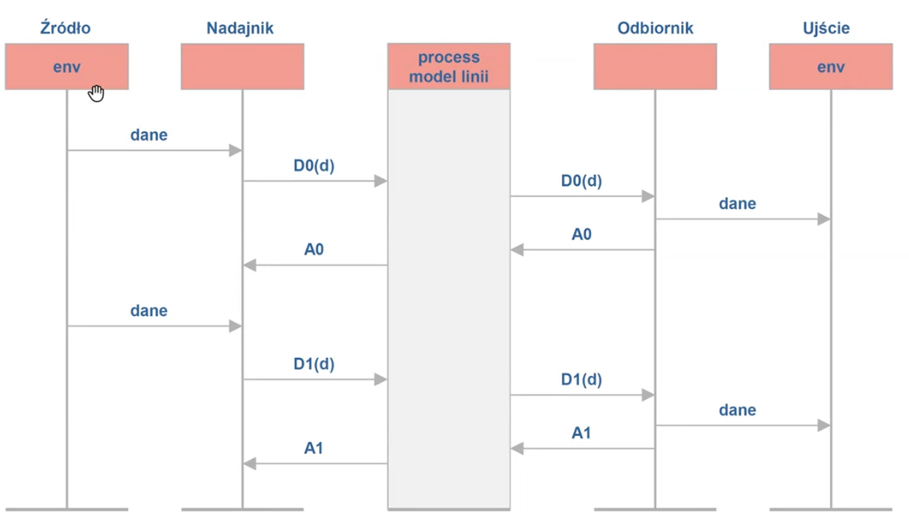
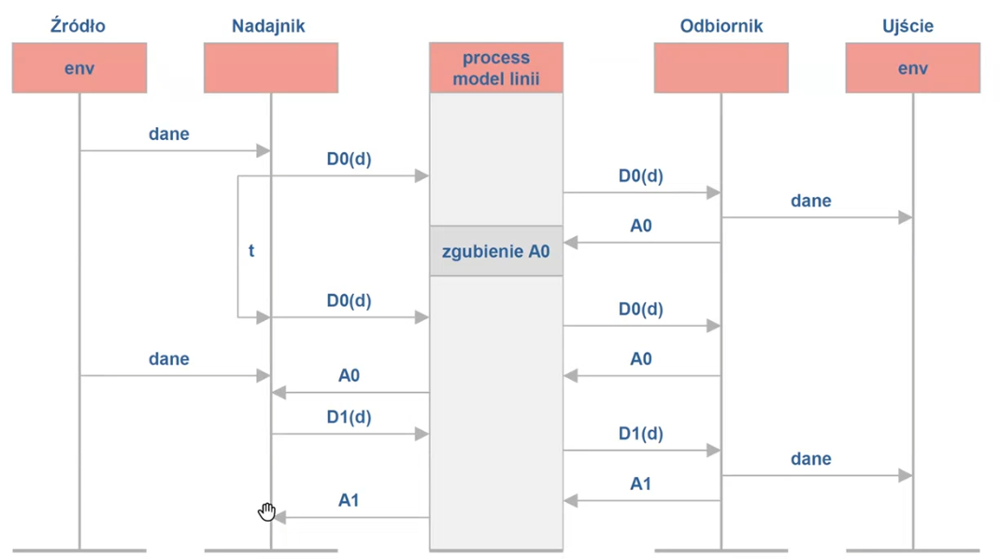
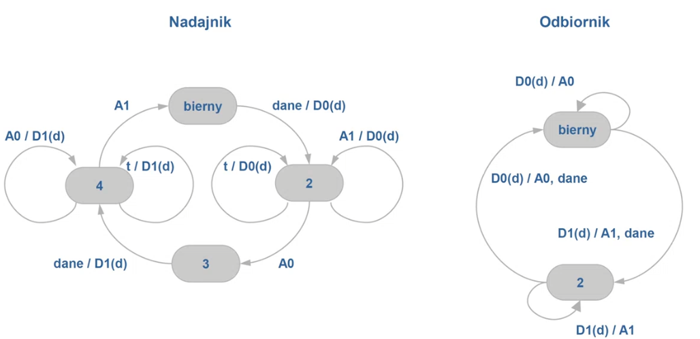
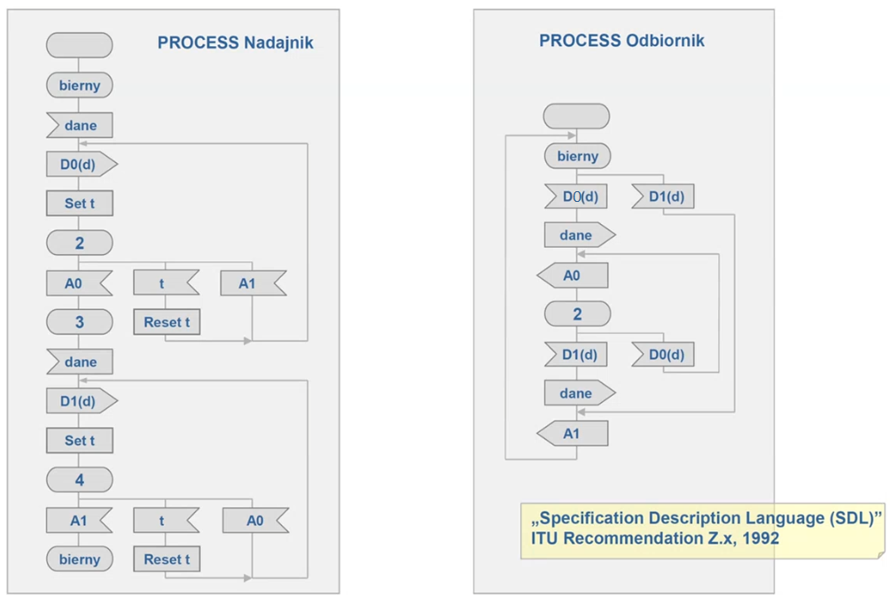

TSST 7

## Projekt 2

NCC jest 1 na całą domenę.

CPCC (calling party call control) jest w kompie u Abackiego, a CPCC (called party call controller) u Babackiego. Ich adresy to adres portu po stronie sieci, do którego podłączeni są oni. 

D i P przechowują bazy danych. D odtwarza, że Abacki to adres x, a Babacki to adres y. P - czy zgłoszenie można obsłużyć czy trzeba odrzucić.

Kolejny proces w projekcie - proces do sterowania (który ma kompenenty NCC, P i D).

Każdy styk to tak naprawdę dwie wiadomości np. 

DirectoryRequestŻądanie z parametrem Name, a druga to DirectoryRequestOdpowiedź z parametrem wyjściowym (translacja DNS). 

Jak już zestawione zostanie połączenie, to Babcki dostaje CallAccept - "czy akceptujesz takie połączenie?"

"Na ogół poradzenie sobie ze złożonością do wprowadzenie hierarchi".

LRM - Link Resource Manager

Gdy np. technologią trensportową jest MPLS to CC wesoły mówi do CC smutnego zrób tam u siebie połączenie między portem 'x' i 'y' natomiast wiedz, że na łączu wchodzącym do 'x' jest etykieta 5 (no i 100 Gbit/s jest wykorzystywane) , a na wychodzącym '17' (i 100Gbit/s też).

!note that! już wiadomo, że między domenami będzie 17 więc chyba najpierw robisz CC tego samego levelu globalnie (w sensie w innych domenach też), a dopiero potem rekurencyjnie wewnątrz domen równolegle. **Albo** (to prawda jednak) po prostu sobie teraz założylim 17 i potem jak już u siebie wszystko zestawimy to tak damy domenie sąsiad.

Jeśli rekurencyjnie dojdziemy do węzła, to jego funkcja CC zamienia się nie w wywoływanie RC i potem CC niższych tylko zrobić wpisy w FIB. 

**CallTerdown** wysyła CPCC żeby zakończyć połączenie.

Styk którym komunikują się RC to **NetworkTopology()**

LRM muszą informować RC o stanie łącza. A ktoś powie, że przecież RC wie, że tu jest zestawiane, NIE ON NIE WIE, on wie, że CC go spytało o drogę, ale CC może zapytać RC o dwie drogi a potem sobie wybrać co zestawi. 

**Jakie są komponenty i za co one odpowiadają**

CallingPCC - odpowiada za to żeby zainicjować całe połączenie

NCC - sprawdza wszystko co się da posprawdzać, żeby wiedzieć czy takie zgłoszenie można obsłużyć.

Najważniejszy jest CC - zestawia połączenie, ale on potrzebuje komponentów pomocniczych:

- RC, który mu powie jaka jest trasa dla połączenia.
- LRM, który mu zaalokuje zasoby na łączu.

 1:00:46 Tu jest druga częśc 

## Specyfikacje systemów

Chcemy móc zdefiniować zachowania i strukturę systemu. Rodzaj systemu jaki nas interesuje to taki, który składa się z wielu jednostek. Przykładem takiego systemu jest właśnie płaszczyzna sterowania naszej sieci, gdzie jest wiele komponentów, które się ze sobą komunikują

Pierwszą metodą są diagramy MSC

### Diagramy MSC

Jeden diagram MSC nie specyfikuje całego systemu a jedynie pojedyńczy scenariusz zachowania systemu. W związku z tym najprawdopodobniej nie jesteśmy w pełni za pomocą tych diagramów wyspecyfikować system. Możemy wyspecyfikować wiele różnych scenariuszy, ale w szczególność ich liczba może być nieskończona.

#### Kiedy my to stosujemy

Żeby pokazać najważniejsze scenariusze. Wyrazić takie najbardziej typowe zachowania systemu. Przygotowywuje się pewną liczbę scenariusz tych najbardziej typowych, przy tworzeniu systemu. Ale potem jak się już system testuje, to oprócz nich, są też scenariusze, sytuacji nietypowych, np. system napotka błąd.

**Jednostka** to prostokącik, ma ona nagłówek.

Możemy w scenariuszu umieścić jednostki co nie tylko należą do naszego systemu, ale mogą to być też jednostki innych systemów lub ogólnie nazwane otoczenie.  *env* - oznacza, że to nie należy do systemu.

Możemy się posługiwać nie tylko osią przebiegu ale też obszarem wystąpienia.

**Wiadomość** - strzałeczka, od osi przebiegu jednostki wysyłającej wiadomość, do osi jednostki otrzymującej wiadomość. 

Jednostka przyjmuje i wysyła wiadomość, ale też wykonuje pewne **zadania**, oznaczone jako prostokąt na osi przebiegu/obszarze wystąpienia.

Wielokąt to to **stan/warunek**, np. Control 1 po wykonaniu zadania jest w stanie oczekiwania

Warunek może dotyczyć pojedynczej jednostki natomiast warunek *sygnalizacja*, dotyczy jednostek: CONTROL 1 i process. Nie dotyczy Komutatora, bo jego oś przebiegu przecina ten wielokąt 

Jedna jednostka może utworzyć inną to się nazywa **kreacja** i wtedy jest przerywana strzałka. Czyli *process* istnieje dopiero od momentu strzałki kreacja, do X, ale tą oś przebiegu i tak się rysuje, bo co miało by tam być pusto?

*T3* - kreska pozioma wyżej to symbol ustawienia timeout'u. Kreska pionowa to upły timeoutu, a kreska pozioma niżej (ze strzałką) to upłynięcie timeout'u.

Upłynięcie timeout'u to tak jak przyszła do nas wiadomość - "upłynął czas, który ustawiłęś" i to możę spowodować, że jednostka podejmie jakieś działania.

#### Upływ czasu

My na tym scenariuszu nie obrazujemy ile czasu upłynęło, istotne jest to, że czas płynie niejako w dół. Im coś jest niżej tym jest później, dla nas istotne jest co jest po czym, związki przyczynowo skutkowe, że coś jest wcześniej a coś później.

#### Przykład

System przesyłu danych. Jest zasilany danymi przez źródło, jednostka należąca do otoczenie systemu (*Źródło - nazwa jednostki, env - nagłówek jej*). W tym systemie jest taki protokół, że dane wysyłane są naprzemiennie z flagą 0 lub 1 i jeśli dane zostały odebrane to jest wysyłanie potwierdzenie z taką samą flagą i nie wolno wysłać kolejnych danych, dopóki nie przyjdzie potwierdzenie.

Źródło robi dane, Nadajnik je wysyła protokołem model lini cykenes je wysyła, Odbiornik stwierdza, że są oporawnie, przekazuje dalej i wysyła potwierdzenie, które idzie przez model lini do Nadajnika. Jeżel chwilę później Nadajnik otrzyma kolejne dane do wysyłki no to cykenes to samo.

To jest taki najprostszy scenariusz, który pokazuje zasadę działania naszego systemu/protokołu.

A tu mamy scenariusz niepoprawny, który pokazuje jak system zareaguje na zgubienie A0. 

Tego nie było na poprzednim diagramie ale Nadajnik po wysłaniu ustawia timeout, jeśli on upłynął przed dostaniem A, to nadajnik wysyła jeszcze raz. Odbiornik widzie, że to są te same dane, bo flaga ta co poprzednio, odsyła potwierdzenie, ale danych do Ujścia nie przekazuje, żeby ich nie zdublować.

W między czasie Nadajnik otrzymał nowe dane do wysłania ale nie mógł ich wysłać i zrobił do dopiero po otrzymaniu A.

### Diagram stanów i przejść

Ten sam przykład. System prezentujemy jak automat przejść. Automat, czyli ma zbiór stanów i realizuje przejścia między tymi stanami na skutek otrzymywania wiadomości. 

**Slash np. t/D0(d)** - pokazuje jaka jest wiadomość przychodząca a jaka wychodząca.

Strzałki podpisują jaką trzeba dostać wiadomość żeby przejść z jednego stanu w drugi.

Sytuacja przykładowo w stanie 2, że dostajemy A1 zamiast A0, może zdarzyć się wiele razy i tutaj jesteśmy w stanie coś takiego sobie wydumać, a w MSC nie bardzo.

Diagram stanów i przejść w pełni specyfikuje co się dzieje z jednostką. Wszystko co się może z jednostką stać jest tu widoczne.

Na MSC widzieliśmy wiele jednostek ale to był tylko jeden scenariusz.  Tutaj widzimy tylko jedną jednostkę, ale ten diagram wyraża wszystkie scenariusze w jakich ta jednostka bierze udział.

### SDL

Tutaj też mamy do czynienia z automatem, ale to jest automat rozszerzony dlatego, że on ma znaczenie więcej symboli i więcej typów kroków między stanami. Tam był tylko stan i przejścia. Tutaj mamy te symbole, które pojawiały się w MSC.

Każda jednostka jest specyfikowana w postaci oddzielnego automatu, w pełni on oddaje zachowanie jednostki. Jak chcemy widzieć zachowanie systemu, to musimy analizować zachowania różnych jednostek. W przypadku SDL mówimy na jednostkę, że to proces.

**Stan ** - to owal, każdy ma nazwę poza początkowym.

Proces może być albo w stanie albo w przejściu.

Jeśli jest w stanie to czeka na sygnał/wiadomość i jeśli ją dostanie to wykona tzw. **operację wejścia** czyli skonsumuje wysłaną do niego wiadomość. 

Jeśli wykona operację wejścia to wykona przejście znowu przechodząc do jakiegoś stanu. Więc proces czeka na wiadomość w zależność jaka przyszła, wykonuje odpowiednie przejście i znowu jest wchodzi do pewnego stanu.

Podczas przejścia proces może np. wykonać **operację wyjścia**, czyli wysłać jakiś sygnał do jakiejś jednostki, może również wykonać pewne zadanie.

Np. ze stanu *bierny* *Nadajnik* wykonuje zadania ustawienie timera, i przechodzi do stanu 2, w nim czeka na wiadomość. Jedną z nich może być upłynięcie timera, wtedy resetuje timer i wraca w odpowiednie miejsce. 	

W stanie 3 dzieje się to samo co w stanie bierny tylko w odniesieniu do flagi 1 a nie 0.

#### Idea SDL

Idea SDL była taka, że tworzy się takie SDL diagram w jakiejś apce, przeciąga bloczki, apka sprawdza syntax, czy dobrze wszystko jest poukładane.

I jak się skończy to są dwie opcje:

- uruchomić taki system, wysyłać mu sygnały patrzeć co i jak.
- wygenerować na podstawie tego systemu kod, gotowy do kompilacji.

Więc prawdziwa specyfikacja skoro ma prowadzić do kodu jest ogromna i ma dużo więcej symboli.

#### Struktura systemu - specyfikacja statyczna

SDL może też oprócz zachowania jednostek pokazać strukturę systemu. Jak jednostki są połączone ze sobą, jak zhierarchizowane.

Są notacje SDL:

- Graphical Representation - SDL/GR
- Phrase Representation - SDL/PL

W rzeczywistości jak używa reprezentacji graficznego to pod spodem jest kod.

Specyfikacja dynamiczna - zachowanie systemu

Specyfikacja statyczna - struktura systemu, jak są rozmieszczone procesy, i kto z kim gada.

System składa się z bloków, fizycznie to by było komputery, na których uruchamialibyśmy nasze procesy. W ramach bloków wykonują się procesy.

Bloki łączone są **kanałami komunikacyjnymi**. Następne pojęcie to **droga komunikacyjna**, to fakt, że dwa procesy mogą się komunikować. Łączy ona albo dwa procesy w bloku albo proces z kanałem komunikacyjnym.

Jakie **wiadomości** są przesyłane między procesami, to też tu można zdefiniować.

#### Podsumowanie

Najpierw robi się specyfikację statyczną, potem dynamiczną. Potem generuje się kod na podstawie SDL i wkłada się go do konkretnych urządzeń systemu, które mają konkretne procesy.