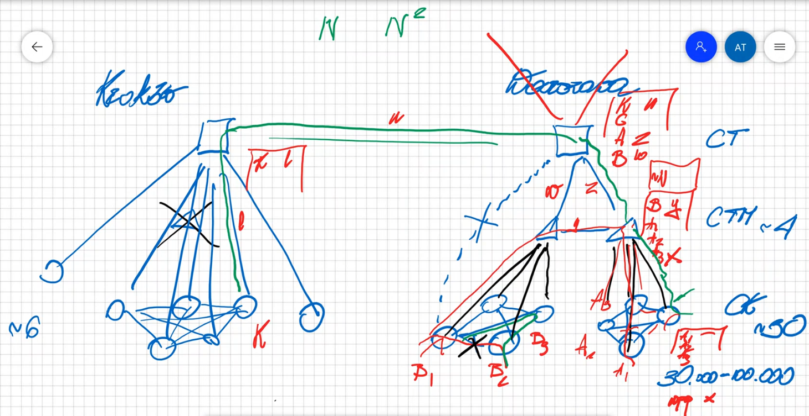

# TSST 8

## Routing, kierowanie ruchu, połączeń

### Co będzie na wykładach

Główną funkcja warstwy sterowania jest zestawianie połączeń. Są różne typy sterowników, każdy za coś odpowiada, jeden za konfigurację połączenia (czyli chyba, kto do kogo, jakie paramsy), inny za znalezienie trasy dla połączenia. Dzisiejszy wykład poświęcony jest głównej mierze jednemu z tych komponentów i usługami jakie świadczy pozostałym.  Kolejny wygład to będzie jak zapewniać niezawodność sieci, między innymi jak automatycznie naprawiać połączenie, gdy uszkadzają się łącza. Z tym powiązane są algorytmy, o których opowiemy sobie na jeszcze następnym wykładzie. Ostatni wykład to organizacja węzłów sterujących.

### Punkt wyjścia do dzisiejszego wykładu

Była omawiana Control Plane w szczególności ASON. Szereg komponentów, tam było powiedziona jaka jest rola każdego z nich i jakie są scenariusze między nimi. Bazując na omówieniu przez Mycka i AT płaszczyzny sterowania w architekturze ASON oraz specyfikacji systemów zastanowimy się jak dobierać trasy dla połączeń.

Są albo bardzo proste sposoby (niektóre stosowane w telefoni kiedyś) albo bardziej skomplikowane, gdzie sterownik routingu RC dobierając trasy korzysta z info, które dostarcza mu LRM (np. LRM może powiadamiać, że 60% pojemności już jest zajęte).

### Na początek taki slajd

Są tu pokazane różne strategie doboru dróg. Te 3 rysunki na dole. Strategie organizacji sterowników rutingu, odziaływanie między nimi i jakimiś innym komponentami na przykład sterownikiem zarządzania.

#### Czym powinniśmy się kierować dobierając drogę dla połączenia

Zacznijmy od tego potem rysuneczki. Wiemy że połączeniem będzie leciał strumień danych.

- na pewno chcielibyśmy zapewnić jakieś paramsy obsługi temu strumieniowi, powinniśmy drogę znaleźć taką, żeby łącza na tej drodze nie były przeciążone, najlepiej, żeby była słabo-wykorzystane bo wtedy mamy dużo przepustowości, więc jakość będzie gitem.
- trzeba zdawać sobie sprawę z tego, że ruch się cały czas w sieci zmienia, więc trzeba przyjąć jakieś strategie/algorytm, która uwzględnia te zmiany i za nimi podąża, przystosowuje do stanu sieci
- jako operator musimy zadbać, żeby zasoby, za które zapłaciliśmy były jak najefektywniej wykorzystywane, co się trochę kłóci z pierwszym kryterium, bo musimy zadbać, żeby urządzenia były dobrze obciążone bo inaczej niepotrzebnie za nie płacimy. Chcemy zasobów dać jak najmniej, żeby zapłacić jak najmniej. Więc jeśli gdzieś są wolne zasoby to powinniśmy starać się je wykorzystywać.
- nie tylko ruch się zmienia ale i sieć. Pojawiają się awarię, np. łącza. Trzeba je uwzględniać przy doborze ścieżek.
- to wszystko nie może być zbytnio skomplikowane, no bo ktoś musi tym zarządzać, im jest bardziej skomplikowane tym większe pstwo, że coś pójdzie źle. Kiedyś to ludzie wypełniali tablice. Duże pstwo pomyłki. Teraz wszystko leci z automatu, więc pomyłki nie ma, ale im bardziej skomplikowany algorytm tym dłużej się on wykonuje, trzeba zdawać sobie z tego sprawę. Jeżli RC dostaje "wylicz trase", to nie może wykonać zbyt skomplikowanego algorytmu, bo jego odpowiedź byłaby po zbyt długim czasie.
- nie tylko ruch i stan zasobów się zmienia, ale i też ilość zasobów. To też trzeba sobie z tym poradzić.

#### Jak sobie z tym radzono

##### rysunek 1

- On obrazuje sytuację w sieci telefonicznej. 

- Zasada (przekładając na terminy z ASON) była tata:
  - W każdym węźle DP jest CC i RC. RC wykorzystywał pewną tablicę. Z centrum zarządzania my ludzi ładowaliśmy tą tablicę.
  - I teraz tak jak CC w węźle dostawało zestaw lub przedłuż połączenie to on zazwyczaj pytał RC "jaki jest następny węzeł na trasie połączenia?".  CC zestawiał połączenie przez ten swój węzeł (czyli w ustawiał, żeby z portu x kierować to połączenie na port y, bo znał od RC następny węzeł). Następnie komunikował się z CC w następnym węźle i mówił mu "przedłuż połączenie dalej do jakiegoś destAddress". No i ten następny węzeł ta sama akcja.

- Metoda zwana **link-by-link**, czy też **step-by-step**.
- RC wiedzę posiada od centrum zarządzania, wyliczamy w niej zawartość wszystkich tablic dla wszystkich RC. Albo robimy raz na dłuższy czas i sieć działa. Te tablice są na tyle bogate, że nawet jak jest awaria to RC wie co robić. Albo cetrum zarządzania zmienia cyklicznie, co kilka dni.
- Algorytmy tu są proste, RC tylko zagląda do tablicy.

##### rysunek 2

- obrazuje sieć Internet
- Zasada (przekładając na terminy z ASON) była tata:
  - W każdym węźle jest RC i CC. Ale RC tutaj są bardziej pro. Potrafią się między sobą komunikować (są różne protokoły albo **Adress-Distance-Vector** (wymienia się info jaka jest odległość do danego adresu) albo **Link-state-vector** (wymienia się info nie o osiągalność adresów tylko o stanie łączy w sieci, wszystkich które znają, RC wie o swoich łączach oraz o tych o których wie od sąsiada).
  - RC na podstawie tych info wylicza sobie trasy w:
    - ADV - RC wie czy przez danego sąsiada można dotrzeć do danego adresu i jaki jest koszt tej drogi
    - LSV - RC wie o stanie łączy i na tej podstawie jest w stanie sobie powyliczać trasy łącznie z ich kosztami

##### rysunek 3

- odpowiada sieci optycznej, gdzie są nie tylko trzeba znaleźć trasę prowadzącą do DesAddr, ale również znaleźć zakres długości fali bezkonfliktowy, dobrać odpowiednio modulację. Ogólnie zagadnienie jest skomplikowane.
- Zasada (przekładając na terminy z ASON) była tata:
  - W węzłach są tylko CC, natomiast nie ma RC. Jest on tylko jeden, funkcja RC a wyniesiona jest do pojedynczego komponentu. Jest po prostu jakiś serwer, on ma bazę danych, różne algorytmy i interfejsy na których każdy CC z węzła może zapytać go o trasę do określonego adresu.
- Scentralizowany sterownik Routingu (Routing Controller), często nazywany **Path computation server**, żeby podkreślić, że w tej sieci mamy oddzielny serwer do wyliczania ścieżek.

Tablica kierowania połączeń, to jest coś innego niż tablica połączeń. Tablica tuneli to jest coś innego niż tablica tuneli.

Węzeł K dostaje żadanie połączenia do adresu A. Pyta on RC o drogę i są dwie opcje

- **Explicit path** - RC zwróci mu całą ścieżke i węzły po drodze nie będą musiały już drugi raz RC o to pytać. Droga została wyznaczona raz
- RC zwróci tylko pierwsze łącze (czyli X). Skąd on mógł to wziąć? No np. ma taką tablice gdzie są 3 kolumny. W pierwszej *jaki węzeł pyta*, No np. pyta węzeł K, w drugiej *adres docelowy, czyli dokąd trzeba trasę znaleźć* no np. A, w trzeciej *identyfikator łącza, które będzie na tej drodze* no np. x.

Wtedy CC do tablicy połączeń węzła K robi wpis:`łącze_wchodzące etykieta_wchodząca łącze_wychodzące etykieta_wychodząca`.

CC przepyta LRM od łącza x, daj mi wolną etykietę. Potem CC kontaktuje się z CC węzła L i mówi mu "mamy zestawić połączenie do adresu A, połączenie jest na łączu między nami 'x' i ma tam numer 'n'".

RC ma tablice jak wyglądają ścieżki z każdego węzła który może zapytać, do każdego adresu o jaki może zapytać. Czyli np. ścieżka z węzła L do adresu A, zaczyna się łączem 'y'. Ta tablica może też być bogatsza, np. bool czy łącze jest sprawne i wtedy mieć kilka opcji dla danego węzła jak spyta  o dany adres i dać mu takie co nie jest zepsute. Jeżeli te łącza są uporządkowane, to jak idzie zapytanie do RC to on bierze pierwsze nieuszkodzone łącze. A jak jest nieuporządkowane, to bierze pierwsze, które spełnia jakieś warunki, np. małe obciążenie. Jak łącza są równoważne to cykenes losowanie.

Tablica routingu to ją ma RC, a tablica połączeń/tuneli to ją ma CC w węźle. Tablica tuneli, mówi jakie tunele są zestawione i jakie przechodzą przez dany węzeł. Każdy węzeł ma swoją. Zawartość jej wpływa na to co jest w polu komutacyjnym w DP. 

Może być tak, że tablice tuneli będą puste w całej sieci, ale tablica routingu nie bo jesteśmy przygotowani na przyjmowanie połączeń.

Skąd się bierze zawartość tablicy RC?

- jest centrum zarządzania, w którym przygotowuję się taką tablicę i ją wsadza do RC
- każdy RC przygotowuje sobie tą tablicę sam
- albo wgl nie ma w RC takiej tablicy wprost tylko to o czym my tu mówimy to jest wynik pewnego algorytmu. Czyli RC uruchomi algorytm, on wyliczy np. 3 łącza, i my musimy wylosować/wybrać to które RC odda do CC węzła.

 !  P R O J E K T  ! 

> Państwo muszą to odzwierciedlić w projekcie. Muszą państwo mieć i komponent CC np. w każdym węźle, albo w każdej podsieci. Muszą mieć państwo RC np. w każdej podsieci, albo jeden na całą domenę. Trzeba zadbać o to, żeby RC odpowiadał na pytania, ablo ma algorytm, który wylicza tą drogę, albo ma przygotowaną pewną tablicę z której korzysta.

> LRM musi ciągle informować RC o stanie łącza/y, żeby RC nie oddał do CC już zajętego łącza.

> Można mieć jeden LRM na łącze albo jeden LRM na węzeł (czyli łącza z tym węzłem powiązane).

To było takie ogólne opowiadanie o tym czym jest routing, czym jest kierowanie połączeń. Jakie są wymagania, czym się kierujemy, jakie są typowe sytuacje, warianty. Po przerwie o realizacji w sieci telefonicznej.

### Sieć telefoniczna

Sieć telefoniczna stacjonarna. 

Lata 90, telefonia stacjonarna.

Warszawa 1,000,000 - 1,500,000 abonentów

Kraków 200,000 - 300,000 abonentów.

Każdy abonent jest dołączony do **centrali klienckiej**. Patrzymy na Warszawę teraz, takich CK jest na terenie dzielnicy np. 4. Każda dzielnica ma swoją **Centralę Tranzytową Metropolitalną.** Na terenie całej Warszawy, oraz na terenie Krakowa i dookoła są **Centrale Tranzytowe**.

 Jak wyglądają tablice komutacji w centralach:

- No CK musi mieć wpis dla każdej innej CK w dzielnicy a jak połączenie wychodzi poza dzielnicę to kieruje je ona do swojej CTM.
- W CTM mamy wpis dla każdej dzielnicy, a jak numer jest spoza Warszawy to kierujemy do CT. Też są wpisy dla każdej CK z danej dzielnicy jak przyjdzie przedłużenie połączenia od CT.
- CT musi mieć wpis dla każdej innego CT na terenie Polski, oraz jak przyjdzie połączenie z zewnątrz do wpis dla każdej dzielnicy.

Czyli np. dzwonimy z Mokotowa dzielnicy A.

Jak dzwonimy do kogoś też z Mokotowa, to CK kieruje od razu do innej, odpowiedniej CK. Jak dzwonimy do innej dzielnicy, to w CK dla każdego takiego numeru (longest prefix) jest wpis, że kierujemy to do CTM Mokotowa. CTM w Mokotowie patrzy czy numer nie wychodzi poza Warszawę jeśli nie, to ma sobie wpis dla każdej dzielnicy i na tej podstawie połączenie trafi do odpowiedniej CTM. W tej odpowiedniej CTM, trafi do odpowiedniej CK. Jeśli numer wychodzi poza Warszawę, to CTM ma dla takich numerów jeden wpis, kierujący połączenie do CT. CT ma wpis dla każdego innego CT w Polsce.

Zauważ, że numery w telefoni stacjonarnej są hierarchiczne i że sąsiad ma numer +/-1 jak ty.

Co gdy jest awaria łącza?

No można zrobić tak, że centrale mają między sobą dwa łącza. I jak jedno się zepsuje to nie bierzemy go pod uwagę w losowaniu.

#### Internet

 Sieć telefoniczna jest niemalże stała, była rozbudowywana ale strasznie powoli. W Internecie jest zupełnie inaczej, sieć jest dynamiczna co chwilę pojawiają się nowe urządzenia itp. Więc trudno, żeby to całe sterowanie ustalać w sposób ręczny z centrum zarządzania. Liczba ruterów w Internecie kilkadziesiąt milionów. Stąd te wszystkie rozproszone algorytmy rutingowe.

#### Jak to rozwijano

Warto wiedzieć jak było kiedyś, bo w infie i telekomie to jest tak, że te rozwiązania z teraz, to już kiedyś były podobne, ale teraz są nowe wymagania i możliwości.

##### Hierarchiczny z wyborem kolejnościowym

Rysunek: Jesteśmy węzłem, lewym dolnym, chcemy do prawego dolnego. Mamy 3 drogi, najpierw próbujemy bezpośrednio potem z wykorzystaniem centrali nadrzędnej  nad węzłem docelowym. Potem przez dwie centrale wyższe.

Z punktu widzenia tego węzła on musi widzieć, te 3 łącza, wiedzieć czy żyją, ile tam jest pojemności. 

Podobny proces decyzyjny jest w następnym węźle.

##### Niehierarchiczny

Każda centrale mogła zarówno tranzytować ruch, jak i mieć abonentów. Tu jest wiele możliwych dróg, na rysunku są tylko 4 węzły ale wyobraź sobie jak dużo więcej możliwych dróg ma węzeł niehierarchiczny w porównaniu do hierarchicznych gdyby ich liczba to było 30. Np. mamy jedną drogę bezpośrednią i 28 dróg każda zaczynają się od innego węzła (gdy każdy węzeł z każdym ma łącze).

Jako pierwsze zastosowało to AT&T (USA) nazwali to *Dynamic NonHierarchical Routing*. Oni zastosowali to w sieci międzymiastowej. Zwrócili uwagę na to, że w USA jest wiele stref czasowych, więc jak wschód USA szaleje, to cześć zachodnia sieci jest uśpiona. Więc może być tak, że między Bostonem a NY, pierwszą rozważamy drogę bezpośrednią ofc. ale gdy jest zajęta, to nie ma problemu, żeby to szło przez część zachodnią, bo ich centrale są słabo obciążone. Oni przez parę tygodni robili pomiary ile jest połączeń między każdą parą węzłów dla każdej wyróżnionej 1 z 10 pór dnia. Na podstawie tego wyliczyli dla każdej pory dnia jakie jest najlepsze kierowanie dla każdej pary central. Otrzymali 10 róznych sposobów kierowania dla 10 różnych pór dnia. To wszystko działa się w centrum zarządzania, następnie z niego załadowali te 10 tablic kierowania ruchu to do węzłów. Tablice się podmieniały 2.4h. W tym czasie znowu mierzyli i tak co kilka tygodni cykenes taka akcja.

AT&T mogło tak robić, bo oni w pewnym momencie byli jednocześnie operatorem i producentem, więc mieli wszędzie jednakowy sprzęt. Ponieważ wszystkie centrale były tego samego typu ten proces był do przeprowadzenia.

W Wielkiej Brytanii też tak było z tym sprzętem. Oni wymyślili DAR *Dynamic Alternative Routing*. Oni opowiadają taką anegdotkę, czym się kierowali: że jest szpital, i w nim pojawiają się pacjenci z różnymi objawami. Lekarz przyjął taką taktykę - przy określonych objawach ma ileś możliwych kuracji, wybiera ją w sposób losowy i zaczyna stosować dla danego pacjenta. Jeżeli pacjent wyzdrowiał, no to okazuje się, że ta kuracja jest skuteczna i można dla kolejnego pacjenta z tymi samymi objawami ją stosować. Jeżeli eksperyment się nie powiódł, to ze zbioru kuracji dla następnego pacjenta losujemy inną kurację.

W sieciach dla każdej pary central mamy jedną drogę główną (najlepiej bezpośrednia) i jedną tylko drogę alternatywną. Jak węzeł chce połączenie do innej centrali do mówi to do RC. RC jak droga główna jest obciążona to zwraca tą alternatywną. Jeśli ta alternatywna nie działa, to odrzucamy ją a RC musi wylosować dla przyszłych żądań inną drogę. Co prawdo to połączenie zostało już odrzucone, ale zaraz ktoś walnie następne zgłoszenie po prostu.

DAR od DNHR różni się mocno:

- DNHR to wiele dróg alternatywnych, w DAR tylko jedna
- Różni się rola centrum zarządzania. W DNHR była istotna, robienie pomiarów przez wiele tygodni, opracowanie dróg dla każdej pory, załadowanie tego wszystkiego do central, i potem znowu. W DAR nie ma udziału systemu zarządzania, system jest w pełni rozproszony. Węzły dobierają drogi na zasadzie doświadczenia, jeżeli jakaś droga wybrana w najprostszy sposób (losowanie) się sprawdza to z niej korzystamy, jeżeli przestaje się sprawdzać to wtedy losujemy nową. Algorytm jest bardzo prosty. A czemu droga może się przestać sprawdzać? Bo węzeł tranzytowy umarł, łącze umarło, coś jest przeciążone. Ale odpowiadamy na to zawsze w ten sam sposób, losujemy nową drogę i elo. RC w węzłach nie muszą się ze sobą komunikować, każdy RC podejmuje bardzo proste decyzje a jednocześnie one podążają za zmianami w sieci, że są awarie, przeciążenia, to wszystko jest zawarte w tym algorytmie.

Po co ten dziad gada o telefonii? 

Kiedyś była sieć telefoniczna i później pojawił się Internet. Rozwiązania dla obu były istotnie różne. Natomiast gdy zaczęto cykenes w sieci optyczne to nagle okazało się, że to wszystko co opracowano dla sieci telefonicznych zaczyna powoli wracać i że można te same idee zacząć wykorzystywać powtórnie. 