# TSST 9

## Struktura sieci

Zacznijmy od slajdu, który nam w sposób bardziej uporządkowany pozwoli mówić o systemach rutingowych, o których już zaczęliśmy mówi na poprzednim wykładzie, ale przerwaliśmy.

Dobrze jest przed planowaniem rutingu spojrzeć na strukturę sieci.

My do tej pory na sieć patrzyliśmy z góry, rekurencyjnie, że jest sieć i ona ma podsieci, i te podsieci mają podsieć, aż tak do najmniejszej możliwej podsieci czyli pojedyncze pole komutacyjne.

### Model struktury sieci

A teraz spójrzmy niejako z boku.

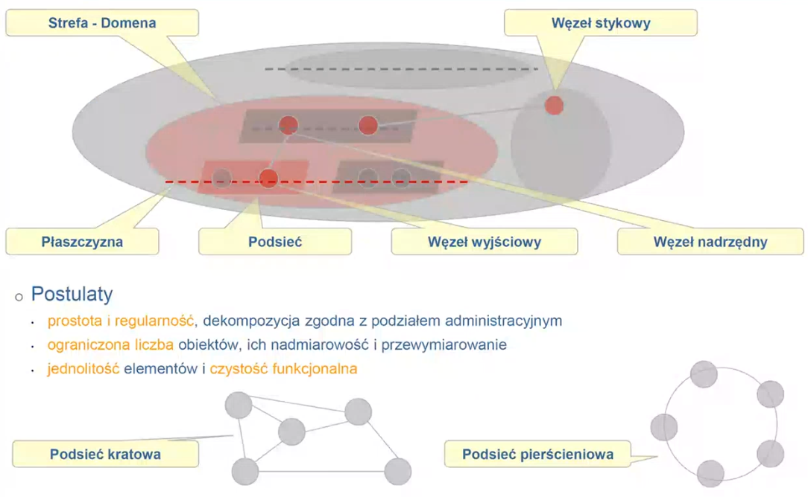

#### Płaszczyzny hierarchii

W szczególności w takim przypadku możemy zobaczyć płaszczyzny hierarchii (na rysunku przerywane linie).

Opisują one różne kategorie węzłów. Im węzły są niżej, są to węzły bliżej end-user'a im wyżej są to węzły, które coraz bardzie tranzytują ruch na coraz większe odległości.

Płaszczyzny hierarchii mówią o różnych kategoriach węzłów, różnych z punktu widzenia kierowania ruchu. 

No i teraz prosta zasada, jeżeli mamy dwa węzły na tym samym poziomie hierarchii to one z punktu kierowania ruchu zachowują się bardzo podobnie.

Jeżeli są one w tej samej strefie, no to ruch między nimi może być kierowany bezpośrednio, ewentualnie przez jakiś inny węzeł z tej samej strefy z tej samej płaszczyzny hierarchii. 

Natomiast jeśli węzły danego poziomu hierarchii są odległe od siebie to wtedy, nie ma możliwość kierowania ruchu pomiędzy nimi bezpośrednio, tylko trzeba korzystać z węzłów wyższej hierarchii. 

Więc mamy dwa kierowania hierarchiczne i nie.

Wracając do przykładu Kraków-Warszawa. To czerwone to Warszawa (a to szare to Kraków haha, bo smog), zakładamy, że cała szara elipsa to operator Orange (cała jego sieć). Najprawdopodobniej centrale tranzytowe są zarządzane prze jakiś dział, który zajmuje się siecią międzymiastową, to wyróżniamy te zasoby jako odzleiną strefę. Wyróżniamy również 3 płaszczyzny hierarchii:

- najniższa central abonenckie, gdzie są dołączeni userzy
- w obrębie Warszawy płaszczyzna węzłów tranzytowych metropolitalnych, bo w niej realizowane są połączenia na terenie Wawy między dzielnicami.
- organizujemy również płaszczyznę węzłów tranzytowych.

No i teraz trzeba powiedzieć jakie w każdej strefie występują rodzaje węzłów. Każdej strefie przypisać płaszczyzny hierarchii

Np.

- w strefie Warszawy dwa rodzaje CTM i CK
- w strefie międzymiastowej przypisujemy jeden poziom ten tranzytowy CT

#### Strefy / domeny

Bardziej strefy, bo pojęcie domena jest dobrze umiejscowione w Internecie, ma tam nadana wyraźnie znaczenie to słowo. Strefa jest bardziej ogólna.

Elipsy symbolizują strefy. Służą one po to, żeby rozdzielić dane fragmenty sieci, bo np. należą one do innego operatora, lub jest zarządzana przez inny dział danego operatora, albo strefa pełni w sieci inną funkcje.

Strefy są tworzone hierarchicznie, cała sieć jest strefą a następnie wyróżniamy kolejne podstrefy rekurere.

#### Podsieć

To jest zbiór węzłów, które są w obrębie jakiejś strefy i są w tej samej płaszczyźnie hierarchii i są wyróżnione z jakiegoś powodu. Np. że ta podsieć ma wyróżnioną strukturę (np. wielobok zupełny lub pierścień), np. jedna funkcja.

Np. węzły CK dzielnicy Wola.

#### Role węzłów

- **węzeł wyjściowy** - to może być węzeł wyjściowy z podsieci (pojęcie gateway w Internecie, nim ruch wychodzi z podsieci), jeżeli jest jakiś węzeł wyjściowy to znaczy, że wszystkie połączenia poza tą podsieć muszą prowadzić przez ten węzeł. Oczywiście mogą być dwa węzły wyjściowe, wtedy takie połączenia mogą iść przez jeden lub przez drugi. Można też powiedzieć, że jest węzeł wyjściowy dla całej strefy.
- **węzeł nadrzędny** - obsługuje węzły, które pod niego podlegają w sensie poziomu hierarchii. Można być węzłem nadrzędnym dla jednego węzła lub dla całej podsieci. Np. na Kazimiekowskiej orange ma centrale i tam jest centrala, węzeł nadrzędny dla Mokotowa, a to oznacza, że wszystkie połączenia z Mokotowa muszą tamtędy przechodzić. A np. taka CTM na Pradze jest wyżej poziom w Hierarchii niż CK Mokotowskie, ale przez nią nie przechodzi ich ruch. Oczywiście może być tak, że podsieć ma >1 węzeł nadrzędny (no bo wtedy single point of failure). Węzeł nadrzędny też można zrobić dla strefy. Np. w szarej płaszczyźnie hierarchii zrobić węzeł nadrzędny dla strefy Warszawskiej. Ale tu znowu problem, single point, więc można zrobić dwa węzły nadzrzędne dla srefy Warszawka najlepiej w innej lokalizacji, a z racji, że bity się nie męczą to niech to będzie w Łodzi.

#### Mycek nie

Mycek omawiając ASONY itp. mówił o stanie już zastanym, o połączeniu, które ma już drogę, jest zestawione. Ale te modele nie mówią o tym jak tą drogę znajdywać. A żeby znaleźć drogę to trzeba wiedzieć jakie są reguły znajdowania drogi i o tym tam nie było, bo tam nie było modelu struktury sieci.

Jeżeli zdefiniujemy sobie strukturę sieci, to natychmiast możemy sobie wyobrazić jak po pierwsze gdzie mogą być łącza, a gdzie ich nie może być, a po drugie jak w takiej sieci powinno wyglądać znajdowanie dróg dla realizowanych połączeń.

Teraz można podsumować modele w sieci tele. A poźniej jak to było w sieci Internet. A potem a jak to może być w sieci optycznej w szczególności w drugiej części projektu.

### Sieć telefoniczna z uwzględnieniem modelu struktury sieci

#### Hierarchiczny z wyborem kolejnościowym

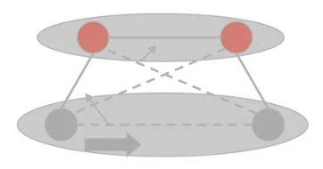

W najprostszym przypadku mamy tu 2 płaszczyzny hierarchii:

- płaszczyznę central końcowych CK
- płaszczyznę central tranzytowych CT

Każda CK ma wskazany węzeł nadrzędny w płaszczyźnie CT.

Każda CT obsługuje pewną liczbę CK.

Każda CK jest podłączona do jednej pewnej CT.

W związku z tym jeśli spojrzymy na parę CK, między którymi mamy realizować połączenie, to widzimy, że jedna ma jedną CT, druga ma CK ma centralę nadrzędną tranzytową. A w związku z tym sposoby pokierowania połączenia są następujące:

-  albo droga bezpośrednia w tej samej płaszczyźnie hierarchii, łączem łączącym te dwa węzły
- albo droga przez CT węzła docelowego, składająca się z dwóch łączy.
- albo droga przez własną CT, składająca się również z dwóch łączy
- albo droga przez obie CT, składająca się z trzech łączy

Z punktu widzenia węzła wybór jest kolejnościowy tzn. RC ma do wyboru np. 3 drogi (ten z rysunku) sprawdza je wg. powyższej kolejności, patrzy czy taka istnieje, i czy łącza są wolne. Jest zestawiany fragment połączenia (rezerwacja zasobów na łączu) i następny węzeł zastanawia się jak dalej realizować to połączenie wg. tego samego algorytmu. W tym przykładzie (gdy węzeł lewy dolny wybrał opcje 3 lub 4) ma on dwa wybory możliwe i znowu wybiera tam gdzie łącze istnieje i są zasoby.

Kierowanie tu jest statyczne, w tym sensie, że wynika ono ze struktury sieci. 

Jeżeli rozpiszemy sobie płaszczyzny hierarchii, węzły które należą do każdej płaszczyzny, zdefiniujemy nadrzędność czyli jaki jest węzeł nadrzędny dla każdego węzła niżej w hierarchii. No to wtedy natychmiast możemy sobie rozpisać jak powinny wyglądać tablice kierowania ruchu i one są niezmienne tak długo jak niezmienna jest struktura sieci.

#### Niehierachiczny

Teraz wiemy co to znaczy "Niehierachiczny" to znaczy, że wszystkie węzły są w obrębie jednej hierarchii. Nie ma tutaj węzłow o roli A i roli B, czyli tranzytowe, końcowe tutaj każdy może być końcowym albo każdy tranzytować komuś i to jednocześnie dla różnych połączeń.

**Gdzie takie kierowanie można wykorzystać?**

Np. w zbiorze central między miastowych CT, wszystkie należą do jednej płaszczyzny hierarchii, są identyczne pod względem kierowania ruchu, taka sama rola. To jest dobre miejsce to zastosowania ruchu niehierarchicznego.

Tutaj można albo drogą bezpośrednią albo jedną z wielu dróg alternatywnych. Ale ograniczamy się do dróg od długości dwa (tylko jeden węzeł tranzytowy)

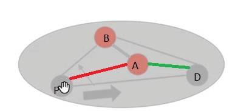

Zasada jest następująca, jeśli jesteśmy w węźle początkowym to mamy do wyboru"

- drogę bezpośrednią, droga pierwszego wyboru, łączy dwa węzły dla połączenia, początkowy i końcowy. Jeśli na niej nie ma wolnych zasobów to
- sprawdzamy* możliwość realizacji połączenia na pierwszej drodze alternatywnej
- sprawdzamy kolejne drogi alternatywne

*Węzeł wie tylko o stanie łączy, które z niego wychodzą. Więc np. patrząc na pierwszą drogę alternatywną węzeł początkowy (z kursorem) nie wie ile jest zasobów wolnych na łączy zielonym. 

Więc węzeł początkowy jak musi wybrać drogę alternatywną zajmuje zasoby na łączu czerwonym i przedłuża CallRequest do węzła A i jemu mówi, żeby on przedłużył to połączenie do węzła docelowego.

Ponieważ my założyliśmy, że droga max długość 2, to to połączenie musi być realizowane z wykorzystaniem łącza zielonego, nie ma innej możliwości.

Jakby to węzeł A był początkowym to on by miał trzy opcje. Czyli zauważmy, że decyzja w tym węźle zależy od tego czy połączenie które realizujemy to jest połączenie, które zaczyna się w tym węźle czy my przedłużamy i pełni role tranzytowego węzła. To znajduje swoje odzwierciedlenie w konstrukcji tablic kierowania ruchu.

W nich oprócz samego adresu docelowego trzeba  rozróżnić dwie sytuacje czy połączenie pochodzi od użytkownika tego węzła, czy dotarło od innego węzła. Jeżeli pochodzi od usera to wyborów jest wiele droga bezpośrednia i jakieś alternatywki w drugiej sytuacji wybór jest tylko jeden.

##### To jest po trosze związane z tym co opowiadamy sobie na PKC.

Mają państwo pewną liczbę kanałów i przychodzi strumień zgłoszeń o pewnej intensywnością lambda no i te połączenia trwają określony czas. 

Jeżeli wiemy jaka jest intensywność napływu sesji, intensywność obsługi sesji mi. (1/mi - to średni czas trwania sesji). Mówi się że stosunek lambda/mi to jest ruch - średnia liczba sesji, które byłyby w toku gdybyśmy mieli nieskończoną liczbę zasobów.

Przykład jeśli przypływa 10sesji/min. Każda sesja trwa 3 minuty/sesja. No więc ruch jest = 30. Czyli potrzebujemy 30 kanałów średnio rzecz biorąc, bo średnio traw 30 sesji jednocześnie.

**I teraz pojawia się następujące pytanie**

A=1 czyli jedna sesja średnio jest w toku. Ile kanałów powinniśmy dać, jeżeli te sesje pojawiają się losowo, żeby ptswo, że pojawia się sesja i dla niej nie ma kanału było <0.0.1. Czyli pstwo, że sesja nie dojdzie do skutku to 1%.

No i teraz okazuje się, że potrzebne są 4 kanały.

Gdyby A=100, to liczba kanałów jest potrzebna 110. 

Co to oznacza?

Gdy A=1 to średnie wykorzystanie kanałów to 25%

Gdy A=100 to średnie wykorzystanie to 90%

Wniosek jest następujący lepiej jest agregować ruch, powodować że mamy więcej sesji na jednym łączu, dlatego że wtedy ilość zasobów na takim łączu może być proporcjonalnie mniejsza niż gdybyśmy korzystali z wielu małych łączy.

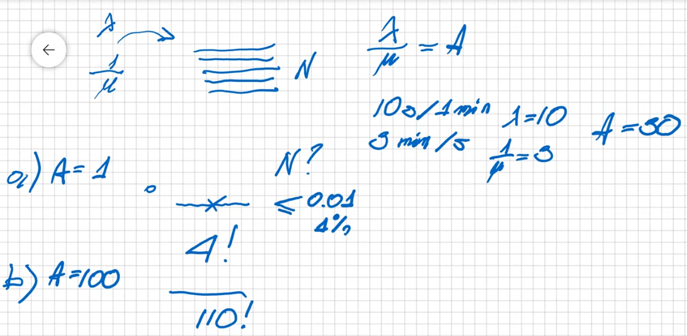

**I teraz wracając do naszego przypadku, dlaczego zdecydowana się na takie kierowanie?**

Mamy wymóg ogólny, że żądanie połączenia/sesji ma być akceptowalne w 99%. Pstwo odrzucenia = 0.0.1

Dobieramy tak zasoby na łączu AB, żeby 90% sesji zostało zrealizowanych  tą drogą. Czyli pstwo zrealizowania sesji = 0.9

Załóżmy że A=100. Więc średnio 90 sesji leci przez AB, co daje jeszcze 10 sesji do zrealizowania alternatywkami.

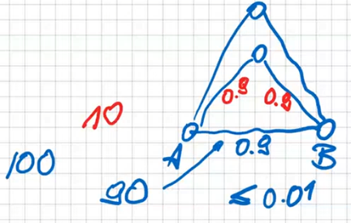 Jeśli łącza na alternatywce są takie, że pstwo zrealizowanie na nich sesji = 0.9. To pstwo wykorzystania tej alternatywki wynosi 81%. Czyli średnio 8 z 10 połączeń odrzuconych przez łącze AB pójdzie tamtędy.

Czyli 98 sesji na 100 jest realizowanych. 90 drogą AB bezpośrednią, 8 alternatywką nr 1. Ale 98 to nadal za mało my musimy 99 na 100 realizować. 

No to lecimy dalej.

Pozostają jeszcze 2 sesje które trzeba zrealizować. Mamy do dyspozycji 3 drogę

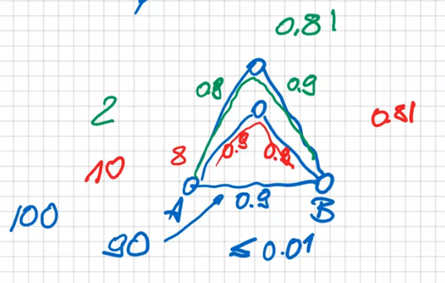

Na niej pstwo zrealizowania sesji jest >50% więc z tych dwóch sesji średnio więcej niż jedna na pewno zostanie zrealizowana (dokładnie 1.6). No więc możemy przyjąć. 

Więc spełniamy wymóg, że 99 na 100 sesji jest realizowanych.

Co więcej my realizujemy średnio 99.6 na 100 sesji, z wykorzystaniem tych 3 dróg.

**Podsumowanie**

Jeżeli chcemy efektywnie wykorzystywać zasoby musimy agregować ruch. Lepiej dawać wspólne zasoby niż małe łącza na kilka sesji. Nie musimy się bać tego, że na jakimś łączu jest za mało zasobów, bo mamy kierowanie alternatywne, to jesteśmy w stanie zrealizować wymaganie na żądanie sesji. Z racji, że na podstawowej drodze zostanie zrealizowana duża część sesji, natomiast jeszcze na alternatywkach trochę będzie. Dodatkowe frakcje ruchu tak żeby w sumie mieć tyle ile jest wymagane (99.6 z przykładu). 

I to właśnie pozwala na realizację kierowania niehierarchicznego.

##### Crunk-back

Możliwość, że alternatywka sprawdzi, że na drugim łączu, przez które miało by iść połączenie nie ma zasobów i jak to powie do węzła początkowego, to on może albo porzucić próby zestawiania tego połączenia albo pytać kolejne alternatywki. Ta druga opcja to właśnie Crunk-back. Stosowało to AT&T.

##### Mechanizm dynamicznej rezerwacji łączy

Zauważ, że alternatywki zużywają 2 razy więcej zasobów niż drogi podstawowe (2 łącza vs 1). W związku z tym co się dzieje?

Jeżeli w sieci gdzieś jest przeciążenie (łącza), nie można skorzystać z drogi bezpośredniej musimy skorzystać z alternatywki. Ale w tym momencie 

Jeżeli na łączu zielonym nie ma zasobów, a my już zarezerwowaliśmy łącze czerwone, to A do węzła docelowego też musi skorzystać z alternatywki, i jak na zielonym nie ma zasobów to trzeba będzie również to połączenie poprowadzić jakąś alternatywką, ale to może zająć ostatnie zasoby na tych łączach, które wykorzystaliśmy. I jeżeli między B i docelowym pojawi się zgłoszenie, to ono będzie musiało iść alternatywką przez to. 

W końcu może się okazać. że wszystkie połączenie byłyby realizowane alternatywkami. Czyli zużywamy 2 razy więcej zasobów -> możemy obsłużyć 2 razy mniej klientów. Bo każde połączenie zużywa 2x więcej zasobów niż mogłoby zużywać. 

Czyli, że nasze kierowanie alternatywne jest bleh. 

Co trzeba zrobić?

Kierowanie alternatywne powinno służyć tylko temu, że jak jest jakieś lokalne przeciążenie (1 łącze), to żeby pokierować połączenie alternatywką. 

Jeżeli ( 57:56//pstryknął palcem) wchodzi w przeciążenie jako całość powinniśmy kierowanie alternatywne wyłączyć. Jak się to robi?

**Mechanizm dynamicznej rezerwacji łączy** 

Zasada jest taka:

Załóżmy, że między P i D jest 100 kanałów, jeśli jest wolny choć jeden, to cykenes tędy. Jeżeli nie ma kanału to będzie się starali zrealizować połączenie alternatywką, ale nią można TYLKO WTEDY, kiedy łącza na tej drodze nie są przeciążone.

Więc jak ma 100 kanałów i <10 jest wolne, to uznajemy łącze za przeciążone. Bo jeśli zrealizujemy nim połączenie, to my zwiększymy przeciążenie sieci, a tego nie chcemy.

Dynamiczna, bo my patrzymy ile jest w tej chwili wolnych zasobów, wolnych kanałów.

##### AT&T - DNHR

Z racji, że korzystali ze swoich central, mogli zrobić na nich dowolne oprogramowanie i mieli centrale jednego typu, więc wystarczyła jedna wersja softu.

Więc no robili te swoje pomiary wyznaczali dla każdej pary drogi podstawowe i kilkanaście alternatywek. Na podstawie tak wyliczonych dróg, wyznaczali zawartość tablic kierowania połączeń i ładowali je do central. Każda centrala 10 razy w ciągu dnia przeładowywała swoje tablice z zestawu tablic.

Tutaj było stosowane zarówno dynamiczna rezerwacja łączy oraz jako jedyni oni zrealizowali ten mechanizm wycofywania,czyli jeżeli połączenie było realizowane drogą alternatywną ale okazało się, że na drugim łączu nie ma zasobów to ta centrala informowała poprzednią i tamta wznawiała proces poszukiwania drogi. Ten mechanizm jest niezbędny jeżeli mamy kilkanaście dróg. Musimy mieć mechanizm wycofywania, że alternatywki dalsze przetestować, bo rzadko się zdarzy że korzystamy nawet z piątej.

To jest rozwiązanie okresowe, bo co jakiś czas są pomiary i zmiany w sieci oraz jest adaptacyjne, bo dostosywyjemy się do zmian w sieci.

##### BT - DAR

Brytyjczycy w sieci między miastowej.  

Węzeł miał drogę main i jedną alternatywkę. Zauważmy, że tu nie ma mechanizmu wycofywania bo nie zdefiniowaliśmy innych dróg poza main i alternatywką. Ale Mechanizm dynamicznej rezerwacji łączy jest, jak najbardziej ofc.

##### DMS - DCR

Dynamic Controlled Routing.

Kanadyjczycy w Montrealu w sieci miejskiej. 

Idea była inna niż w dwóch poprzednich. Tu był system scentralizowany. Wszystkie węzły informują centrum zarządzania ile jest wolnych kanałów co 30sekund. Wtedy centrum zarządzania odsyła do każdego węzła info jaką drogą alternatywną powinien kierować ruch do każdego węzła.

Mamy centrum zarządzania i ono w sposób ciągły rekomenduje nam drogi, info o tych drogach zapisywana jest do lokalnego RC i on przez 30s z tej informacji korzysta. Istotne, że jest to 30 sekund, bo ilość sesji się cały czas zmienia i informacja się dezaktualizuje. To rekomendowanie powinno odbywać się jak najczęściej, ale ograniczenie jest takie, że każdy węzeł musi najpierw wysłać zajętości łączy, centrum zarządzania poobliczać i podmienić tablice w węzłach. Jak centrum oblicza?

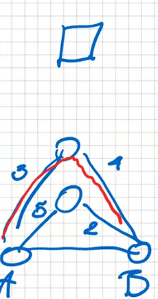Jak mamy taką sieć i centrum zarządzania szuka alternatywki między A i B i dostało od A i B takie info o wolnych kanałach jak widać na rysunku, to centrum zarządzania wybierze drogę gdzie jest większa wartość min{wolne_kanały_łącze1, wolne_kanały__łącze2}.

Takie coś się nazywa **reguła resztkowej przepustowości** - **residual capacity**.

Dynamiczne to jest, bo monitorujemy zajętość zasobów i decydujemy na tym kierowaniem ruchu.

**Podobieństwo do sieci optycznych**

Jeżeli rozważymy wariant ze scentralizowanym RC, to jesteśmy bardzo blisko tego co tutaj mamy. Tu jest co 30s do lokalnych RC spływają rekomendacje jak kierować ruch. W przypadku w pełni dynamicznym byłoby tak, że my przy każdym zgłoszeniu pytam kontroler jak pokierować zgłoszenie. Oraz w tym w pełni dynamicznym RC byłoby jedno a nie w każdym węźle i byłby przepytywany za każdym razem gdy potrzebne jest wyznaczenie drogi.

#### Te systemy nie

Te system z lat 80 nie przetrwały do dziś, były. Nie nadawały się do sieci heterogenicznych (czyli wiele producentów sprzętu) oraz oszczędzały tylko 5% kosztów naszych węzłów i łączy między węzłami a jednocześnie znaczenie komplikowaliśmy kierowanie.

Od pewnego momentu zaczęło się przyjmować, że koszty OPEX są dużo ważniejsze niż CAPEX, bo CAPEX tylko raz, a OPEX w sposób ciągły ponosimy. Dlatego należy kosztem tego, że pierwotna inwestycja jest nieco droższa minimalizować koszty OPEX, stąd niechęć do skomplikowanych rozwiązań

Dlatego wymyślono kolejny system:

#### Hierarchiczny z podziałem obciążeń

Hierarchiczny ale taki nowoczesny. Na czym on polega?

On polega, że wyróżniamy dwie płaszczyzny. Węzły CK i CT. Wyróżniamy podsieci w płaszczyźnie central końcowych. i Dla każdej takiej podsieci wyróżniamy nie jeden ale 2,3 lub węzły tranzytowe. I każdy węzeł końcowy podłączamy do węzłów tranzytowych. Czyli jeśli mamy podsieć z 2 CK i ta podsieć ma wyróżnione 2 CT, to będą 4 połączenia między płaszczyznowe.

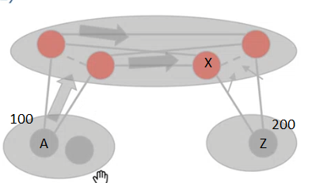

Więc teraz jak pomyślimy sobie jak pokierować połączenie z węzła A do Z to zasada jest następująca. Tutaj wykorzystujemy w sposób istotny tzw. **podział obciążeń**.

Realizuje się to przez losowy wybór łącza z jakiegoś zbiory. A ma do wyboru dwa łącza przez które może iść połączenie. No i losuje jedno i cykenes.

Widać, że w płaszczyźnie tranzytowej węzły nadrzędne podsieci 100, mają po 2 połączenia do węzłów nadrzędnych podsieci 200, wobec tego tu też można zastosować mechanizm **podział obciążeń**. Więc RC węzła tranzytowej również w sposób losowy wybierze jedno łącze z 2.

No i potem w węźle X, to już jest tylko jeden wybór.

Oczywiście może się okazać, że łącze XZ jest niedostępne (czy to awaria czy przeciążenie) i wtedy można zrobić tzw. **wzajemy przelew**, tzn. można połączenie skierować awaryjnie niejako do drugiego węzła nardzędnego tak żeby on mógł zrealizować to połączenie do węzła docelowego, ale to jest na ogół sytuacja awaryjna.

**W skrajnym przypadku, a tak bywało to też realizowane.**

> Można, wyobraźcie sobie, że cała płaszczyzna tranzytowa miałą by tylko dwa węzły, czyli każde CK byłoby połączone 2 łączami do płaszczyzny tranzytowej.

> Wtedy schemat jest prostszy bo nie mamy kierowania w płaszczyźnie tranzytowej natomiast nadal byłby podział obciążeń. 

>  No więc węzeł początkowy losuje jeden z 2 CT i jak połączenie tam dotrze, to CT przedłuża do odpowiedniego CK.

W tym podejściu nawet połączenie w podsieci kierować przez węzły nadrzędne, nie robić wieloboków zupełnych, bo to kosztuje, do tego się to rozwiązanie sprawdzało właśnie. 1000 USD miesięcznie za sam fakt istnienia łącza o rany.

Wtedy zasada działania pojedynczej CK jest prosta, on musi tylko zadecydować czy połączenie jest do klienta tej samej CK, czy nie. Jeśli nie to on je wysyła do CT i voila. A zatem całe skomplikowanie odkłąda się w płaszczyźnie tranzytowej.

I w taki sposób reorganizowano w latach 90 wszystkie sieci telefoniczne.

**Londyn**

Np. w Londynie tak zrobili. Oni w szczególności powiedzieli, że to im się zwróci w 3 lata. 

Postawili 11 CTM na cały Londyn i każdą z kilku dziesięciu central końcowych dołączą do 3 z nich. I będzie to działało na zasadzie podziału obciążeń. Jeśli chodzi o ruch międzymiastowy to postawili dookoła Londynu 9 CT obsługujących miasto i każda CK była podłączona do 3 z nich.

I wtedy CK, ma taką robotę jak przyjdzie połączenie:

- albo to w obrębie tej samej CK, to wtedy ona obsłuży
- albo to w obrębie Londynu, to wtedy losuje jedną z 3 CTM
- albo poza Londyn, to wtedy losuje jedną z 3 CT

No i to im się zwróciło po 3 latach sztos, bo OPEX taki mały, że hit.

To co w szczególności trzeba zapamiętać to mechanizm podziału obciążeń, on oprócz robienia roboty, dobrze pozwala na zabezpieczanie się między awariami w bardzo prosty sposób.

Spójrzmy na następującą sytuację. 

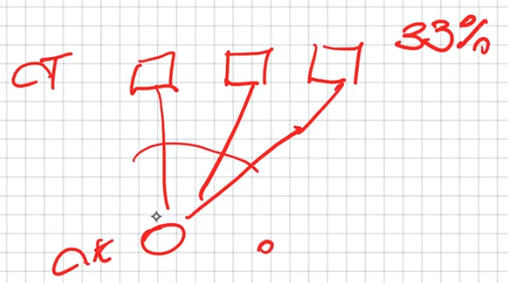

Jeśli nasza CK jest podłączona do trzech CT i korzysta z podziału obciążeń, to średnio każda CT (i łącze) jest obciążone 33% ruchu z tej CK.

Jeżeli natomiast węzeł się uszkadza:

To procedura pozostaje bez zmian. Musimy losować ale nie uwzględniając łącza uszkodzonego. Wtedy losujemy z tych dwóch i średnio wykorzystujemy 50% z każdego z nich. 

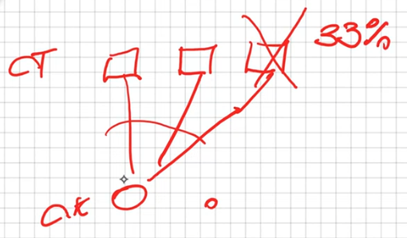

Jeżeli byśmy przewymiarowali zasoby tzn. zwiększyli pojemności CT, to moglibyśmy obsługiwac ruch tak samo jak poprzednio. 

Bo zauważmy, że w stanie nominalnym dla 3 CT, każde łącze obsługuje 33%. Łącznie obsłużymy 100% ruchu z tego węzła. Ale jeśli jedna CT się uszkodzi, to możemy łącznie obsłużyć 66% ruchu.

Jeżeli byśmy zrobili tak, że te CT nieco powiększymy:

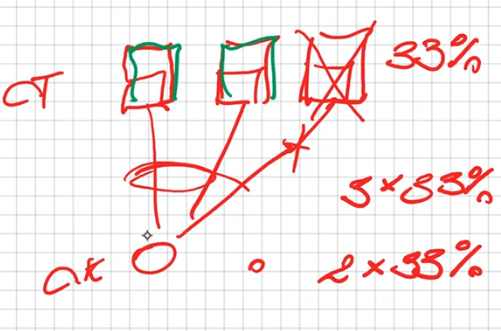

I założymy, że w przypadku awarii mamy obsłużyć 90% ruchu z CK, no to w tym momencie jeżeli jeden węzeł się uszkadza, to każdy z pozostałych musi obsłużyć po 45% ruchu. 

Czyli wcześniej każdy węzeł musi mieć pojemność 33% całkowitego ruchu, a po awari jednego, dwa co zostały muszą mieć pojemność 45% całkowitego ruchu z CK.

A zatem wiemy jakie jest przewymiarowanie CT --> 45%/33%. 

Gdy mamy 2 łącza to każde cyk 50% ruchu z CK. Ale gdy awaria a założenie jest nadal na 90% po awarii, to musimy przewymiarować CT i łącze o 90%/50%.

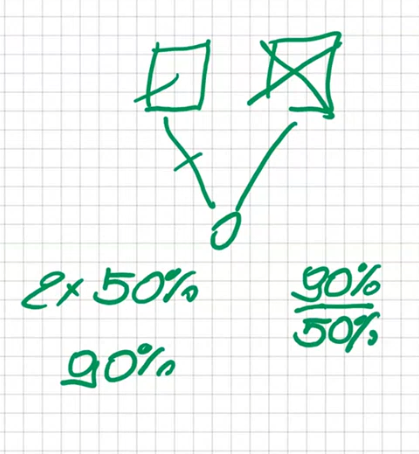

Im więcej węzłów tym mniej musimy przewymiarować, ale mamy efekt skali. Czyli jeden węzeł o danej wielkości kosztuje mniej, niż dwa węzły każdy połowa tego co tamten.

Takie coś jest na egzaminie 1:36:47

### Podsumowanie

Naszym punktem wyjścia jest to, że kierowanie ruchu w sieci powinno zależeć od jego struktury. Czyli powinniśmy sobie strukturę naszej sieci zdefiniować. Dekomponując zasoby sieci na strefy, definiując płaszczyzny hierarchii, które odpowiadają różnym rolą węzłow, przypisując te płaszczyzny do rożnych stref, definiując podsieci i funkcje poszczególnych węzłów tj. nadrzędny, wyjściowy. Na tej podstawie jesteśmy już dużo powiedzieć jak będą wyglądały drogi w naszej sieci.

Drugi element to jaka będzie zasada doboru dróg, ten system kierowania. Czy to będzie:

- Tak jak w telefonii, że centrum zarządzania rozsyła do węzłów tablice kierowania połączeń, które są w nim przygotowywane
- Nie ma centrum zarządzania, system rozproszony, RC komunikują się ze sobą wymieniają info i na tej podstawie wypełniają tablice
  - Tu RCki mają do wyboru ADV lub LSV. Address-Distance-Vector lub Link-State-Vector.
- Mamy scentralizowany sterownik routingu RC, nie ma RC w poszczególnych węzłach są tam tylko CC i za każdym razem jak nam potrzeba drogi wysyłane jest żądanie do RC i ten sterownik routingu wylicza tę drogę. 
  - Wylicza on ją w oparciu o strukturę sieci, i zajętość zasobów o czym musi być informowany przez LRMy. Muszą one systematycznie informować RC o łączach jaka jest dostępność.
  - Ten RC może korzystać z jednego ze sposobów, które były wymyślone dla sieci telefonicznej. Oczywiście te sposoby mają duży związek ze strukturą sieci, więc wcześniej należy ją zdefiniować.

1:43:50 o projekcie