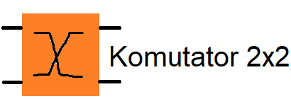
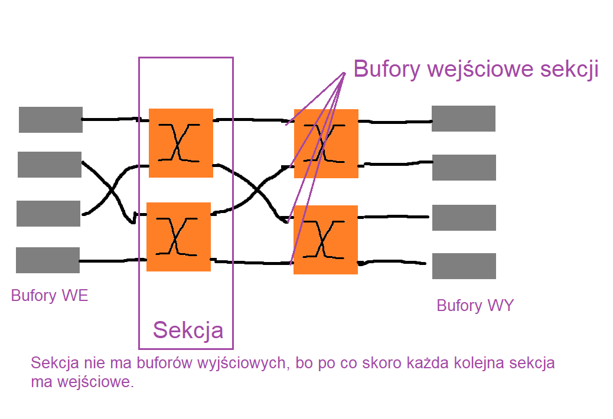
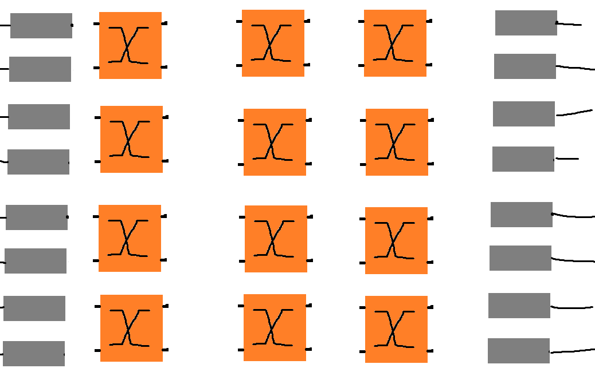
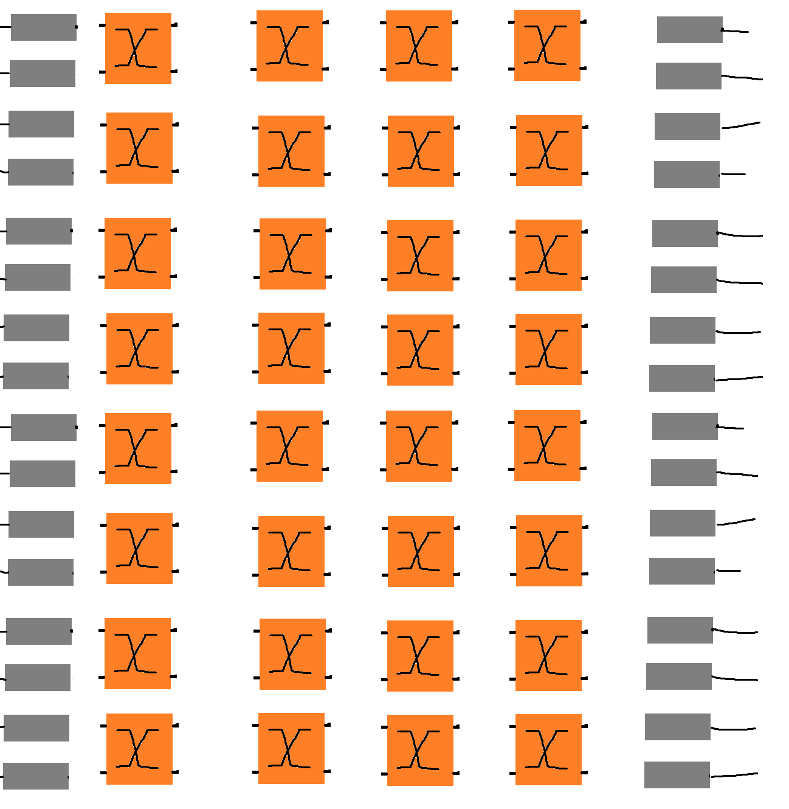

# Komutatory

Podstawowa jednostka to:

Buforwanie jest wymagane na wejściu wyjścia komutatora oraz na wejściu każdej sekcji.

Jak jest pytanie, że pakiet przechodzi przez bufory w polu, to liczą się tylko bufory sekcyjne.

## 1

Ma on:

- 4 wejścia i wyjścia
- 2 sekcje
- 2 bity sterujące

## 2

- 8 wejść/wyjścia
- 3 sekcje
- 4 komutatory na sekcje
- 3 bity sterujące
- 12 komutatorów 2x2

## 3

- 16 wejść wyjść
- 4 sekcje
- 8 komutatorów na sekcje
- 4 bity sterujące
- 32 komutatory 2x2

# Pytania o te drogi

To jest tak, że liczba sposób na jakie pakiet może przejść przez cały komutator jest równa

liczba_wejść x liczba_wyjść

 16 x 16 

A jeden komutator w danej sekcji stanowi przecież ułamek

1/liczba_komutatorów_w_sekcji

 1/8

Więc przez ten komutator przechodzi 

liczba_wejść x liczba_wyjść / liczba_komutatorów_w_sekcji

 16 x 16 / 8 = 32 

Czasem jest jeszcze dopytane o konkretne wyjście, wyjścia wiadomo są dwa, więc dzielimy liczbę przez 2

 32 / 2 = 16 

# Koszt

Prawo Moore'a:

Za tą samą cenę za 18 miesięcy możemy kupić dwukrotnie lepszy sprzęt.